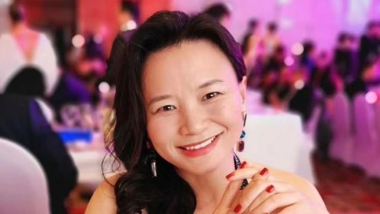
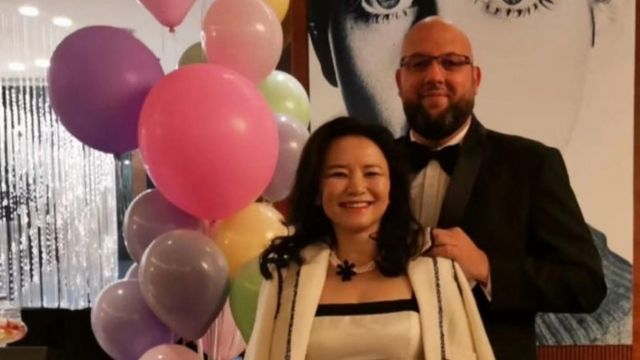

# [World] 成蕾：澳洲华裔记者在中国被关押千日后仍未得到判决

#  成蕾：澳洲华裔记者在中国被关押千日后仍未得到判决

  * 麦笛文（Stephen McDonell） 
  * BBC驻中国记者 

> 图像来源，  Nick Coyle
>
> 图像加注文字，成蕾从2020年起被国安人员拘捕。

**“1000天拘留是一个长得惊人的时间。”尼克·柯伊尔（Nick Coyle）说。**

他说的是他的女友、澳大利亚籍记者成蕾。她至今仍身在中国大陆的监狱里。对于她的指控详情仍然是个谜，而她也没有被判刑。

和成蕾的其他亲友一样，柯伊尔说，对于成蕾到底做了什么，为什么要被这样对待，他仍一无所知。

“我要求中国有关当局尽快解决这个糟糕的状况。”他向BBC表示。

成蕾原本供职于中国国营英文电视台中国环球电视网（CGTN），她在2020年8月13日忽然被中国国安人员带走，之后被指控“向境外非法提供国家机密”。

她被拘的前6个月是独立关押，被置于压力之下，在接受问讯时也未有获得律师协助。

自此之后，她与其他囚犯共同关押。

成蕾的审讯于去年3月闭门进行，连澳大利亚驻华大使傅关汉（Graham Fletcher）亦不获准进入。

不过，她的审判却被一再延后。

BBC致电成蕾受审的北京第二中级人民法院，未获接听。

柯伊尔是中国澳大利亚商会前首席执行官，现在已经离开北京，但仍在海外致力于寻求让成蕾获释。

“1月，我相信了中国驻澳大使肖千的话，当时他表示希望‘会尽快找到解决方法’，”科伊尔说，“五个月过去了，我们还在等。”

> 图像来源，  Contributed photo
>
> 图像加注文字，成蕾与男友尼克·柯伊尔

另一名澳大利亚籍人士杨恒均也在被控泄露国家机密之后陷入监禁，判决同样一再延后。

在中国，可能被列为“国家机密”的信息，是一个涵盖广泛的概念，基本上可以是政府想要包括的一切。

对于一个在数年的严厉新冠疫情封控政策之后想要重新吸引外资进入的国家来说，政党控制的不透明司法系统长时间拘押外国人正在成为一项挑战。

加拿大人康明凯（Michael Kovrig）和麦可·斯帕弗（Michael Spavor）在2018至2021年间被拘押，这是当时的一场人质外交事件，为了回应加拿大针对华为首席财务官孟晚舟所开展的引渡程序。

在美国对孟晚舟的引渡要求被撤回之后几小时，二人获释。

不过，对于外国公司的施压则没有停止。

六周前，一家医药公司的日本籍行政人员被拘留，中国外交部称他被怀疑从事间谍活动。最近几星期，这里的多家国际公司的研究机构遭到搜查。

很多潜在的外国投资者正在评估留在中国的风险，但同时又觉得不能无视这个国家巨大市场显而易见的吸引力。

澳中关系经历了几年低估。北京对澳大利亚的红酒、大麦和龙虾实施制裁。在这个超过5%的人口与中国有所渊源的国家，这种紧张关系不可忽略。

在所有这些摩擦当中，成蕾的案件受到广泛关注。

多年来，持外国护照的华裔所在中国被拘押时所受到的待遇，一直与其他外国人不同：简单来说，就是严苛得多。

不过，假如中国政府以为澳大利亚会因成蕾是华裔而对事件少一些关心，实情却并非如此。

她被带走时两个孩子分别是9岁和11岁。小孩在这一段长时间里一直未能见到母亲，令澳大利亚以及其他地方很多人能够共情。

“头脑理智的澳大利亚人——从商界到政界领袖，以及大众——都不接受这个现状，”尼克·柯伊尔说。

中国外交部曾试图冲淡这一案件的全球关注度。

在一次例行发布会上，发言人汪文斌表示：“中国司法机关依法办案，充分保障成蕾的合法权利。”

在她被拘押的第二年，汪文斌表示，法院将会“择期宣判”。但是，在秘密审讯一年多后，“宣判”仍然未发生。

> 图像来源，  Nick Coyle
>
> 图像加注文字，柯伊尔希望，案件能够得到紧急处理。

在中国，被起诉几乎肯定意味着败诉。官方的定罪率接近100%，律师和声援者则是尽其所能减轻被告的刑罚。

涉及外国人的时候，他们的政府会与中国政府谈判，寻求释放他们的国民。这有时候会涉及一些协议。

中国政府期望澳大利亚总理安东尼·阿尔巴尼斯（Anthony Albanese）在今年稍后访问北京，正式推动关系解冻。

成蕾和杨恒均的案件可能会被澳大利亚当成谈判筹码，为这次访问铺路。

澳大利亚政府表示，已经多次提出他们的立场。

上周，在伦敦出席国王加冕礼期间，阿尔巴尼斯在一次电视访问中说：“我们对中国的立场一直是建设性地接触，但要继续要求移除贸易障碍。要向习主席非常直接地说，像成蕾这样的澳大利亚人需要获得合理的正义，但是他们并没有得到。”

他直接提到习近平的名字，这一点在北京不会被忽略。

成蕾的职业生涯当中，很长时间都在致力于在她出生的国家和她一家移居的国家之间建立桥梁。

她的案件令中澳之间鸿沟加深，并不会是她想要的。

从澳大利亚外交官每月半小时的探访当中传出的有限信息来看，似乎有一点是很突出的：她非常想念她的孩子们，以及她不在他们身边感到多么痛苦。

尼克·柯伊尔表示，她的孩子们现在分别是11岁和14岁，一直在没有妈妈在身边的情况下，尽他们的努力在澳大利亚长大，但是他说，“看在成蕾和她孩子们的份上，我真的希望这一切能够忙找到解决办法。”

