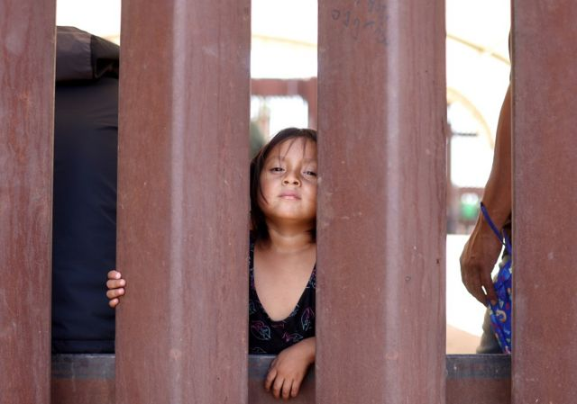
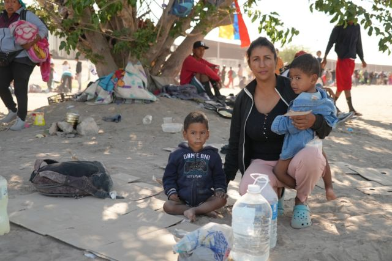
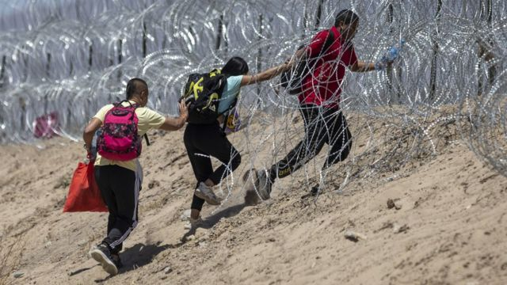

# [World] 美国移民：《第42条法案》终止，美墨边境弥漫着困惑和混乱

#  美国移民：《第42条法案》终止，美墨边境弥漫着困惑和混乱

**三年多之后，特朗普时期一项允许迅速驱逐大量非法越境移民的政策即将到期。这项被称为《第42条法案》（Title 42，42条）的政策于当地时间周四（5月11日）午夜终止。**

但在42条到期前的一周，每天都有创纪录的移民涌向美国与墨西哥边境。

几乎与此同时，美国众议院于周四通过了一项法案。《华尔街日报》称，该法案旨在通过对人员和设备的资金投入来阻止移民越境，增加寻求庇护的难度，并将恢复南部边境筑墙等特朗普时代的政策写入法律。

美国总统拜登（Joe Biden）承认，政策解除后“将会有一小段时间的混乱”。

##  美墨边境状况：困惑加恐惧

> 图像来源，  Getty Images

> 图像加注文字，来自委内瑞拉的米莱克西·戈麦斯带着孩子长途跋涉来到美墨边境。

美国官员在本周每天处理超过10000抵境个案，被认为是有史以来最高，3月时这个数字只有约5000。

路透社引述消息源称，周三（5月10日）的边境设施收容着2.8万移民，远高于设施容纳的上限。

为了应对移民涌入，美国国土安全部派遣超过2.4万名执法人员和1500名现役军人前往边境。

与此同进，墨西哥也派出军队至其中美洲边境，以控制预计会大量试图过境进入美国的移民。

BBC北美事务编辑莎拉·史密斯（Sarah Smith）从墨西哥华雷斯城报道，大量移民顶着烈日等候在美墨边境的铁栅栏附近，但是没有人知道自己能否获准过境。

来自委内瑞拉的米莱克西·戈麦斯（MiLexi Gomez）表示，她带孩子穿过原始丛林、翻过高山、坐过火车顶才到达这里。她的孩子们患了感冒，她担心会变成支气管炎。

她感到很绝望：“我问上帝，在这种地方，我应该做什么来保护我的孩子们。”

> 图像来源，  Getty Images

这样的景象并不寻常。寻求进入美国的移民通常会被安排住在华雷斯城市区，但是近日数量激增使得安置移民的系统难以为继，在边境工作数十年的人员也表示，状况前所未见。

莎拉·史密斯指，她访问过的人大多都知道本周《第42条法案》将终结，但是很多信息不尽不实，令他们感到困惑。

很多人相信只要法案到期，移民和寻求避难者会更容易进入美国；另一些人则认为，必须要在周四午夜前入境。

戈麦斯就表示，她听说自己必须在11日之前到达边境，才有机会去美国。她担心一旦这里积聚的人太多，自己的家庭就会无法越境进入美国。

“如果我们不能进美国，我不知道我们会去哪里，因为我们不能回我们的国家，”她说，“这就是真相。”

##  法案终结后将如何？

> 图像来源，  Getty Images
>
> 图像加注文字，移民在5月11日跨境进入美国得克萨斯州的埃尔帕索县。

拜登政府在本周引入新规定替代过去三年里实施的《第42条法案》，新措施将试图在超过3000公里的边境线上改变现状，这导致了大量移民近日涌向这里。

严格措施将很大程度上禁止经由其他国家到达美墨边境的移民申请获得美国庇护，包括未事先于网上申请的人士。

据边境管理局称，非法越境者将被递解出境，至少五年内不准再进入美国，且会被“假定为不符合避难资格”。在《第42条法案》下则没有这些后果。

在美国得克萨斯州的埃尔帕索县（El Paso），一些入境者告诉BBC，自己赶在政策变化前赶到了边境。他们说对新移民法规会带来什么感到不确定，同时也因为听到大量谣传信息而感到迷惑。

同为24岁的乔（Jon Uzcategui ）和女友埃斯迈尼（Esmaily）来自委内瑞拉。他们告诉BBC，蛇头和其他偷渡者告诉自己，一旦出现在（美墨）边境就会被立即驱逐出境。这导致他俩赶紧非法穿越边境，从墨西哥来到艾尔帕索。

“所有移民都在谈论5月11日，”已经身在美国难民营的乔说，“但其中有很多谣言。我只知道有些事情在发生变化”。

这些判断和预期导致近期大量人群涌向美墨边境，穿越者达到每天1万之多，创下纪录。

##  什么是《第42条法案》？

政策可追溯到1944年一项被称为《公共卫生法》（Public Health Act）的法律。该法给予美国当局阻止疾病蔓延的紧急权力。

2020年3月，特朗普政府援引该法令，指需要阻止2019冠状病毒病（Covid-19）从边境传入。

随着《第42条法案》实施，美国当局能够迅速将从墨西哥边界越境的移民驱逐，包括寻求庇护者——均以全球大流行疫情为理由。

据美国海关及边境管理局（US Customs and Border Protection）资料， 在《第42条法案》实施以来，有约280万人被驱逐出境。

2021年1月上任后，拜登和他的政府继续保留了这一政策，在超过一年的时间继续为该政策辩护，称它是一项公共卫生措施。

2022年4月，监督美国卫生政策的美国疾病控制及预防中心（Centers for Disease Control and Prevention）释出信号，称由于公共卫生风险降低，将终结这项政策。

