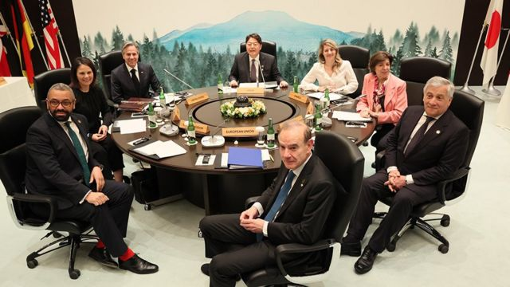
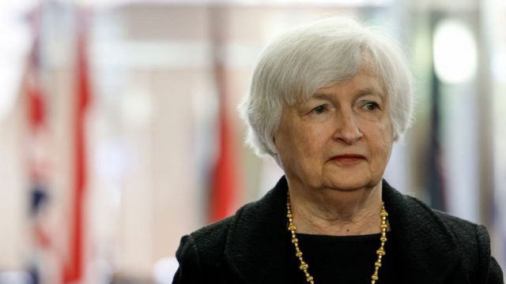
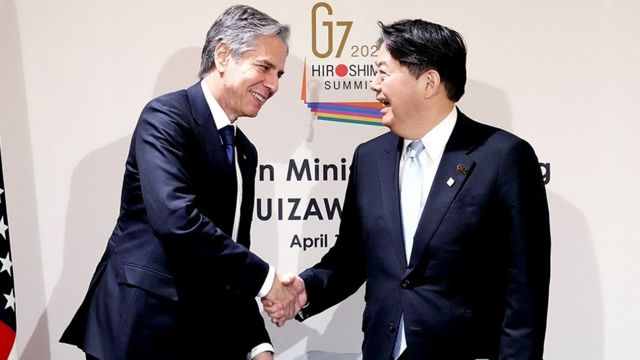

# [World] G7首脑峰会前夕 备受关注的公报涉华内容和日本新角色

#  G7首脑峰会前夕 备受关注的公报涉华内容和日本新角色

> 图像来源，  G7 2023 Website
>
> 图像加注文字，除了七国外长，欧盟也有代表参加G7外长会。

**今年7大工业国家集团(G7)领导人峰会即将于5月19至21日在日本广岛举行。其中，许多消息传出，今年峰会除了会聚焦在俄罗斯入侵乌克兰议题上，与中国相关的议题是本次峰会另一重要焦点。路透社引述一位参与会前讨论的美国官员透露，在下周开幕的领袖会议，将发表一份关于中国在全球各地“使用经济胁迫”（economic coercion）的声明。**

报导称，此声明可能是共同公报中的一部分，同时也是一项有关G7国家将如何合作抵御来自任何国家“经济胁迫”的计划提案。

这位官员还透露，七国领导人峰会主声明将涵盖“一个专门针对中国的部份”，列出一份来自中国的经济胁迫与其他行径的具体关注清单。

> 图像来源，  Getty Images
>
> 图像加注文字，美国财政部长耶伦提及，美国一直在考虑对北京对其他国家市场施行的强制性经济政策采取反制。

G7国家包括日本、美国、英国、法国、德国、加拿大和义大利（意大利），这些国家的现任领导人计划在下周陆续飞抵日本参与峰会。

##  剑指中国“经济胁迫”？

外界对于此次G7将触及中国挑战的讨论一直存在。在领袖峰会之前先举办的G7财长及央行行长会议上，美国财政部长耶伦（Janet Yellen 叶伦）便提及，美国一直在考虑对北京对其它国家市场施行的强制性经济政策采取反制，并可能在G7领袖峰会上得到其他国家的协调及协助。她指出，中国对立陶宛和澳洲明显地实施“经济胁迫”，令人十分关切。

根据《金融时报》报导，他们掌握到峰会草拟的相关文件称，此次峰会东道主日本和美国都想将“经济安全”作为峰会的主要议题之一。而耶伦也表示，华府正在完成一个针对中国的新的对外投资审查机制，新的美国投资限制将“范围缩窄”，并且针对“明确影响国家安全”的技术，并将与其他G7成员国据此进行非正式讨论。

2023年以来，北京已经对美国军武制造商洛克希德·马丁（Lockheed Martin）和雷神（Raytheon）及相关的若干客户实施新一轮制裁，还展开对美国芯片大厂美光（Micron）的调查，并在3月搜查了美国尽职公司（due diligence ）明智集团（Mintz Group）在北京的办公室，拘留了五名中国籍员工。4月底，美国四大咨询公司之一的贝恩集团（Bain & Company）在上海的办公室遭中国警方突击检查，并带走一些文件。此外，最近北京又拘留了日本艾力斯（Astellas Pharma）公司的一位高层。本周还传出隶属美国微软公司的知名求职平台领英（Linkedin）将关停在中国的业务。

> 图像来源，  G7 website
>
> 图像加注文字，G7外长会已经于4月中旬在日本举行。

此外，4月中，G7 外长会议在日本长野举办，日本首相岸田文雄与美国国务卿布林肯会面，再次就美日共同安保工作交换意见，同时，日本外务省称，G7各国外长都重申台海和平稳定的重要性，并认为此举方有助于国际社会的安全繁荣。

针对G7提到各种有关中国的发言，4月19日，中国外交部约见日本驻华使馆首席公使小泉勉称， G7 外长会“涉华消极动向”，向主办国日本表达强烈不满，并提出严正交涉。《金融时报》透露，根据中国商务部的一项评估，习近平政权正考虑限制西方于汽车行业中取得关键材料和技术。

外界分析，根据中南海强硬的外交政策，预计北京将对G7领导人峰会声明中有关中国或两岸问题等不会有任何让步，并同时将有严厉的回应。

##  日本的新角色

北京对美日不管是在G7或之前的合作，以及日本最近在美国协助下与韩国的合作，都有所批评跟发出讯号。这也凸显出日本在最近全球政治上的地位越来越突出。

东亚事务评论员瑞迪（Gearoid Reidy ）在G7前夕于彭博社发表的评论称，日本更换首相速度之快，让众人对岸田文雄政权没有太大期待，岸田的前任首相菅义伟，上任不到一年后辞职。

> 图像来源，  Getty Images
>
> 图像加注文字，岸田的优势在于外交，因为他在后疫情时代上台，正好让他能够大展身手。今年三月份闪电访问基辅，与同期的习近平会见普京形成鲜明对比。

但瑞迪指出，最近几个月，日本政治发生了一个不寻常的情况。岸田成功挺住了许多风波和民调开始崩盘的困境，并通过一系列外交活动掌握住政权。

目前，岸田现在的支持率已经恢复到前首相安倍遇袭身亡前的水平，而上个月在地方补选中自民党表现出色，在党内的权力巩固。过去外界认为G7本来是他告别首相的舞台，这个传闻现在已经转变：在家乡广岛举办的G7反而成了岸田可能利用的契机，他可能在举办成功峰会后提前召开大选。

瑞迪分析，岸田的优势在于外交，因为他在后疫情时代上台，正好让他能够大展身手。今年三月份闪电访问基辅，与同期的习近平会见普京形成鲜明对比。本月，岸田又在全球南方展开了一系列访问，是日本领导人近十年来的首次出访该区域。

岸田文雄登上了本月时代杂志的封面人物，该报导分析岸田如何将东京带回国际舞台，成为解决世界各地冲突的决策者。

“这很大程度上归功于拜登政府对中国日益强硬的立场，东京正在全球获得重要性，因为华盛顿寻求盟友来遏制北京的崛起……其中日本处于核心地位。”瑞迪表示。

