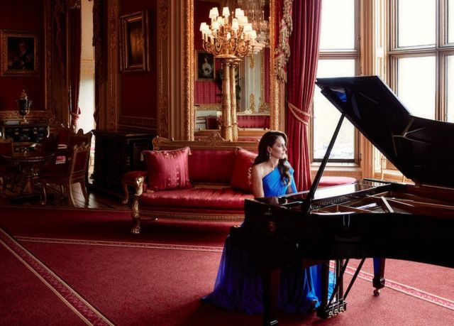
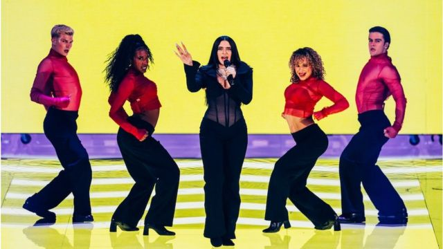

# [World] 欧洲歌唱大赛落幕： 政治色彩依然浓郁，瑞典歌手洛琳再次夺冠

#  欧洲歌唱大赛落幕： 政治色彩依然浓郁，瑞典歌手洛琳再次夺冠

  * 马克·萨维奇（Mark Savage） 
  * BBC音乐事务记者 

> 图像来源，  Getty Images
>
> 图像加注文字，来自瑞典的洛琳（Loreen）

**来自瑞典的洛琳（Loreen）凭借其高亢的流行歌曲《纹身》（Tattoo）第二次赢得欧洲歌唱大赛的冠军。她上次赢得比赛是在2012年，击败了芬兰歌手卡里亚（Käärijä）。**

英国选手梅·穆勒（Mae Muller）未能取得山姆·莱德（Sam Ryder）去年的成功，排名25，倒数第二。

威尔士王妃凯瑟琳（凯特王妃）出人意料地客串表演，她与去年的获奖者卡卢什管弦乐团（Kalush Orchestra）一起弹钢琴。

洛琳是第一位两次赢得欧洲歌唱大赛冠军的女性。“太震撼了，”她在领奖时说。“非常感激。非常感谢。”

“我在最疯狂的梦里都没想到会发生这种事。”

瑞典的胜利意味着它将主办明年的比赛，那将是1974年瑞典乐团阿巴（Abba）以一曲《滑铁卢》（Waterloo）取得历史性胜利的50周年纪念日。

爱尔兰在比赛中连续第五年在半决赛出局，他们的代表团团长称这一结果是“令人深受打击”。

> 图像来源，  PA Media
>
> 图像加注文字，芬兰歌手卡里亚的歌曲赢得了公众喜爱，但给陪审团的印象不佳。

梅·穆勒（Mae Muller）只获得了24分，使英国在排行榜上几乎垫底。“这不是我们希望的结果，”她在赛后发推文说。

她说:“我知道我经常开玩笑，但在过去几个月里，我们真的在全力以赴。”“祝贺所有国家，我永远不会忘记这段旅程，我爱你们。”

利物浦代表饱受战争蹂躏的乌克兰主办了今年的比赛，乌克兰在2022年赢得了冠军。

去年获奖的乌克兰卡卢什管弦乐团担任今年颁奖典礼的开场嘉宾，演奏了他们的歌曲《Stefania》的加长版，是在基辅提前录制的。

> 图像来源，  Alex Bramall
>
> 图像加注文字，威尔士王妃凯瑟琳客串钢琴演奏。

卡卢什演唱了新单曲《Changes》，表达对俄罗斯的不屑：“奉献我的一切/让我自由。”

这是首个提到战争的歌曲，这场比赛比许多欧洲歌唱大赛都带有更浓郁的政治色彩。

来自克罗地亚的Let 3！在歌曲中将俄罗斯总统普京称为“鳄鱼精神病人”，捷克乐队Vesna用乌克兰语演唱了“我们在心里和你在一起”。

乌克兰自己的参赛者特沃奇（Tvorchi）演唱的歌曲灵感来自于马里乌波尔（Mariupol）遭围困。官方称，在登台演出前，两位歌手的家乡捷尔诺皮尔被俄罗斯导弹击中。他们最终以243分的总分排名第六。

由于俄罗斯入侵乌克兰，俄罗斯被暂停参加比赛，不过，组织者没有让乌克兰总统泽伦斯基在比赛期间发表演说。

> 图像来源，  Sarah Louise Bennett / EBU
>
> 图像加注文字，以色列歌手Noa Kirel带来了精彩的表演。

在其他地方，欧洲歌唱大赛就是一场歌唱大赛。有向80年代的作品《迈阿密风云》（Miami Vice）致敬的歌曲、有关于埃德加·艾伦·坡（Edgar Allen Poe）鬼故事的歌曲，等等。

比赛的音乐水平仍在不断提高。

来自西班牙的布兰卡·帕洛玛（Blanca Paloma）将传统的弗拉门戈节奏与跳动的电脉冲结合，演奏出充满活力、节奏紧迫的EAEA；法国的La Zarra把几十年的高卢音乐史结合在一起。

来自亚美尼亚、波兰和以色列（尤其是以色列）的表演者加入了流畅的舞蹈；意大利表演者马尔科·蒙戈尼（Marco Mengoni）的伴舞是在蹦床上表演的两名体操运动员。

> 图像来源，  Getty Images
>
> 图像加注文字，芬兰的Kaarija献上了令人难忘的表演。

比赛还有后现代风格，以两首关于歌曲创作过程的乐曲结束。

奥地利双人组合Teya & Salena以一首流行歌曲《埃德加到底是谁》（Who The Hell Is Edgar）拉开了比赛的序幕，在这首歌中，她们向美国诗人埃德加·爱伦·坡致敬。

一个半小时后，梅·穆勒以《我写了一首歌》（I writing A Song）结束了比赛。她在这首歌中记录了前男友的不端行为。

去年获得英国赛区第二名的山姆·赖德（Sam Ryder）演唱了新单曲《山脉》（Mountains）的情感版，由皇后乐队的罗杰·泰勒（Roger Taylor）伴鼓。赖德的歌曲诉说了如何克服逆境，在舞台上伴奏的是失去四肢的舞者。

> 图像来源，  Sarah Louise Bennett / EBU
>
> 图像加注文字，英国歌手梅•穆勒(MaeMuller)未能复制山姆•莱德(SamRyder)去年的成功。

洛琳轻松赢得了评审团的投票，从爱尔兰、爱沙尼亚、西班牙、阿尔巴尼亚、塞浦路斯和乌克兰等国获得了最高12分。她以340分的成绩结束了评审比赛，轻松领先意大利选手马尔科·蒙戈尼（Marco Mengoni）163分。

公众更喜欢芬兰说唱歌手Käärijä，给了他526分，暂时领先。洛琳在最后一刻重新夺回桂冠，以243分的得分回到榜首。

英国排名垫底，公众得分仅为9分，评审团得分为15分。德国的情况更糟，他们的摇滚歌曲《Blood And Glitter》仅获得18分。

BBC对此表示遗憾，它与欧洲广播联盟（European Broadcasting Union）合作组织了这场比赛。

BBC官方推特写道：“梅，我们为你感到骄傲，为你在今年的欧洲歌唱大赛中取得的一切成就感到骄傲。”

