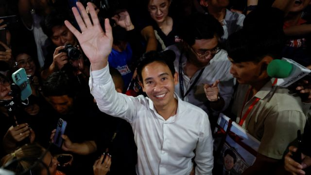
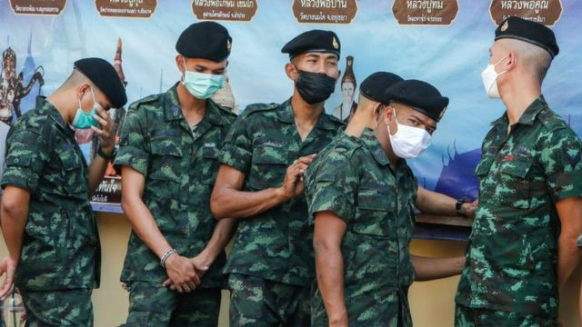
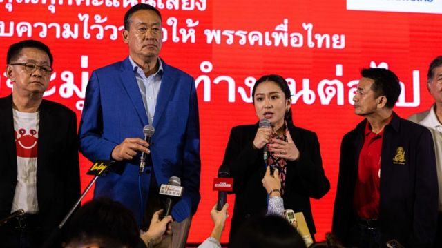
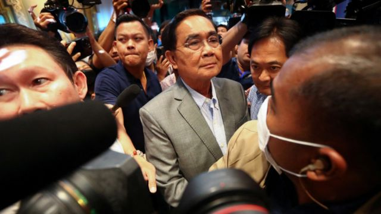
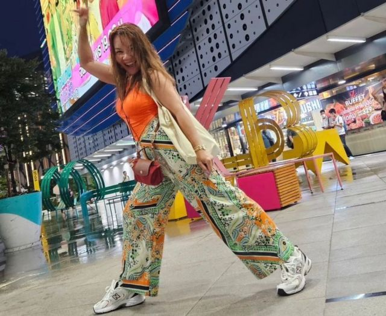

# [World] 泰国大选：在野党强势领先，巴育亲军方政权面临挫败

#  泰国大选：在野党强势领先，巴育亲军方政权面临挫败

  * 托马斯·麦肯托什（Thomas Mackintosh）、乔纳森·赫德（Jonathan Head） 
  * BBC记者，发自伦敦及曼谷 

> 图像来源，  Reuters
>
> 图像加注文字，前进党领袖皮塔·林家伦拉的竞选纲领简明却有力：“泰国需要改变”。

**泰国大选投票结束，初期点票结果显示，呼吁对泰国国家制度进行大规模改革的在野党将赢得一场轰动性的胜利。**

泰国选民用选票拒绝让军方支持的政府继续执政，大选形势显示两个反对党将会协商组成联合政府。

初期点票结果显示，前进党和为泰党遥遥领先现任总理巴育·占奥差（Prayuth Chan-ocha）。

本届大选被形容为近年经历军事政变的泰国所迎来的一个转折点。

巴育曾在2014年领导军事政变，目前正寻求延续执政任期。

但是，他在选举中面对着前进党和为泰党的强势挑战——两个在野党均为反对军政府的党派。

前进党由前科技公司高管皮塔·林家伦拉（Pita Limjaroenrat）领导，前总理他信（Thaksin Shinawatra）的女儿贝东丹·西那瓦（Paetongtarn Shinawatra）则是代表为泰党的候选人。

截至周一（5月15日）上午，98%的选票已点算，路透社根据选举委员会的数据进行统计，显示前进党将会赢得多数席位，为泰党将排在第二。

皮塔形容这个晚上的结果“轰动”，并承诺他的党派在组建政府时仍将与军方支持的政党对抗。

皮塔向媒体表示，他的政党将会寻求与为泰党谈判，而联合执政“肯定是选项之一”。

为泰党领袖贝东丹·西那瓦则向前进党的胜利表示祝贺，表示“我们可以合作”。

“我们已经准备好与前进党对话，但是我们还在等候正式结果，”她说。

##  选民将改革派推上前台

早期点票结果显示，前进党超出了所有人的事前预料，在下议院500个席位中赢得了151个。

现在，它领先此前的领跑者为泰党10个席位——后者由前总理他信的女儿领衔。

分析人士形容这是一场政治地震，代表着民意的重大转变。

同时它也是对现届政府两个与军方同一阵线党派的拒绝。现在执政的联合政府仅赢得15%的席位。

> 图像来源，  Getty Images
>
> 图像加注文字，投票结果是对近十年亲军方政权的拒绝。

“大部分选票反映了对逃离‘巴育政权’的需要，以及对改变的渴望，”法政大学（Thammasat University）的政治学者拉贾克·孔吉拉提（Prajak Kongkirati）说，“它显示了人们相信前进党对改变的要求——这样的人比预期要多得多。”

在泰国的社交媒体上，前进党支持者的信息铺天盖地——他们称这是“新时代的开始”。

“这场选举真的告诉你，仅仅过了四年，但是人们的想法改变了很多，建制派和亲民主阵营都是，”一条推文说，“民主不能被当作理所当然。”

“如果他们不适应想法和需要，他们真的可能失去阵地。”

哈佛毕业的前进党领袖皮塔在推特上说，自己“准备好了”成为泰国第30任总理。

一个呼吁对泰国的官僚机构、经济和军方角色，甚至保护君主制的法律进行全面改革的政党——“前进党”，能够赢得比任何竞争对手更多的席位和选票，这曾经是不可想象的。

这些问题在2020年曾引发了长达数月的学生主导的抗议运动，这并非巧合。前进党一些候选人曾是该运动的领导人。就像2020年的抗议活动一样，年轻而热情的选民，其中许多是前进党的追随者，在选举结果中发挥了重要作用。

不过，尽管在选举中获胜，前进党和为泰党仍然可能要面对一场斗争，才能取得政权。

新任总理将会由500名当选议员和250名参议院成员共同选出，而后者是由巴育军政府任命，摆好架势支持军方。

参议员一直都将票投给执政的现任军政府，从未投给反对派。

> 图像来源，  Getty Images
>
> 图像加注文字，前总理他信的女儿贝东丹（中）在选举日结束时向媒体发言。

当地时间周日17时（格林尼治标准时间10时）票站关闭后，点票开始——此前9.5万个票站进行了九小时的投票。

此前预期约有5000万人投票，选举下议院500个成员——有约200万人预先投了票。

选举委员会预计要几个星期才会正式确定每一党派赢得的最终席位数量。

但是这标志着泰国民意的重大转变，因为各年龄群体似乎都愿意碰一次运气，让相对未经检验的理想主义年轻政客掌权。

2014年，经过数月的政治动荡之后，69岁的巴育从他信的妹妹英拉手中夺取了政权。

泰国在2019年举行大选，当时结果显示没有政党赢得多数派。

> 图像来源，  Reuters
>
> 图像加注文字，Prime Minister Prayuth Chan-ocha, the army general who led the last coup in 2014, sought re-election

几星期后，亲军方政党组成了政府，任命巴育为其总理参选人，当时反对派指这一过程并不公平。

之后一年，一场争议性的法庭裁决解散前进党的前身“未来前进党”——这一党派在那一届大选中因为获得年轻选民的热情支持而表现出众。

该裁决引发了持续六个月的大规模示威，呼吁改革军队及王室。

此次选举前，几乎没有人想到，要求泰国的官僚体系、经济、军队角色甚至保王法律全面改变的前进党，能够在议席和票数上胜过任何一个对手。

> 图像来源，  Courtesy @pimm_miezs2465
>
> 图像加注文字，社交媒体上，很多泰国人发布“大踏步”照片，表达对前进党的支持

前进党的参选人手上的资源比对手少，因此须依赖社交媒体，甚至像骑单车这样的土办法来传播他们的讯息。他们的愿景比其他党派清晰明确得多，这起到了作用。

前进党已经排除和任何与2014年军事政变有关的党派组成联合政府的可能。它的改革派对手为泰党此前回避了这一立场。

前进党得益于公共要求改革的普遍渴望。26岁以下的选民，在逐渐老龄化的泰国不算多数——只占5200万选民当中的14%——但是他们努力说服年长的选民支持前进党，以求给他们新一代一个更好的未来。

