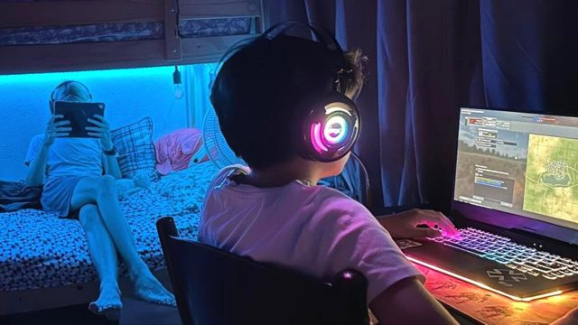

# [World] 电玩游戏是如何诱导小孩花钱的？家长又该怎么办？

#  电玩游戏是如何诱导小孩花钱的？家长又该怎么办？

  * 凯瑟琳·莱瑟姆（Katherine Latham） 
  * BBC商务记者 

> 图像来源，  NAra ward
>
> 图像加注文字，和很多小孩一样，娜拉·华德的小孩对电玩游戏非常着迷。

**娜拉·华德（Nara Ward）说，跟踪小孩在玩最喜欢的电玩游戏时如何花钱，是一项全天候的工作。**

华德女士生活在巴巴多斯，和她丈夫以及两个儿子，14岁的费恩（Finn）和12岁的莱夫（Leif）。

莱夫刚开始玩《机器砖块》（Roblox）时，就开始要“robux”——这是它的游戏币，让玩家可以通过购买虚拟装备来升级他们控制的角色人物。于是，他的祖父母就给了他200美元（159英镑）的苹果（Apple）点数，作为圣诞礼物。

“吓我一跳的是，他几天的工夫就花光了，”华德说，“在那之后，我就每月给他最多10美元的robux。他很快就觉得这个游戏没意思，败下阵来了。”

莱夫又改玩《战车世界》（World of Tanks），它同样要求玩家使用PlayStation的点数来升级武器。

“不过，这个游戏有一个选项是看广告赚点数，”华德女士说，“他用完每月游戏津贴之后，就会在迫不得已的时候就这么做。”

华德女士说，她的小儿子还没学会自制和金钱的概念。

“这是我必须时常监督的事情。”

> 图像来源，  Nara Ward
>
> 图像加注文字，娜拉·华德看到儿子玩游戏花起钱来有多快之后，吓了一跳。

现在的很多游戏公司并不是靠出售电玩游戏本身赚钱，而是依赖游戏内销售或者微交易实现营利。

出售的内容可能纯粹是为了好看——比如某些舞步动作、皮肤或者服饰。

另一些游戏内销售商品则是能为游戏玩家提供战略上的优势——额外的生命、角色或者武器的升级等——这些能让玩家得到一些不购买额外内容的玩家所没有的优势。
 业内预计  ，全球的线上微交易市场价值将从2022年的679.4亿美元上升至2023年的766.6亿美元。

然而，有迹象显示，专家和消费者都对此有所反弹。一些公司也承诺发布一些没有游戏内销售的新作。

> 图像来源，  Loughborough University
>
> 图像加注文字，米尔斯教授指，年轻人可能会对自己在游戏里花很多钱而感到羞耻。

莎拉·米尔斯教授（Prof Sarah Mills）说，游戏公司利用行为心理学来操弄玩家，让他们花钱。她还解释说，游戏和赌博之前的界线正在变得“越来越模糊”。

米尔斯是拉夫堡大学（Loughborough University）的人文地理学教授。她的研究发现，赌博技术使得游戏玩家花更长的时间和更多的钱来玩游戏，并且驱动重复购买。

“家长天地”（Parent Zone）是一个帮助家长在数字世界中为孩子导航的机构，其行政总裁维姬·肖特博尔特（Vicki Shotbolt）更加具体地阐述了游戏如何激励玩家去花钱。

通过花钱，玩家可以“跳过研磨的过程”——游戏内买一些装备意味着你能够跳过很多个小时的单调游戏过程，进阶到下一个级别。

“痛并快乐”的机制则会让你失去一些重要的东西，假如你不买升级装备的话。

与此同时，类似于游戏币这种采取“混淆术”的概念，令人更难直观地看到你到底花了多少钱。

另一种策略则是利用“战利品箱”。玩家买一个盲盒，不知道里面是什么。它可能装着一个改变命运的物品——但是更多时候，奖品不过是一些无用的自定义设定。

“年轻人在回想自己曾花过多少钱来得到一个稀缺装备时，常常会感到惭愧，即使他们最后赢了，”米尔斯教授说。

而且，尽管很多小孩都说他们不喜欢游戏内购买，但是在微交易上花钱已经成为一个合理期待。

虽然在游戏里花钱的程度提高了，但是一些人还是辩解说，玩游戏是可以给年轻人好处的，而当中的恐惧是被夸大了。

电玩是一种游戏形式，其发明的目的是为了释放压力，帮助发展认知能力，还能对抗孤独。

> 图像来源，  Zhenghua Yang
>
> 图像加注文字，杨正华说，电玩游戏可以是对年轻人有益的事物。

来自科罗拉多州的杨正华，少年时代曾在医院度过了两年。

“我曾经大量玩游戏。那种单机游戏让我感觉自己是一个英雄。那些多人游戏又让我与其他人连通。我在全世界都交到那种一生的朋友。”

2014年，杨正华创办了“Serenity Forge”（宁静锻造），这是一家致力于助人的游戏公司。至今有超过2000万人玩过该公司的游戏。

“我们正处在一个拓展人们视野的行业里。”杨正华说。

Serenity Forge不使用微交易，但是杨正华说，这一点未来可能有变，假如他们发现这种交易方式会带来“有意义且有情感冲击力的游戏，挑战你的思想方式的话”。

杨正华说，微交易的影响力大小，取决于玩家的脆弱程度。

“就像信用卡在不恰当的情况下对一些人来说也可以很危险，微交易也是一样的。但是，信用卡也可以发挥很重要的功能，而游戏内购买也可以成为玩家投入自己最爱的游戏当中一种重要的方式。”

> 图像来源，  Serenity Forge
>
> 图像加注文字，Serenity Forge出口的游戏不使用微交易，至少目前是这样。

莎拉·洛亚（Sarah Loya）的儿子安德鲁（Andrew）14岁，零花钱几乎都花在游戏上。但是她说，这不是问题，游戏令他快乐。

“他每天都玩，放学和周末的时候玩。我没有将此看作是负面的东西。他是个聪明的孩子，知道现实与幻想之间的差别。”

洛亚女士在得克萨斯州生活，同住的有安德鲁和他的弟弟、6岁的雷克斯（Rex）。

“我的银行账户连通着安德鲁的游戏订阅，所以我会看到他有没有在未经允许之下买 东西，”43岁的洛亚说，“但是他买之前都会问我。”

虽然父母要时刻跟踪多个平台和装置的注册电邮、密码和付款卡可能很困难——你还是有方法可以保护你的小孩，还有你的银行账户。

儿童账户和家长控制功能可以用来禁止购买或者设定支付上限。家长可以设定电邮通知来获得购买提醒，也可能使用礼品卡而不是信用卡。

杨正华补充说，最重要的一点或许是，要和你的孩子交谈。

“在我的经验里，摩擦通常都来自于家长陪伴不足，”他说，“我现在有两个孩子，我不会把游戏当成是看管小孩的工具，我会确保在他们使用媒介的时候，我在他们的生活里是存在的。”

回到巴巴多斯，华德女士设定了屏幕使用时间限制和密码，以让莱夫玩游戏的时候更安全。

“买任何东西都需要我的密码，如果他想在帐户上增值，就必须问我。微交易是很烦，但这是人生的一课。”

**如果家长担心年轻人受困于游戏或者其** **它** **可能与赌博相关的伤害性行为，请到访** ”Parent Hub“  **网站，寻求支援及协助。**

