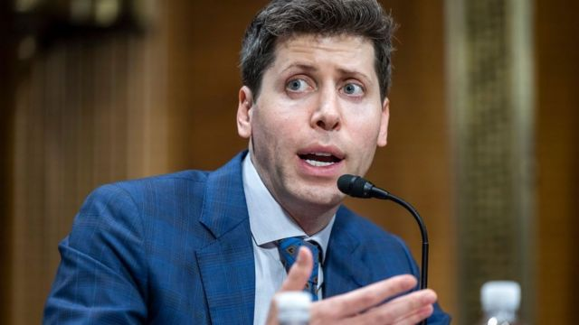
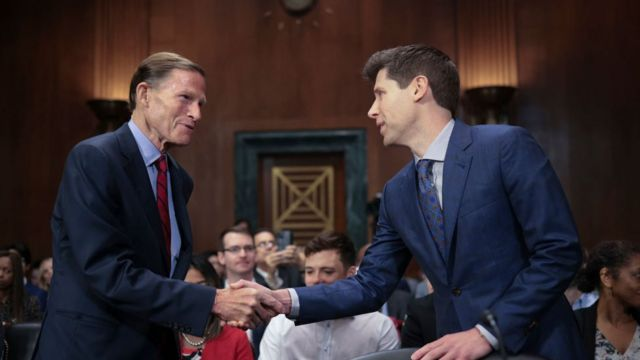
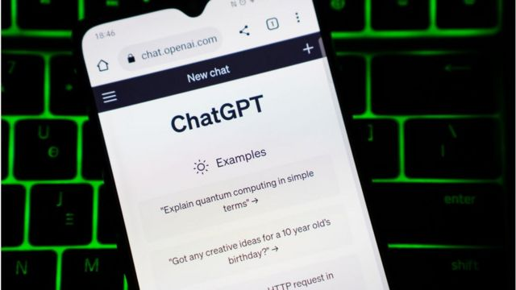

# [World] 人工智能：ChatGPT创始人如何看监管与AI对就业的影响

#  人工智能：ChatGPT创始人如何看监管与AI对就业的影响

> 图像来源，  EPA
>
> 图像加注文字，阿尔特曼在美国参议院委员会就人工智能的潜力及其风险作证。

**先进聊天机器人ChatGPT的创始人呼吁美国立法机构对人工智能进行监管。**

ChatGPT背后的OpenAI（开放人工智能）公司首席执行官山姆·阿尔特曼（Sam Altman）周二在美国参议院委员会出席听证会时谈到了这项新技术的可能性和缺陷。

这次听证会有哪些要点？

##  政府监管

阿尔特曼明确指出，随着人工智能行业的发展，政府监管至关重要。

他表示，ChatGPT的最新模型经过了严格的测试，但“政府的监管干预对于减轻日益强大的模型带来的风险至关重要”。

他呼吁将许可和测试要求作为一种选项。

阿尔特曼补充说，“无论政府做什么，公司都要承担自己的责任，这一点很重要”，而且人工智能“是在考虑民主原则的情况下开发的”。

##  对就业的影响

当被问及他对人工智能发展最大的噩梦时，阿尔特曼表示，他预计人工智能将对就业产生重大影响，但很难预测这种影响到底是什么。

他说，重要的是要把GPT-4视为“一种工具，而不是生物”。

> 图像来源，  Getty Images
>
> 图像加注文字，美国参议员理查德·布卢门撒尔和阿尔特曼在听证会上握手。

他说，这是一种人们可以在很大程度上控制的工具，人们可以控制自己如何使用它。

回顾科技的历史，他说，随着科技的发展，我们的生活质量也在提高。他补充说，“他对未来的就业机会非常乐观”。

##  对选举的影响

来自密苏里州的共和党参议员乔希·霍利（Josh Hawley）提问，美国人是否应该担心人工智能模型可以预测公众舆论。

他指，机构可以利用他们学到的知识“调整策略，以诱导选民的行为”，他声称，即使是谷歌搜索也会根据搜索排名和出现的文章来影响尚未决定的选民。

OpenAI首席执行官阿尔特曼承认，他对这个问题感到“紧张”。

他的建议是，公司应该自愿采用，或者在监管下采用一些准则，这些准则是关于提供模型的公司在披露方面的问题。

##  音乐产业

田纳西州共和党人玛莎·布莱克本（Marsha Blackburn）提问，音乐家和其他内容创作者的作品被用来训练未来的人工智能模型，他们能得到什么。

她指，OpenAI的应用“驻克音乐盒”（Jukebox）——当你输入艺术家、流派或歌词时，它会以原始音频形式生成音乐——有能力让乡村音乐艺术家加斯·布鲁克斯（Garth Brooks）歌曲“再现”。

> 图像来源，  Getty Images

阿尔特曼回答，如果内容所有者的作品被用于训练人工智能模型，他们应能获得重大利益。

他还说，他们也应该有权阻止使用他们受版权保护的歌曲和图像，以及他们的声音和肖像。

##  阿尔特曼的薪水

参议员肯尼迪在国会以其丰富多彩的提问而闻名，他问阿尔特曼是否在担任首席执行官期间赚了很多钱。

阿尔特曼笑着说，他“有足够收入支付医疗保险”，但“没有OpenAI的股权”。

“你需要一个律师或代理人，”肯尼迪开玩笑说。

“我做这个是因为我喜欢它，”阿尔特曼回答。

几十年来，阿尔特曼一直是科技行业的投资者，虽然我们不知道他的确切净资产，但准确来说，他并不缺钱。

在2020年大选期间，他个人向拜登捐赠了25万美元。

