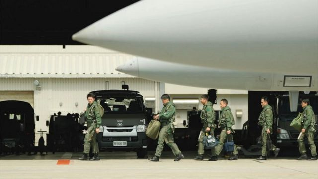
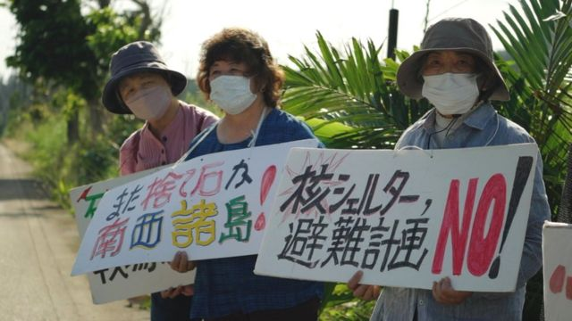
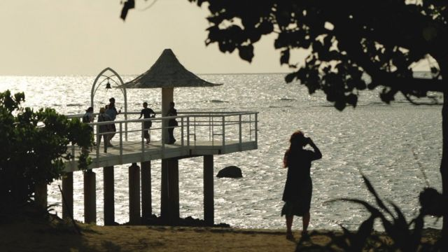
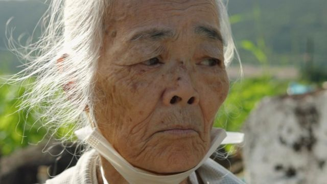

# [World] G7七国集团广岛峰会： 台湾问题料主导议程

#  G7七国集团广岛峰会： 台湾问题料主导议程

  * 沙伊玛·哈利勒（Shaimaa Khalil） 
  * BBC驻东京记者 

> 图像来源，  BBC/Jiro Akiba
>
> 图像加注文字，日本专家认为，乌克兰战争和印太地区紧张关系升温，把日本推到了“大国联盟的关键位置”。

**在日本冲绳那霸空军基地，F-15战斗机轰轰作响，让共用跑道的商用飞机相形见绌。**

三架战机相继起飞展开一天的训练，进行战斗演习和飞机拦截——有些已经进行了“真实的争夺”，或紧急呼叫去拦截可疑的中国军机。

日本自卫队空军中校田中（Masatoshi Tanaka）说，这些例行演习近期增添了一种紧迫感。

他说：“我们非常紧绷。我们每天面对日本领空被侵犯的情况。中国军方的活动在质和量上都有所扩大，包括无人机、轰炸机和侦察机。在这个区域有许多航空母舰在活动。”

那霸是冲绳岛链的一部分，而冲绳岛链处于台海潜在冲突的前线。北京声称拥有台湾，并指必要时会以武力夺取，这已成为世界上最大的引爆点之一，尤其在美中两国关系越趋紧张之际。

随着中国变得更加强硬，日本也越发关注台湾的安全。日本周末将在广岛举办七国集团峰会（G7 summit），中国议题料将主导峰会议程，而日本在建立区域稳定所扮演的角色只会增加。

日本国家政策研究所国际关系教授岩间洋子（Yoko Iwama）指出，乌克兰战争和印太地区升温，把日本推到了“大国联盟的关键位置”。

她说：“我们是美国在该地区的联盟以及伙伴关系网络的关键，我认为美国人已经意识到这一点。”

日本首相岸田文雄一直在采取行动来反映这一点。今年3月，在多年的沉默之后，日本与韩国实现了外交关系正常化，这被誉为“新篇章”。

同月，岸田会见印度总理莫迪（Narendra Modi），并突然访问乌克兰，承诺提供3000万美元（2400万英镑）的非致命军事援助。

在岸田的领导下，日本公布了自二战以来最大的军费增幅，承诺到2027年将国防开支翻一番——这将使日本成为世界上第三大军费支出国。这既说明了东京迫切需要表明它有能力保卫自己，也需要帮助它最亲密的盟友美国。

任何防卫方案都会涉及到美国，而冲绳是日本境内美军最集中的地方，但该国也要展示其战斗能力。外界期望增加军费足以震慑北京，避免该地区发生冲突。

不过日本离得很近，足以感受到一场它不乐见、但可能被卷入的冲突的涟漪。

> 图像来源，  BBC/ Jiro Akiba
>
> 图像加注文字，日本民众的反战抗议。

中国军队4月曾举行三天“封锁”台湾的军事演习，日本国防部表示，一艘中国航母在宫古岛以南约230公里（145英里）处，该岛也是冲绳岛链的一部分。

去年美国前众议院议长佩洛西访问台湾后，被激怒的中国发射导弹，至少五枚落入距离日本最西端与那国岛不到100公里处。

冲绳县石垣市市长中山义隆（Yoshitaka Nakayama）说：“在地理上，我们离台湾和东南亚非常近，我们感受到一种危机感。”

该岛距离那霸空军基地约一小时航程，是风景如画、以渔业和农业闻名的度假天堂，岛上的白沙和澄碧海水長期吸引着遊客和浮潜爱好者。

现在，石垣也是日本自卫队最新军事基地的所在地。当农民在基地周围的田地里照料他们的庄稼时，士兵们驻守大门口，起重机和推土机在施工。

中山义隆说，他们需要保护自己： “中国船只在附近非常近地巡逻。我们拥有的导弹发射器等设备是为了保护自己。这是为了保护我们，以防有飞机或船只想要攻击我们。我们不是在寻求战争。”

今年稍早有近600名士兵搬到这里，包括能够向中国东海和其他地区发射陆对舰和陆对空导弹的小队。

石垣岛和邻近的岛链紧邻两个冲突引爆点，一个是日本控制的尖阁诸岛，中国称该岛为钓鱼岛并拥有主权，另一个则是200公里外的台湾。

> 图像来源，  BBC/ Chika Nakayama
>
> 图像加注文字，石垣岛距离台湾只有200公里

而俄罗斯入侵乌克兰，也加剧了外界对中国潜在攻击的担忧，人们开始类比两者。

岩间教授说，两者确有相似之处。“普京和习近平是同类的领导人，而且两国都宣称由别人控制的土地是自己的。人们看到了这一点，并担心它可能发生在这里。”

她补充说，乌克兰大片地区被轰炸和炮击的画面，勾起人们的二战记忆，“你会感同身受”。

但这些记忆也激怒了石垣岛居民，他们担心家园再次陷入冲突。毕竟，冲绳是美军和日军历史性战斗的地点。

近80年后的今天，一个军事基地再次引爆这些恐惧，分裂了这个曾经紧密相连的社区。

85岁的山里节子（Setsuko Yamazato）在二战中失去四位家人，当她听说石垣岛正在建造军事基地时，她召集了“一群祖母”来反对。

她说：“我想到的第一件事是‘不要再来’。”

> 图像来源，  BBC/Jiro Akiba
>
> 图像加注文字，85岁的山里节子（Setsuko Yamazato）反对石垣岛建造军事基地。

现在，她和其他人每周都会到基地外抗议。她一手拿着拐杖，一手拿着“给我们的孩子一个和平的未来”橫額，嘴里念念有词，时不时停下来咳嗽一下，喘口气。

“自卫队要来这个岛了。他们要在这里建造一个导弹基地，”她喊道。“我们的岛是由弥勒佛保护的，不是由军队保护的。”

作为经历过战争的人，她说她不想在晚年再目睹另一场战争。

“我不希望这个岛成为战场，”她说。“我们已经被这个岛屿的自然和文化所熏陶。我不希望这些被战争摧毁或偷走。”

