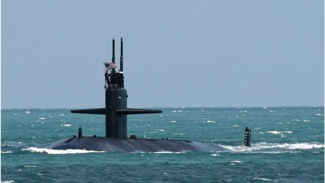
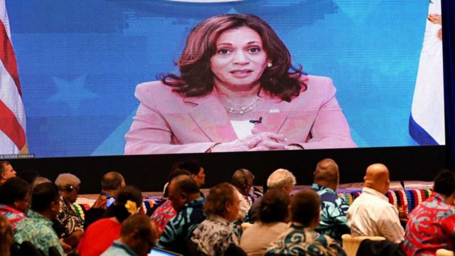
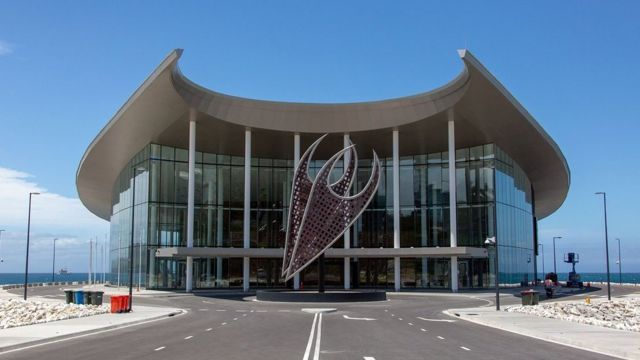

# [World] 中美博弈与南太平洋之爭：拜登取消访问巴新 美国是否能抗衡中国影响力

#  中美博弈与南太平洋之爭：拜登取消访问巴新 美国是否能抗衡中国影响力

  * 吕嘉鸿 
  * BBC中文 

> 图像来源，  AUSTRALIAN DEFENCE FORCE
>
> 图像加注文字，澳大利亚士兵2021年曾被派往所罗门群岛，帮助当地在骚乱后恢复秩序。

**七国集团（G7）首脑峰会星期五（5月19日）在日本广岛召开，美国在附近的太平洋岛链地带的部署动作也越来越大。**

此前在5月9日，美国国务院宣布在汤加（Tonga，东加）王国开设大使馆。这是1972年两国建交后，美国首次在汤加设立大使馆。各界分析，美国开始在南太平洋岛屿加强部署，目标是针对中国在该区域日益庞大的影响力。

澳大利亚国立大学讲师宋文笛告诉BBC中文说，拜登政府不断加强该区域的部署，代表着美中战略竞争的进一步“全球化”。中美双方的竞争已经从东亚和欧洲的传统战场转移到太平洋地区。

宋文笛解释，太平洋岛屿是重要的战略资源所在地，控制着连接美国与印太地区主要合作伙伴（尤其是与澳大利亚）的水道，“更不用说它是台湾仅剩不多的数个邦交国所在地。”

然而，本周意外传出，拜登因为联邦债务上限问题，取消了美国总统首次赴巴布亚新几内亚（Papua New Guinea，简称巴新）的访问；与此同时，原将在下周于澳大利亚举行的“四方安全会谈”（Quadrilateral Security Dialogue，缩写为QUAD），改为本周末在G7广岛峰会期间举行。有许多分析指出，这将损害美国在该区域抗衡中国影响力的工作。

美国总统拜登原计划同巴布亚新几内亚总理签署“国防和监视协议”，增强两国监控领海内的中国船只活动，保护当地资源。

拜登总统希望美国影响力重返南太平洋，但美国如何能联合盟友并与北京抗衡，成为外界关注的焦点。

##  美国“重返”南太平洋

> 图像来源，  Getty Images
>
> 图像加注文字，美国太平洋舰队潜艇部队司令杰夫·贾布隆少将今年5月表示，美军不再沉默，而是积极在此区域施行威慑（deterrance）战略（图为一艘核动力美国海军潜艇驶入卡纳维拉尔港的海军港口，资料照片）。

一般来说，除了澳大利亚和新西兰外，南太平洋岛国共有20多个国家和地区，其中包括巴布亚新几内亚、索罗门群岛（Solomon Islands）、马绍尔群岛（Marshall Islands）、斐济、汤加、帕劳（Palau，帛琉）、瑙鲁（Nauru，诺鲁）等等。

据位于台北的智库“国防安全研究院”副研究员黄恩浩的 研究  ，太平洋岛国群是连结南亚与南美的重要区域。他表示，冷战时期，美国为遏制前苏联扩张，该地区——也就是第二岛链通过的地带，过去一直是美国与盟友新西兰与澳洲积极防守的地带。

但1990年代，苏联瓦解后，美国逐渐对该区域丧失兴趣，陆续关闭南太平洋大使馆且减少援助，淡出该地区的经营。后来，在世界舞台崛起的中国，在外交扩张时，开始了解该区域的战略重要性，借由经济投资手段，逐渐开始将影响力带进该区域。

据路透社报道，美国国务院发言人马修·米勒（Matthew Miller）曾表示，“设立（汤加）大使馆象征彼此关系的补强，并强化我们对双边关系、汤加人民和我们在印太地区伙伴关系之承诺”。

美国国务院亚太事务助卿康达（Daniel Kritenbrink）也在开馆前夕说，美国在缺席30年后，今年也重新在索罗门群岛开设大使馆，并继续与瓦努阿图（Vanuatu，万那杜）、基里巴斯（Kiribati）就研议开设中的新大使馆接触。

> 图像来源，  Reuters
>
> 图像加注文字，所罗门2019年与台湾断交，并与中国建交（资料照片，图为所罗门群岛总理玛纳西·索加瓦雷、所罗门群岛外长耶利米·马内莱、中国国务院总理李克强、中国国务委员兼外交部长王毅出席在北京人民大会堂举行的签字仪式）。

美国为何要加码扩大在这些岛国的影响力？据外界分析，原因是虽然这些太平洋岛国人口稀少（比如汤加只有10万人口），总人口数加起来还不到百万，但这些岛国在太平洋的象征及战略意义越来越重。而且，美国这些年来不断加强在南太平洋岛国的军事外交部署，自然是想要抗衡北京借着“一带一路”，在该区域建立的庞大影响力。

##  “一带一路”与南太平洋

2012年，习近平上台没多久开始推动“一带一路”计划，在亚太地区，这些经济不宽裕但拥有丰富未开发自然资源的国家成为“一带一路”的重点目标。许多分析称，北京希望借着经济影响力扩大到政治影响力，目标是剔除美国、澳大利亚与新西兰在该区域的影响力。

北京的策略是以无偿援助或优惠贷款支持这些岛国的基础设施建设，特别是针对这些岛国的港口与机场建设，分析称此举不仅能提供经济利益，也给了北京从南海到南太平洋进行军事扩张的重要依托。

针对中国在南太平洋的发展，澳洲国立大学亚太学院研究员张登华对BBC中文称，太平洋岛屿是中国加入2003年联合国成立的“南南合作”计划中，针对安全及军事价值的重要区域。

“而这些岛国日益卷入大国博弈， 这将对该地区的政治、经济和安全架构产生深远的长期影响。”张登华分析说，中国在该区域的战略似乎侧重于政府对政府的合作方式，但他表示这也是一把双刃剑——此举虽然帮助北京在与太平洋岛国政府官员的往来中获得很大的影响力，但在非政府利益相关者中的影响力可能有限。譬如，民间社团或私人企业，并不总是与中国政府有那样紧密的关系。

此外，张登华还强调，中国提供的巨额贷款是另一个关注焦点，因为北京如何解决债务问题会影响其与这些国家的接触和关系。

毫无疑问，太平洋地区对北京很重要的另一理由是台湾，因为台湾现有的13个邦交国中有四个盟友来自南太平洋。台湾在该区域有四个邦交国：分别是马绍尔群岛、瑙鲁、帕劳、图瓦卢（Tuvalu，吐瓦鲁）四国。其中马绍尔群岛（1990至1998年）和瑙鲁（2002至2005年）曾与北京建交。

因此，两岸的外交竞逐，加上一直存在的美国、澳大利亚及新西兰与中国的抗衡，在这几年来越来越激烈。

> 图像来源，  Getty Images
>
> 图像加注文字，美国副总统卡玛拉·哈里斯2022年在斐济论坛上发表了讲话。

##  大国博弈：美国能抗衡中国吗？

自从索罗门群岛在2022年和中国达成安全协议以来，美国和澳洲、新西兰等盟友便一直关注中国是否有意仿效南海岛礁模式，逐渐在该区域建立海军基地。之后，美国也试图与马绍尔群岛、帕劳、密克罗尼西亚联邦（The Federated States of Micronesia）等国续签协议，希望维持对这些岛国的“防御责任”。

今年5月，美国太平洋舰队潜艇部队司令杰夫·贾布隆（Jeff Jablon）少将甚至在接受 采访  时表时，美军不再沉默，而是积极在此区域施行威慑（deterrance）战略。他说：“我们不会再将自己描述为沉默的队伍。威慑是我们潜艇部队的主要任务。如果不传达给外界你有的能力，你就无法拥有可靠的威慑力量；如果对手对这种特定威慑一无所知，那它就不是威慑。”

但美国真的能够对抗北京在该区域的影响力吗？

位于华府的保守派智库哈德逊研究所（ Hudson Institute））研究员长尾贤（Satoru Nagao）向BBC分析称，即使中国影响力已经扩大到该区域，美国及盟友再次扭转这些岛屿的态度，也是有可能的。长尾贤表示，这些岛屿的规模小，因此美国、澳洲或日本可以准备与中国相同规模的投资。这也是为什么今年举办“四方安全会谈”峰会，焦点就是讨论南太平洋问题。

他说：“这些举措将对扭转局势产生影响。如果中国继续扩大在南太平洋的影响力，把美国、澳大利亚和日本（还有印度在斐济等一些岛国的影响力）挤压得太厉害，‘四方安全会谈’国家会反击的。”

> 图像来源，  Getty Images
>
> 图像加注文字，巴布亚新几内亚主办APEC峰会会场之一的国际会展中心，是由中国援建。澳大利亚已向巴布亚新几内亚派遣特种部队，作为2018年11月在莫尔兹比港举行的APEC首脑会议的大规模安全行动的一部分。

目前中国在该区域开设了八个大使馆或领事馆（密克罗尼西亚、基里巴斯、萨摩亚、巴布亚新几内亚、所罗门、瓦努阿图、斐济和汤加），而美国开设了九个大使馆或领事馆（密克罗尼西亚、马绍尔、基里巴斯、萨摩亚、帕劳、巴布亚新几内亚、所罗门、斐济、汤加）。

哈德逊研究所研究员长尾贤因此认为，“尽管中国在某些领域有优势，但美国正对后者进行反制。”这些岛国忧心 “大象们打架，受伤害的是草”。然而，与此同时，由于存在竞争，“投资正在到来。而且因为投资规模大，美国的行动也不晚，在不久的将来，美国在该区域大使馆和领事馆的数量和相关投资也会增加。”

不过，原本下周要在澳洲悉尼举行的“四方安全会谈”因为美国总统拜登无法出席，改为G7峰会期间在日本举行。同时，拜登取消了赴巴布亚新几内亚的访问。有分析指出，此举将损害美国在该区域抗衡中国影响力的工作。

亚洲协会（Asia Society）高级研究员理查德·莫德（Richard Maude）对路透社说，拜登此次取消对巴布亚新几内亚访问恐会挫伤白宫与中南海在该地区争夺影响力的努力。他认为，本来这是美国总统首次访问这个独立的太平洋岛国，而该区域的情势正在转变，目前“转变已到一半的时刻，中国无时无刻不在施加影响，所以状况看来不太妙。”

曾经担任澳大利亚前情报局局长的莫德说，在南太平洋区域，“所有的事情都跟你会不会亲自‘亮相’有关。亮相是战斗的一半，而中国在那边一直都看得到人”。

