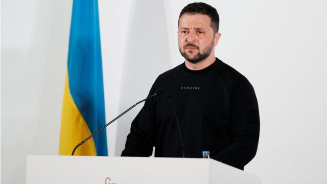
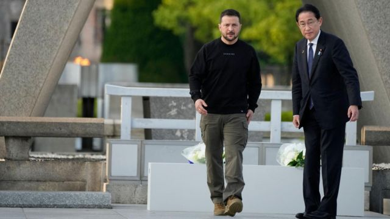

# [World] G7峰会最后一日，泽连斯基谈重建、反攻、F-16战机和争取印度支持

#  G7峰会最后一日，泽连斯基谈重建、反攻、F-16战机和争取印度支持

> 图像来源，  EPA

**乌克兰总统泽连斯基5月20日抵达日本广岛参加G7峰会，期间他与日本首相、英国首相、印度总理等国领导人会面，成为此次峰会最后一日的焦点人物。**

泽连斯基乘坐的是法国总统马克龙借给他的一架法国飞机。

以下是泽连斯基此行的一些亮点：

##  巴赫穆特

莫斯科支持的雇佣军组织声称控制巴赫穆特后，泽连斯基坚称巴赫穆特“没有被俄罗斯占领”。

这位乌克兰总统在前往日本广岛参加七国集团峰会期间发表了讲话。

瓦格纳创始人叶夫根尼·普里戈津（Yevgeny Prigozhin）早些时候宣布在巴赫穆特获胜。

但乌克兰军方消息人士告诉BBC，他们仍然控制着该市郊区的几座建筑。

在峰会最后一天的新闻发布会上，泽连斯基拒绝提供具体细节。但他表示，这座城市“截至今天”未被俄罗斯占领。去年8月以来，这座城市爆发了这场战争中持续时间最长、最血腥的战斗。

在周六发布的一段视频中，瓦格纳的普里戈津声称，他的武装分子已经完全控制了这座城市。这些武装分子领导了俄罗斯对巴赫穆特的进攻。

##  重建

星期天（5月21日）早些时候，他和日本首相岸田文雄一起参观了广岛和平纪念公园。1945年，美国在广岛投下了原子弹。

泽伦斯基向在袭击中丧生的人献了花圈。

将巴赫穆特比作二战中遭到原子弹袭击的广岛，并承诺对他的国家进行类似的“重建”。

> 图像来源，  EPA
>
> 图像加注文字，泽连斯基和日本首相岸田文雄

在与岸田文雄会晤后，他大步走进和平公园的一个礼堂，向记者发表讲话。

他在广岛和乌克兰之间做了几个类比，说该日本城市被轰炸后的废墟照片让他想起了今天的巴赫穆特。他称，乌克兰也会有类似的“重建和恢复”。

“现在广岛已经重建了他们的城市，我们也梦想着重建我们的城市，”他说。

##  反攻

在七国集团峰会上，泽连斯基还会见了多名它国领导人，游说他们提供更多支持。

他的坚持得到了回报。在峰会上，美国宣布将允许其西方盟友向乌克兰提供先进的战斗机，包括美国制造的F-16。

但到目前为止，还没有国家承诺向乌克兰提供战机。

当被BBC问及他对从盟友那里获得F-16战斗机有多大信心时，泽连斯基表示：“我确定，我们将为此努力……我不能告诉你有多少架。这不是秘密，我们真的不知道。”

BBC还问他被推迟的春季反攻何时重启。

“当我们发动反攻时，俄罗斯会有感觉的，”他回答。

##  印度

泽连斯基还在七国集团峰会间隙会见了印度总理莫迪，这是自俄罗斯入侵乌克兰以来两人首次会面。 印度拒绝谴责俄罗斯入侵。

印度总理在推特上发布了两张照片，其中一张领导人握手，另一张领导人似乎隔着桌子进行了激烈的对话，助手在他们身旁。

今年2月，印度在联合国大会谴责俄罗斯侵略的决议中投了弃权票，并坚持认为，和平对话是解决冲突的唯一办法。

俄罗斯和印度的关系可以追溯到冷战时期，俄罗斯是印度最大的武器供应国。俄罗斯还否决了联合国安理会对于有争议的克什米尔地区的决议。

