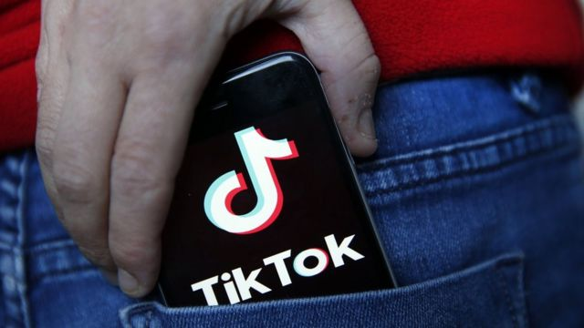
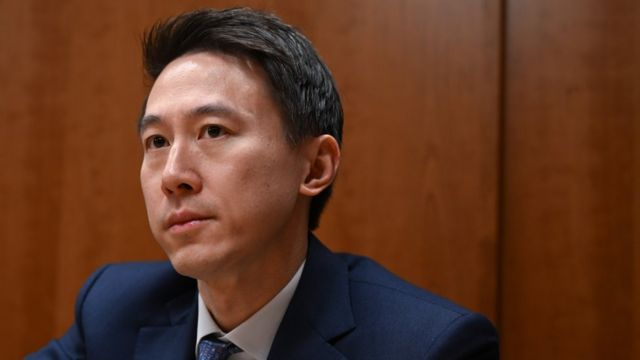

# [World] TikTok对美国蒙大拿州全面禁令提出法律诉讼

#  TikTok对美国蒙大拿州全面禁令提出法律诉讼

> 图像来源，  Getty Images

**TikTok已提起诉讼，要求推翻美国蒙大拿州禁止州民使用该社交媒体平台的立法。上周蒙大拿成为全美第一个全面禁止这个中国公司经营的影音短片应用程式的州。**

TikTok在一份声明中表示，该州的禁令与美国的言论自由权相冲突。

由于担心数据可能会被传递给中国政府，TikTok现在在全球各地都受到了审查。

该公司在美国蒙大拿州地方法院提起的诉讼称，他们正起诉并希望推翻这个“非法”禁令。TikTok一位发言人声明中说：“我们正在挑战蒙大拿州违反美国宪法的TikTok禁令，以保护我们的业务和蒙大拿州数十万的TikTok用户。”

> 图像来源，  Getty Images
>
> 图像加注文字，TikTok首席执行官周受资

“我们相信，基于极其强大的先例和事实，我们的挑战将成功。”

TikTok称，此禁令违反了美国宪法第一修正案赋予的言论自由权。投诉又称，该禁令“违宪地关闭了TikTok所有使用者的言论讲台”。

禁令将于 2024 年 1 月生效。此后应用商店提供TikTok将成为非法行为，但不会禁止已拥有TikTok的人使用它。

人口刚刚超过100万的蒙大拿州去年 12 月已经禁止在公共设备上使用该应用程序。TikTok表示公司拥有 1.5 亿美国用户。尽管该应用程序的用户群近年来有所扩大，但它仍最受青少年和 20 多岁用户的欢迎。

不过，美国政界担心TikTok可能成为国家安全风险隐患。该社交媒体平台归中国公司字节跳动所有，后者则一再否认它受中国政府控制。

此外，TikTok提出的诉讼还称，蒙大拿州过度关注用户数据和国家安全——但后者这是联邦政府的职权范围——蒙大拿州已经越权。它还说，该禁令基于中国政府可以访问TikTok数据，是“毫无根据的猜测”。

