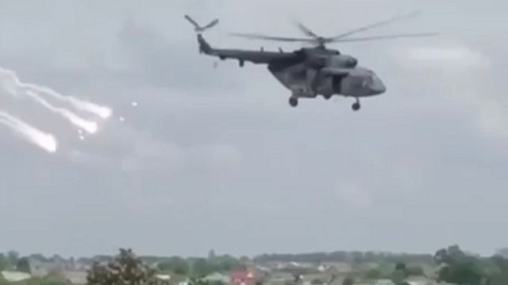

# [World] 乌克兰战争：俄罗斯一边境地区遭跨境武装组织袭击

#  乌克兰战争：俄罗斯一边境地区遭跨境武装组织袭击

> 图像来源，  Telegram
>
> 图像加注文字，5月22日在别尔哥罗德上空的直升机

**俄罗斯当局表示，一个武装组织从乌克兰越境进入俄罗斯别尔哥罗德（Belgorod）地区发动袭击，造成多人受伤。**

当地州长格拉德科夫（Vyacheslav Gladkov）表示，俄罗斯军队正在搜捕袭击边境地区格雷沃龙斯基（Grayvoronsky）的“破坏分子”。

普京的发言人表示，俄罗斯总统已被告知此事。

乌克兰否认对此事负责，并表示两个准军事组织的俄罗斯公民是此次入侵的幕后黑手。

格拉德科夫表示，有8人受伤，其中2人在一个村庄被炮弹击中后入院，3人在格雷沃龙镇被弹片击中。

他说，战斗还破坏了三座房屋和一座地方行政大楼，局势仍然“非常紧张”。

州长表示，已经在该地区开展了“反恐行动”，赋予当局特殊权力，包括身份核查和通信监控。

BBC事实核实（BBC Verify）一直在分析周一出现在社交媒体上的别尔哥罗德地区的视频。

到目前为止，团队已经找到了一段显然是由无人机拍摄的视频，视频中别尔哥罗德南部边境检查站附近有几辆装甲车。此外，BBC事实核实已经对在该地区行动的直升机画面进行地理定位。

这段视频是最近拍摄的，但很难从视频中确定事件的确切顺序。

基辅方面表示，此次事件的幕后黑手来自自由俄罗斯军团（Liberty of Russia Legion）和俄罗斯志愿军（Russian Volunteer Corps）。

总部位于乌克兰的俄罗斯民兵组织“自由俄罗斯军团”周一在推特上表示，他们已经“完全解放”了边境城镇科津卡（Kozinka）。该组织称，他们正在俄罗斯境内开展推翻总统普京的行动。它说，前方部队已经到达了更东边的格雷沃龙镇。

然而，普京的发言人佩斯科夫（Dmitry Peskov）告诉俄罗斯新闻机构，称正在努力消灭这个破坏组织，并表示其目的是转移人们对乌克兰东部城镇巴赫穆特（Bakhmut）的关注。一个俄罗斯雇佣军组织声称，经过数月激烈血腥战斗，他们已经控制了该镇。

“我们完全理解这种破坏的目的，就是转移人们对巴赫穆特方向的注意力，尽量减少乌克兰方面失去阿尔乔莫夫斯克（即巴赫穆特）的政治影响，”他说。

基辅方面表示，他们仍然控制着这座城市的部分地区。

乌克兰国防部长顾问尤利克·萨克（Yurik Sak）评论说：“这些袭击的背后是受够了恐怖主义政权行为的俄罗斯公民。”

在接受BBC广播第四频道的《今夜世界》节目（World Tonight）采访时，他对近期事态发展表示欢迎，也就是他所称的“日益增长的俄罗斯派别运动”。

但他表示，他无法证实或否认他的国家是否窝藏或支持相关组织。

这起最新事件发生在人们普遍预计基辅将对入侵的俄罗斯军队发动反攻之前。

自去年2月俄罗斯全面入侵乌克兰以来，别尔哥罗德和其他几个俄罗斯地区的部分地区遭到了火炮或无人机袭击。

俄罗斯官员指责乌克兰军方所为，乌克兰则否认发动对俄罗斯领土的破坏袭击活动。

今年4月，俄罗斯意外在乌克兰边境以北40公里处的别尔哥罗德市投下了一枚炸弹。

几天后，一枚未引爆的炸弹被发现，3000多人被从家中疏散。

