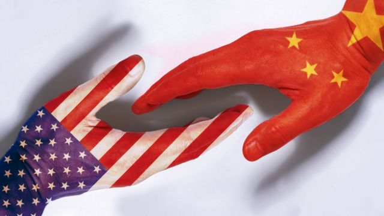
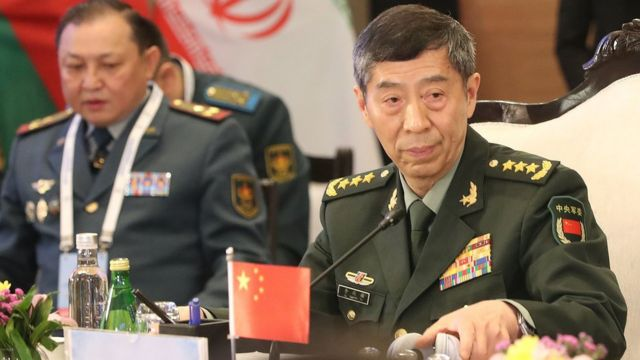
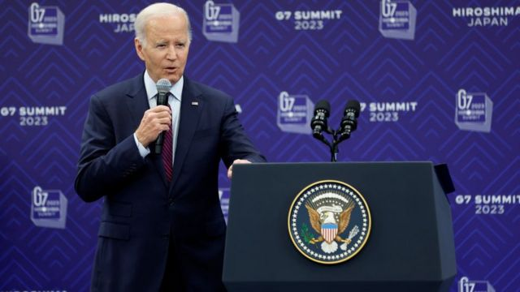

# [World] 拜登政府出“乌龙”，美中关系“回暖”再蒙阴影

#  拜登政府出“乌龙”，美中关系“回暖”再蒙阴影

  * 常思颖 
  * BBC中文 

> 图像来源，  Getty Images

**美国总统拜登早些时候在七国集团峰会闭幕时透露，就解除对中国国防部长李尚福的制裁“正在磋商中”。他还称， 今年2月发生的间谍气球事件相当愚蠢；並表示，预计两国关系“即将解冻”。**

拜登此番言论受到广泛关注。然而，仅一天后，美国国务院发言人就做出澄清表示，不会取消对李尚福的制裁 **，** 让“回暖”之说蒙上浓雾。

本周一（5月22日），当被问及是否考虑解除对这位中国防长制裁时，美国国务院发言人米勒（Matthew Miller）说：“不，我们没有。”

米勒还说，拜登“明确表示，我们不打算解除对他或更广泛地对中国采取的任何制裁。”

近年， 美中两国因贸易摩擦、高科技领域竞争以及台湾和南海等一系列问题关系急转直下。

拜登总统与习近平主席去年11月在巴厘岛的会面为缓和关系迎来一些曙光。然而，2月份的间谍气球事件致双边关系再次转冷，进入专家担心的“危险雷区”。

> 图像来源，  HARISH TYAGI/EPA-EFE/REX/Shutterstock
>
> 图像加注文字，中国国防部长李尚福今年3月履新，这是他4月出席在印度举办的上海合作组织防长会议。

##  制裁和筹码

> 图像来源，  Getty Images

2月的间谍气球事件后，美国取消了国务卿布林肯原定的访华之旅。 但最近几个月，许多华府要员都表示了希望与北京对话的意愿。布林肯5月初表示，希望今年年内能够访问中国。此外，美国财政部长耶伦（Janet Yellen）和美国商务部长雷蒙多（Gina Raimondo）也多次表示，希望能在近期访华。

但中国似乎表现冷淡。外交部发言人王文斌19日在回答有关耶伦访华的提问时说，“中美之间保持着必要沟通”，但没有回应具体的细节。

根据美国国防部公布的信息，今年2月，中国曾拒绝了美国国防部长奥斯汀（Lloyd Austin）与时任防长魏凤和会面的要求。

中国外交部多次重申，美方不能一边说要沟通，一边不择手段打压遏制中国。

美国智库德国马歇尔基金会（GMF）亚洲项目主任葛来仪（Bonnie Glaser）说，中国方面曾私下表示，除非美国解除制裁，否则李尚福不会与奧斯汀在新加坡举行的香格里拉对话上会面。

由于李尚福最近才被任命，如果这次不会面，“可能意味着高层国防官员之间在几年内都不会有任何会面，”葛来仪说。

中国外交部对美国维持制裁李尚福表示“坚决反对”。在拜登表示有关解除制裁正在磋商之后，外交部发言人毛宁22日说：“美方应立即撤销制裁，采取实际行动为对话沟通扫清障碍、营造氛围、创造有利条件。”

美国智库史汀生中心（Stimson Center）中国项目主任孙韵说：“由于美国想要寻求同中国的官方军事交流和对话，解除对中国国防部长的制裁是恢复对话的必要条件。所以如果美国的重点是恢复军事交流，解除制裁似乎是不可避免的。”

美国国防部发言人此前表示，对李尚福的制裁不影响两国防长会面，并称美国继续寻求与中国军方的沟通，“以确保竞争不会演变成冲突”。

美国卡特中心中国项目主任刘亚伟分析称， 美中关系已经进入“危险的雷区”， 拜登总统终于意识到中美目前零和博弈对两国的和平共处和世界的稳定都是非常危险的。

他说， 拜登很可能希望借此时机缓和关系，通过解除对李尚福的制裁来换取双方军事高层见面的机会。

“拜登及其中国团队一直强调无论与中国竞争多么激烈，与中国政府领导人和决策团队保持沟通渠道的畅通是必须的”，刘亚伟说，“我想拜登中国政策团队肯定有人提出了解除对李尚福将军的制裁的建议，拜登总统也觉得此‘计’可行。”

他还说：“取消或保留制裁本身对美国其实没有什么重要意义。”

李尚福今年3月刚刚上任，他在履新前曾任解放军总装备部副部长、解放军战略支援部队副司令员兼参谋长、中央军委装备发展部部长等职务。据报道，他曾在2017年和2018年试图向俄罗斯购买苏35战机与S-400地对空飞弹，被当时的特朗普政府加入财政部特别名单，禁止美国公民与其有商务往来。

##  进退两难

对美国来说，即便对李尚福的制裁没有实际意义，但解除制裁也是一个难题。

刘亚伟说，国务院发言人的澄清表明，拜登总统的中国政策团队意见并不一致，也分鹰派和鸽派。

他解释，如果取消对李尚福将军的制裁，国会的批评肯定会十分严厉。其次，美国反华阵营也会借此大做文章，批评拜登总统对“险恶的中共太心慈手软”。

“拜登政府的‘出尔反尔’说明即使他有稳定和改善美中关系的意愿，要按中国的要求拿出实际行动其实非常困难，”刘亚伟说。

“中美关系的解冻需要双方都改变自己的言行并修订自己的对内和对外政策。目前看不出两边有启动‘调头’的任何迹象。”

