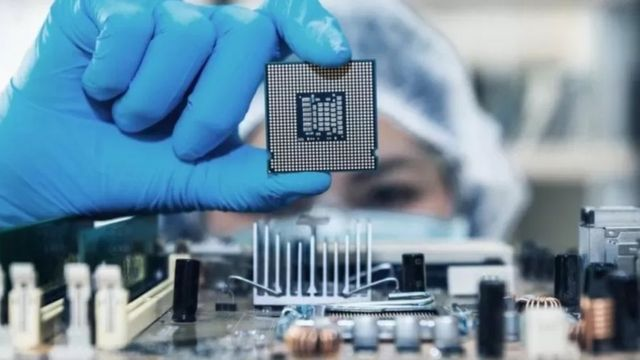

# [World] 日本加入限制芯片设备出口阵营 美国完成对华合围？

#  日本加入限制芯片设备出口阵营 美国完成对华合围？

> 图像来源，  GETTY IMAGES
>
> 图像加注文字，美国正迅速加大努力，试图阻碍中国在半导体行业的进步。

**本周，日本政府宣布限制出口半导体制造设备新规定将于7月23日正式生效。3月份日本已宣布对23种高性能半导体制造设备实施出口管制。**

新规并未指明针对中国，而是限制包括中国在内的160个国家，但中国占其半导体制造设备出口规模的三成左右，占比最高。

23种出口管制设备涵盖半导体清洗、成膜、光刻、蚀刻、检测等多个环节。日本经济产业省称，此举主要为防止半导体被用作军事用途，以应对日益严峻的国际安全环境。

中国商务部回应称，这是对出口管制措施的滥用，是对自由贸易和国际经贸规则的严重背离，中方对此坚决反对。

##  日本的加入意味着什么

从特朗普时代，美国就开始逐步对中国进行芯片（晶片）禁运，然后进一步延伸到芯片制造设备。早在2018年，在美国要求下，荷兰已对华禁运其阿斯麦（ASML）公司生产的最先进极紫外线光刻机。

> 图像来源，  EPA
>
> 图像加注文字，美国投资者还被禁止持有或交易中芯国际股票。

拜登上台后，谋求进一步在全球芯片产业链中排除中国。白宫一位安全顾问称，以前限制芯片出口的理由是“只需要比中国领先几代”，现在是“我们必须尽一切可能保持足够大的领先优势”。

美国战略与国际问题研究中心的研究员艾伦（Gregory C. Allen）则认为具体策略上讲体现在四点，首先禁运用于人工智能等行业的高端芯片；禁止使用EDA软件，可阻断中国企业的芯片研发；禁运美制半导体设备，阻断中国企业在高端芯片制造的发展；禁运半导体设备零部件，阻断中国企业在半导体制造设备方面的发展。

其中第一点已经实现。去年10月7日，美国商务部工业和安全局（BIS）宣布对芯片出口实施新的管制。其中禁止向中国销售18纳米及以下的DRAM芯片、28层及以上的NAND闪存芯片、14纳米及以下FinFET工艺的逻辑芯片生产工具，即刻生效。

随后，禁运开始向制造设备和零件延伸。虽然最先进的极紫外线光刻机已经对华禁运，但中国还能进口应用更广泛的深紫外光刻机，而全球有能力生产深紫外光刻机的只有荷兰的阿斯麦和日本的尼康。

> 图像来源，  Getty Images
>
> 图像加注文字，2021年上海举行的中国进口博览会上，一家日本半导体公司的展台。

路透社称，美国采取措施确保企业能保持竞争优势，而这些措施要有效果，就需要日本、荷兰两个行业巨头的合作。

今年1月，美国总统拜登分别会晤两国首相，希望一同加强对先进技术设备的出口管制，并安排了三方会谈敲定细节。3月份，荷兰和日本分别宣布了出口管制计划。本周，日本公布了具体时间表。

“这将破坏日本公司的市场拓展，从监管的角度讲，肯定会降低他们的竞争力，”日本大商社丸红商事的中国经济调查总监铃木贵元表示，日本国内缺乏一个足够大的芯片市场，这些出口限制对日本芯片设备制造商而言，将是一个打击。

目前，日本芯片制造设备产业规模为300亿美元左右，其中100亿美元的订单来自中国，居各个市场之首。

##  中国的反应

上述一系列针对中国的芯片禁令下，中国实施了首次反击——5月21日，中方宣布美光公司产品“存在较严重的网络安全隐患”，对中国的“关键信息基础设施供应链造成重大安全风险“，影响国家安全。要求中国的“关键信息基础设施的运营者应停止采购美光公司产品”。

美光是美国最大的存储芯片制造商，在电子设备中广泛应用，中国市场占该公司总销售的10%左右。

日本国立政策研究大学院大学经济学终身教授邢予青撰文表示，中国的企业显然并不掌握半导体产业和技术的“阻塞点”。因此，无法对美国实施对等的技术禁运。

邢予青表示，但中国流行的说法是以市场换技术，现在美国开启半导体技术上的禁运，这意味双方关于市场换技术的默契的结束。不给技术，自然也就不要指望市场了。这是中国利用市场优势的一次反击，效果如何还要看美国如何出牌。

> 图像来源，  Reuters
>
> 图像加注文字，有些专家认为，芯片已经成为“现在的石油”，容易受地缘政治影响而触发全球危机。

不过在日本的角度来看，中美撕破脸，也有好处。就在中国宣布对美光公司监管之时，彭博社援引知情人士称，美光科技将从日本政府获得约15亿美元资金，用于在当地生产下一代存储芯片，这有利提升日本国内半导体生产，对台湾芯片生产形成后备力量。

位于上海的咨询公司Intralink的分析师兰道尔（Stew Randall）认为，中国企业虽然在出口限制下，将失去获得很多日本设备和零件的机会，不过目前中国的芯片企业大多集中在较为成熟的生产节点上，不太会受到影响，但大家不得不静观其变。

长期来看，中国企业在全面的出口限制下，自研芯片能力将大受影响。比如，在设计环节所必备软件——电子设计自动化软件EDA，该领域三家巨头都是美国企业；制造环节的核心光刻机方面，中国也没有独立制造能力，而主要光刻机企业都受美国禁令的钳制。如果摆脱现有技术成果，从零积累，投入资金和周期都太大太长。

而这些影响，将顺着芯片继续向产业链下游传导——手机企业的国际竞争力将下降，比如华为不得不退出国际手机市场；电动汽车正在成为中国最有潜力的支柱产业，4月出口数量达到9.1万辆，同比增长1028.5%，而电动汽车平均要使用约3000个芯片，是非电动汽车的两倍多。

