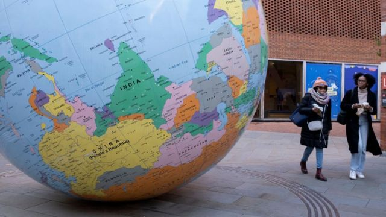
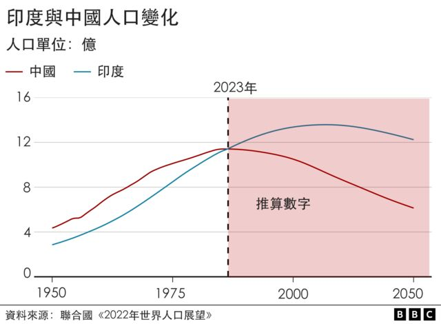
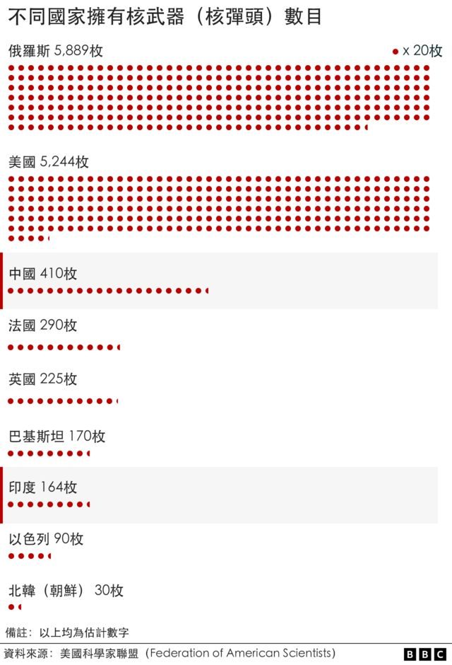
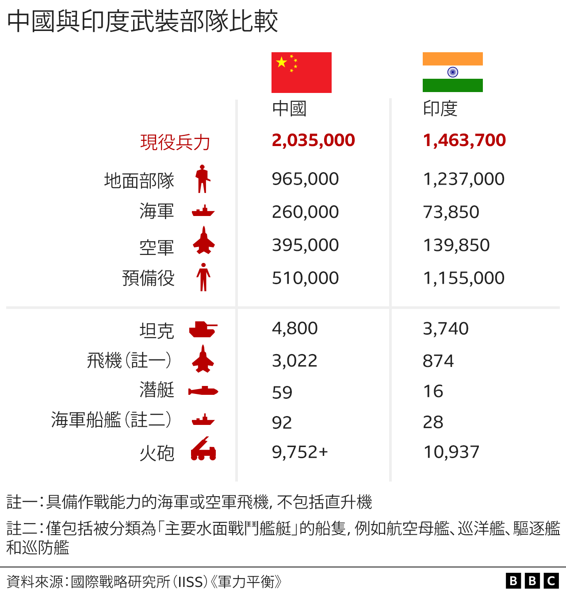
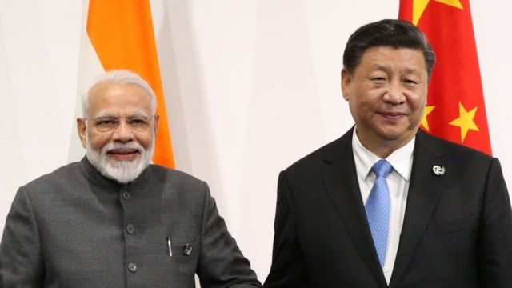
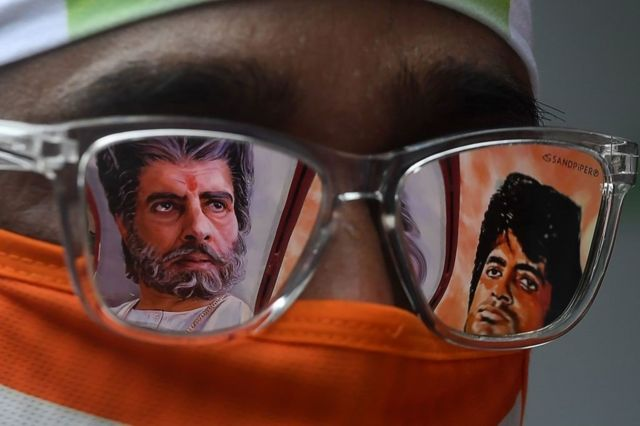

# [World] 印度人口超中国，它能成为一个全方位的超级大国吗

#  印度人口超中国，它能成为一个全方位的超级大国吗

  * 利卡多·森拉（Ricardo Senra） 
  * BBC记者 

> 图像来源，  Getty Images
>
> 图像加注文字，“人越多，国家便越强大，这是很19世纪的想法。”

**根据联合国数据，印度刚刚超越了中国，成为世界上人口最多的国家。那它能跟这强大的邻居匹配——甚至超越它——成为世界超级大国吗？**

在经济规模、地缘政治影响力与军力方面，北京仍然游刃有余，但专家们认为，这一格局正在改变。

2001年诺贝尔经济学奖得主麦克尔·斯澎斯（Michael Spence）认为，印度的高光时刻来临了。

这位斯坦福大学（Stanford University）的荣休院长暨教授对BBC说：“印度终将能与中国匹配。中国经济会放慢，但印度不会。”

但印度也面临挑战。

中国是世界第二大经济体，它几乎比印度大上五倍之多，印度仅排名第五。

印度中产阶层规模相对较小，需要下重本投资教育、提升生活标准、实现性别均等和经济改革，以实现“中国式”爆发增长。

要当世界超级大国，光靠人口和经济还不够格，还要看地缘政治与军事力量——印度在这些方面还望尘莫及。

软实力也会起关键作用。印度的宝莱坞（Bollywood）电影工业在国际上宣传本国方面甚具效率，还在网飞（Netflix；奈飞）上打破了好些纪录。

但另一边厢，也有所谓的华莱坞（Chinawood）——中国电影行业蓬勃发展，2020年首次取代好莱坞，登上全球最大票房宝座。2021年，中国卫冕成功。

##  印度的经济势头

目前，印度每天诞生8.6万个婴儿，中国则是4.94万个。
 出生率偏低  ， 中国人口已开始收缩  ，预计在本世纪末可能跌破10亿。

联合国指出，印度人口将持续增长至2064年，从目前的14亿增加到2064年的17亿。

这会让印度享受“人口红利”——经济随着劳动年龄人口增加而急速增长。

美国纽约新学院印度中国研究所（India China Institute, The New School ）所长马克·弗雷泽教授（Prof Mark Frazier）说：“印度1990年代增量改革如今开始分红了，但关键在于其劳动力队伍所接受的教育有多高，有多健康，技术能力有多强，还有他们有多大能力贡献经济。”
 印度近月吸引到苹果和富士康这样的主要跨国企业落户  ，但其内部官僚主义与政策朝令夕改所造成的不稳定吓怕了一些国际投资者。

弗雷泽教授补充说，“人越多，国家便越强大，这是很19世纪的想法。”因为还有别的因素要考虑进去。

根据世界银行（The World Bank）数据，目前印度劳动人口（14至64岁）中，只有一半在劳动，或在求职。

只看女性的话，比率更跌至25%——中国的是60%，欧盟则是52%。

经历1980与1990年代的连串改革，中国经济规模增长超越了所有国家。但2019新冠病毒病（COVID-19）疫情、人口老龄化和与西方关系日趋紧张相互叠加，正影响着这个国家的经济增长。

印度国内生产总值（GDP）增速已超越中国，根据国际货币基金组织（IMF）预测，这样的势头还将持续。

那么，经济增速放慢是否意味着中国将走向边缘化？

斯澎斯教授解释说：“要是中国维持增长4%到5%直到2030年，那将是个骄人成就。大家也许会想，对于一个经济增速8%到9%的国家来说这是一种糟糕的减速，但这样其实不太对。”

“中国现在更像美国，我们从未有过8%、9%、10%这样的增长率。他们将要依赖生产率的提升。我想他们做得到，因为他们对教育、科学技术等做了巨额投入。”

##  中国的军事扩张

中国与印度都是核大国，这让他们在国际博弈上占有战略先机。

据美国科学家联盟（Federation of American Scientists）估算，北京的核武器库规模是新德里的2.5倍。

中国比印度多近60万兵力，且重点投资建设国防工业。

弗雷泽教授说：“ 印度非常依赖俄罗斯  ，引进了他们的技术与专长，中国则毫无疑问做了许多科研，自主研发军事基础建设。”

中国在国防军工领域有明显优势，印度则倾向与欧洲和美国维持良好关系，那里有的是世界绝大部分军事力量。

弗雷泽教授补充说：“印度可以成为印太地区的一个重要战略伙伴，美国政府正围绕中国建立某种安全区，这不仅包括东亚，还包括南亚；不仅包括西太平洋，也包括印度洋。”

##  地缘政治的选择

印度是本年度二十国集团（G20）峰会东道主，当拥有全球85%财富的国家的领袖坐在谈判桌上时，印度似乎有了推销自己的机会。

自特朗普（Donald Trump）担任美国总统以来，北京与各世界强国的关系日趋恶化，但从俄罗斯到南非，从沙特阿拉伯到欧盟，中国仍然是超过120个国家的主要经济伙伴。

伴随着投资数万亿美元的“一带一路”项目而来的，是中国在海外的政治影响上更加游刃有余。

印度虽然被西方视为关键的地缘政治伙伴，但北京手握联合国安全理事会五个常任理事国席位之一，这意味着它在这个组织中，几乎对一切重大决策均有包括否决在内的决定权。

> 图像来源，  Getty Images
>
> 图像加注文字，印度总理莫迪（左）与中国国家主席习近平（右）各自面对着截然不同的挑战。

过去数十年，印度与其他新兴经济体都在想方设法去改变此局面，可没有人成功过。

弗雷泽教授说：“我不会寻求当上安理会的新常任理事国，纵使我们都很清楚，让一场在1945年结束的冲突当中胜利的国家继续经营全球安全秩序是毫无道理的。”

斯澎斯教授也同意。

“投票权再也不反映经济体量和影响力，远远不能反映。总有一天要不就是世界去改革这些体制，要不就是这些机制与时代脱节，因为会有别的取而代之。”

目前最主要的代替品是金砖五国（BRICS）——一个由巴西、俄罗斯、中国与南非所组成，旨在抗衡北方世界（Global North）经济与地缘政治影响力的集团。

##  软实力

> 图像来源，  China News Service
>
> 图像加注文字，“华莱坞”（Chinawood）——中国电影院票房收益自2020年起连续两年超越美国市场。

一个世纪之前，好莱坞（Hollywood）将电影院改造成一件强而有力的工具，将美国价值与影响力向外输出。

中国与印度成功地依样画葫芦。

自2007年起，中国电影院数目翻了20番，达到8万间。相比之下，美国有4.1万间，印度有9300间。

美国加州大学河滨分校（University of California Riverside）传媒与文化研究系副教授苏为群博士（Dr Wendy Su）说：“疫情以前，华莱坞维持着增长势头，透过合拍片和并购好莱坞片商来扩展其全球影响力。”

但在2020和2021年连续两年超越美国电影市场之后，受新冠疫情相关的电影院闭锁命令影响，中国电影票房收益在2022年同比下跌36%。

而虽然宝莱坞被广泛认为是亚洲版本的好莱坞，华莱坞对于多数人来说仍然很陌生。

> 图像来源，  AFP
>
> 图像加注文字，宝莱坞（Bollywood）让印度电影走向国际。

苏为群博士说：“宝莱坞在世界上的影响力更大、更强。”

“即使在中国，宝莱坞电影对中国观众影响甚深。 《摔跤吧！爸爸》  （Dangal，2016年一部讲述前摔跤选手马哈维亚·辛格·珀尕（Mahavir Singh Phogat）的影片；台译《我和我的冠军女儿》、港译《打死不离3父女》）的票房收益击败了所有在中国放映的好莱坞影片，连续16天占据中国电影票房首位。它上映了60天，这也是环球电影史上数一数二的长寿电影。”

