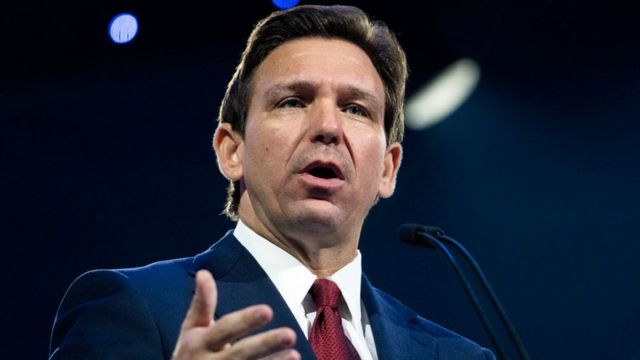

# [World] 美国大选2024：德桑蒂斯在推特技术故障中开始了竞选之旅

#  美国大选2024：德桑蒂斯在推特技术故障中开始了竞选之旅

> 图像来源，  Getty Images
>
> 图像加注文字，德桑蒂斯的参选将对特朗普形成挑战。

**美国佛罗里达州州长罗恩·德桑蒂斯(RonDeSantis，迪尚特)已经宣布角逐2024年共和党总统提名。**

他5月24日接受推特行政总裁马斯克（Elon Musk）直播访问，但这场推特空间（Twitter Spaces）的活动却出现技术故障，延误20分钟才开始。

他在直播中宣传其保守派立场、疫情期间的反封城措施和教育改革。

德桑蒂斯说：“我正在竞选美国总统，以引领我们的伟大美国卷土重来。”

##  特朗普劲敌

此前，前总统特朗普已宣布争取共和党下届总统提名，而德桑蒂斯被视为特朗普的主要对手。

德桑蒂斯在美国政坛相对资浅，他于2012年首次当选国会议员。仅仅六年后的2018年，他在竞选参议员失败后当选佛罗里达州州长。

他监督颁布了备受瞩目的法律，使拥有枪支更加容易，限制学校的性教育和性别认同教育，并减少堕胎机会。

他声称，这个“佛罗里达州蓝图”可以作为联邦政策的指南，使美国朝着更保守的方向发展。

他是寻求推翻特朗普的竞争者之一，但特朗普目前在全国民调中以30多个百分点于党内领先。

5月24日推特直播正式开始时，数十万推特用户已离开该平台。

自马斯克去年10月执掌推特以来，他已经解雇数千名员工，包括负责网站运营和技术故障处理的工程师。

发生技术失误后，德桑蒂斯的团队迅速进行公关粉饰，他们在推特上写道，这次直播让人“兴奋到网络不堪负荷”，并发布一个竞选网站的链接。

其新闻秘书格里芬（Bryan Griffin）称，在线活动一小时内筹集了100万美元（80.8万英镑）。

据路透社统计，推特直播一度吸引了60多万名听众，但到活动结束时人数只有不到30万。对照之下，英国广播公司(BBC)上月采访马斯克，在推特空间上吸引了300多万听众。

##  保守立场

直播开始后，德桑蒂斯把话题转向其保守立场，吹捧其对佛州疫情危机的处理——当时他反封城的做法获得许多共和党人称赞。

他辩护自己对佛州的教育系统改革，说他的州“选择了事实而不是恐惧，教育而不是灌输，法律和秩序而不是暴动和混乱”。

随后，德桑蒂斯接受福克斯新闻（Fox News）访问时谈到更具体的承诺，包括入主白宫首天就宣布美国南部边境进入紧急状态，并承诺解雇特朗普任命的联邦调查局局长克里斯托弗·雷（Christopher Wray），以及撤销总统拜登的“反美能源政策”。

5月24日稍早，德桑蒂斯确认寻求共和党总统提名，他在联邦选举委员会登记后发布一条风格化的公告影片。

“我们的边境是一场灾难，罪案侵扰着我们的城市……而总统陷入困境，”他在影片中说。“但是衰退是一种选择，成功是可以实现的，自由是值得争取的。”

特朗普及其竞选团队在这位前总统的社交平台Truth Social上，发出大量电邮和帖文，表示欢迎德桑蒂斯加入2024年竞选。

德桑蒂斯在直播中告诉马斯克他将研究美国宪法、“看看我可以按什么按钮”来调用行政权力后不久，特朗普随即发文针对德桑蒂斯说：“我的红色按键更大、更好、更强，而且运作正常（真相！），你的不是！(根据在我与朝鲜的金正恩的谈话，他很快就会成为我的朋友!）”

美国晨间咨询公司（Morning Consult）最新调查显示，在德桑蒂斯宣布参选前，他落后特朗普38个百分点，在共和党内位居第二。

在明年初开始的漫长初选过程，共和党选民将决定哪位候选人将在2024年11月大选中，面对寻求连任的民主党总统拜登。

##  竞选资金丰厚

佛罗里达州议会最近通过一项法案，容许州长不必辞职也能参选总统，这为德桑蒂斯的候选资格清除了潜在的“辞职竞选”障碍。

他还将拥有丰厚的竞选资金。截至上月底，他在佛罗里达州竞选连任时剩下的基金中有8800万美元（7100万英镑），可转用于总统竞选基金。

据报道，他还有大约3000万美元由一个独立委员会控制，其盟友可用来支持他竞选。

相比之下，特朗普说在2023年的前三个月，其筹款总额为1880万美元。

德桑蒂斯料将起用佩克（Generra Peck）为竞选经理。佩克是德桑蒂斯的最高政治顾问，2022年曾领导州长竞选连任的日常运作，助他取得了近20个百分点的胜利。

根据美联社和《纽约时报》报道，德桑蒂斯已在至少18个州的竞选基地进行招聘。

