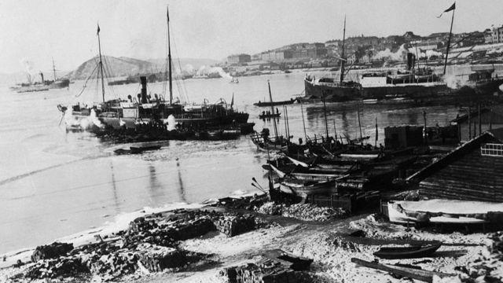
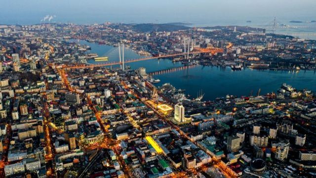
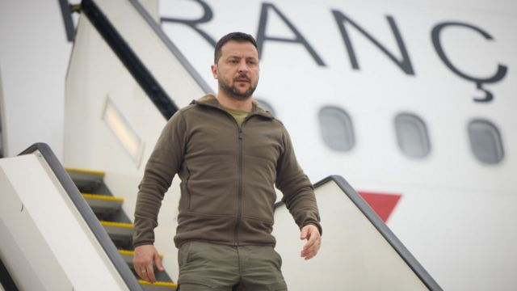
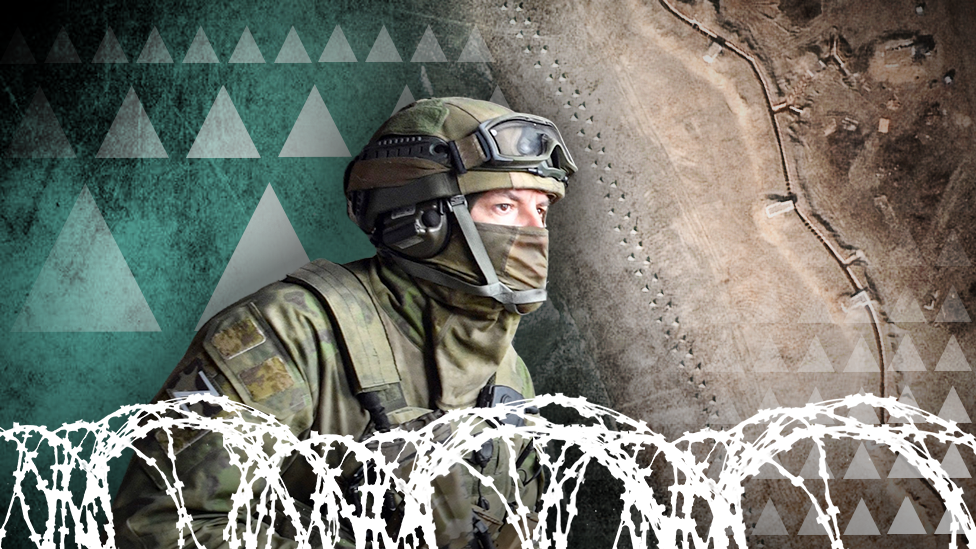
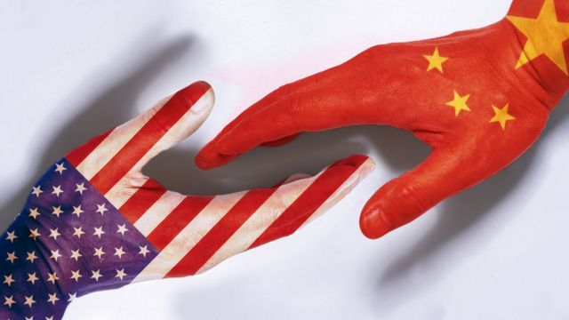

# [World] G7峰会、乌克兰战争、中俄远东互动和本周更多重要故事

#  G7峰会、乌克兰战争、中俄远东互动和本周更多重要故事

> 图像来源，  Getty Image
>
> 图像加注文字，1893年的符拉迪沃斯托克港，此时距割让给俄国33年。

**五月第四周，七大工业国集团（G7）领袖高峰会在日本广岛落幕。乌克兰总统泽连斯基（Volodymyr Zelensky 泽伦斯基）受到全球瞩目。**

美国总统拜登在G7峰会闭幕时透露，就解除对中国国防部长李尚福的制裁“正在磋商中”。然而仅一天后，美国国务院发言人就做出澄清表示，不会取消对李尚福的制裁。美中关系回暖蒙上阴影。

除此之外，中国打算在吉林省增加俄罗斯符拉迪沃斯托克港（旧称“海参崴”）作为内贸货物中转口岸。BBC带你了解中俄远东互动的现实与历史。

刚刚过去的一周，BBC中文以下新闻内容受到读者的关注。如果你错过了，我们带你一一回顾。

##  1\. 符拉迪沃斯托克变身中国内贸港？

> 图像来源，  Getty Image
>
> 图像加注文字，符拉迪沃斯托克临近俄、中、朝三国交界之处，三面临海，是俄罗斯在太平洋沿岸最大的港口。

中国海关总署近期发文称，同意在吉林省进一步扩大内贸货物跨境运输业务范围，增加俄罗斯符拉迪沃斯托克港（中国旧称“海参崴”）作为内贸货物中转口岸。

这意味着，中国的货物在国内运输，穿过中俄边境，通过符拉迪沃斯托克港出海，再在中国东南沿海港口卸货。而中国则按照国内货物流通来处理，不必经过出口和进口的繁杂程序。

##  2\. G7峰会：联合声明剑指中国“经济胁迫” 泽连斯基成最后一日焦点

> 图像来源，  Getty Images
>
> 图像加注文字，乌克兰总统泽连斯基亲自飞抵广岛，并与多国领袖会面，全球瞩目。

七大工业国集团（G7）领袖高峰会周日（5月21日）在日本广岛落幕。周六抵达的乌克兰总统泽连斯基（Volodymyr Zelensky 泽伦斯基）会议最后一天与多国领袖会面， 受全球瞩目。

此次会议扩大了参与国家范围，澳大利亚及印度领袖均受邀请出席。 同时，“四方安全对话”（QUAD）也改在广岛会场举行。

##  3\. 乌克兰战争：BBC透过卫星图片披露俄罗斯军队的防御部署

在被俄罗斯占领的克里米亚半岛上，一个海滩度假村现在布满了军事防御工事，另个主要道路两旁设有反坦克壕沟。

BBC Verify的丹尼尔·帕隆博（ Daniele Palumbo）与艾赫旺·雷沃特（​​Erwan Rivault）分析了一些重要的卫星图片，披露俄罗斯军队为了准备应对乌克兰可能的大规模反攻所建造的大片防御工事。

##  4\. 拜登政府出“乌龙”，美中关系“回暖”再蒙阴影

> 图像来源，  Getty Images

美国总统拜登早些时候在七国集团峰会闭幕时透露，就解除对中国国防部长李尚福的制裁“正在磋商中”。他还称， 今年2月发生的间谍气球事件相当愚蠢；並表示，预计两国关系“即将解冻”。

拜登此番言论受到广泛关注。然而，仅一天后，美国国务院发言人就做出澄清表示，不会取消对李尚福的制裁 **，** 让“回暖”之说蒙上浓雾。

##  5\. 中国一标志性同志机构“因不可抗力”关闭 性少数群体倍感“唇亡齿寒”

> 图像来源，  Getty Images

“北同文化”是一家开展青年心理支持和多元性别教育的公益机构，2008年成立。因资历深厚、资源广泛等因素，在性少数群体中被视为推动权益保障的重要平台，也为中国首都以外地区的相关机构撑起保护伞。

该机构宣布“因不可抗力”决定终止运营。最近几年，在中国言论空间紧缩的环境下，许多LGBTQ的团体纷纷停止运作，北同最终也难逃厄运。

**本周其他** **重要** **故事：**

