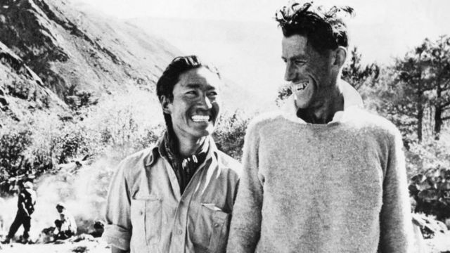
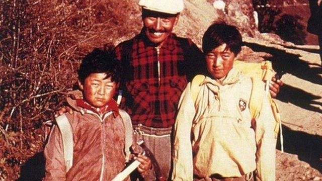
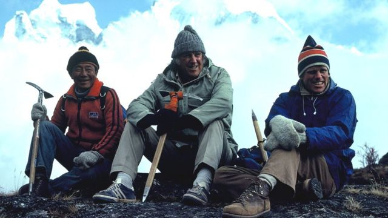
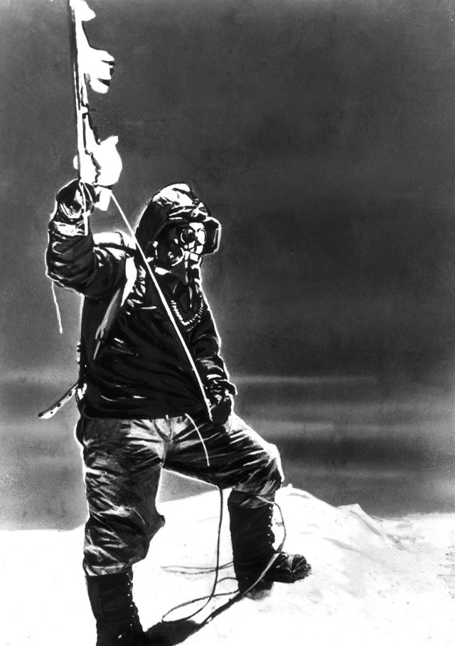
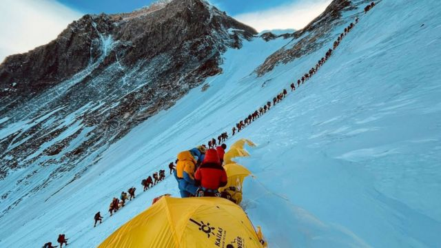
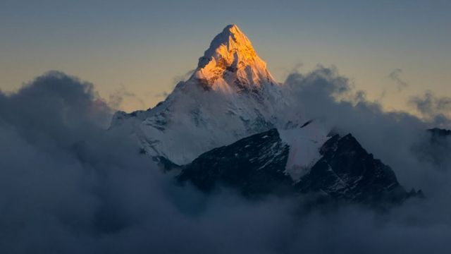

# [World] 珠峰登顶70周年：父辈首次成功的经历和如今的攀登热潮

#  珠峰登顶70周年：父辈首次成功的经历和如今的攀登热潮

  * 斯瓦米纳坦·纳塔拉詹（Swaminathan Natarajan) 
  * BBC国际台 

> 图像来源，  Getty Images
>
> 图像加注文字，1953年5月29日，丹增·诺盖(39岁)和埃德蒙·希拉里(33岁)登顶珠穆朗玛峰后不久拍摄的照片。

**“我认为他们是真正的开拓者和探险家，给未知领域铺平了道路。正是因为他们两人和他们的团队，我们今天才能做很多事情。” 詹姆林·丹增·诺盖（Jamling Tenzing Norgay）说。**

他指的是70年前的5月29日，那一天他的父亲成为全球首次登顶世界最高峰的人。

丹增·诺盖 （Tenzing Norgay）在新西兰养蜂人埃德蒙·希拉里（Edmund Hillary）的陪同下登上了尼泊尔与中国边境的珠穆朗玛峰。

两位登山者的儿子，詹姆林·丹增·诺盖（Jamling Tenzing Norgay）和彼得·希拉里（Peter Hillary），从小就听着父亲的英雄故事长大。两人都追随父亲的脚步征服了珠穆朗玛峰。

在这次历史性攀登的周年纪念日，他们自豪地向BBC讲述了父亲的辉煌成就。

##  登顶先驱

> 图像来源，  Jamling Norgay
>
> 图像加注文字，1970年代中期，詹姆林与他的父亲和弟弟在一起。

“他们上去时只是普通人，回来后成了世界英雄。这并没有改变他们。他们都是同样简单和谦逊的人。都用自己的余生回馈了喜马拉雅山的人民，” 詹姆林自豪地说。

“每当有人做了以前从未做到过的事情，就会向别人发出你也可以做到的信号。在（人类首次登顶珠峰）70周年之际，让我们庆祝这一成就。”

1953年的登顶无疑开创了一个先例，很多人都会效仿：在今年登山季的头十天里，500多人登上了8849米高的珠峰峰顶。

技术、物流和通信的进步使这一切成为可能，但丹增·诺盖和埃德蒙·希拉里当时是在没有GPS或卫星电话等现代设备的情况下实现了这一壮举。

他们成功的消息过了三天才传到伦敦。

在这次登顶之前的30年里，两人多次探险都未能成功。

其中丹增·诺盖参与了20年里的六次登顶尝试，包括1952年那次近在咫尺的失败。

“当我父亲还是个养牦牛的男孩时，他常常好奇为什么没有鸟能飞过那座山，” 詹姆林回忆说。

“喇嘛（高级佛教僧侣）的预言激励着他，他说佛教徒会首先登上顶峰。”

##  闻名世界的15分钟

> 图像来源，  Peter Hillary
>
> 图像加注文字，埃德蒙·希拉里(中)和彼得(右)与像明玛次仁这样的夏尔巴人登山者保持着长久往来。

彼得说，当父亲被邀请参加英国第九次攀登珠峰探险队时，他知道那是个创造历史的好机会。

“他一直都知道自己想要走在前面。他是个雄心勃勃的人，”彼得在接受BBC《见证历史》节目采访时表示。

“我记得最清楚的一件事是，他描述自己如何穿过冰雪向南峰攀登。”

“他说他当时在前面，切出台阶，大片的雪和冰从陡峭的山坡上崩落下来，落到西藏。”

他们不顾恶劣的天气继续前进。彼得说，如果是其它高峰，他父亲可能会放弃，改天再来。他相信内心有个声音告诉父亲要继续前进。

他们在到达山顶时已经缺氧了。在世界之巅待了大约15分钟后，他们下来了。

##  标志性形象

> 图像来源，  ullstein bild via Getty Images
>
> 图像加注文字，丹增在珠穆朗玛峰上的照片，由埃德蒙·希拉里拍摄。

丹增在雪里埋了一些糖果和饼干，作为佛教的祭品。

埃德蒙·希拉里拍摄了几张照片，照片中丹增挥舞着代表英国、尼泊尔、联合国和印度的旗帜。

但是没有希拉里在顶峰的照片。

“爸爸开玩笑说，据他所知，丹增从未用过相机——他不认为这是开始的地方，”彼得回忆道。

几十年后，当彼得和詹姆林登上珠穆朗玛峰时，他们都更清楚自己的父亲曾穿越过的未知领域。

“我第一次攀登是在1990年。我只是一直在想我爸爸。当我走到希拉里台阶时，我目睹了我父亲看到过的景象。我也有同样的经历。这让人非常激动，”彼得告诉BBC。

詹姆林1996年因宗教和个人原因“登顶”。

他和父亲都是夏尔巴人，这是来自西藏的民族，以登山技能而闻名，他们与喜马拉雅山有着深厚的精神联系。

“对我来说，这更像是一次朝圣。我想重新与我的宗教和习俗联系起来，了解我父亲所经历的一切。”

##  过度拥挤

> 图像来源，  Getty Images
>
> 图像加注文字，2001年，登山者在攀登珠穆朗玛峰的一个斜坡时排起了长队。

随着每年都有众多人登顶珠峰，彼得和詹姆林没有像他们的父亲那样受到公众的追捧。

周二，卡米·丽塔（Kami Rita）第28次登上顶峰，打破了自己创造的纪录，而这距离他自己上次创造纪录只有一周的时间。

但他说自己不会很快退休，可能是因为他的竞争对手夏尔巴人帕桑达瓦（Pasang Dawa）紧随其后，已经26次登顶，而且还在增加。

拉克帕·夏尔巴（Lakpa Sherpa）保持着女性登山者的纪录，去年她第10次登顶。他们都不是家喻户晓的人物。

“与我父亲的时代相比，现在攀岩变得容易多了。技术帮助很大。登顶后，一些人乘坐直升机从2号营地前往加德满都。所有的路线都设定好了，氧气和其他设备都由夏尔巴人携带。”詹姆林继续说道。

“没有冒险的刺激。它已经成为一项摄影事件。爬山并不是因为他们喜欢爬。”

彼得部分赞同这一观点。“我们从大本营到山顶有很多绳索，有跨越裂缝的梯子，还有夏尔巴人团队在营地里端着热茶。你可以在6300米到6500米的高空被直升机安全救出。”

“可是山还是老样子。这是一座具有挑战性的大山。”

这说法较为保守。在过去的100年里，有300多名登山者死亡。仅这一季，死亡人数就达到11人。

“这座山教会你尊重自然，”卡姆林说。“我们只是这个星球上的过客。”

> 图像来源，  Getty Images

