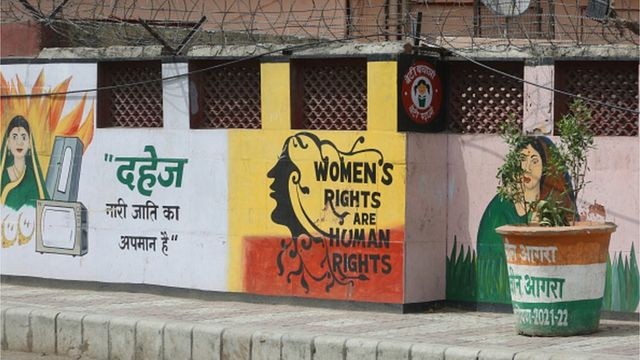

# [World] 繁荣如何刺激印度的嫁妆需求

#  繁荣如何刺激印度的嫁妆需求

  * 苏蒂克·比斯瓦斯（Soutik Biswas） 
  * BBC驻德里记者 

> 图像来源，  Hindustan Times
>
> 图像加注文字，尽管支付和接受嫁妆自1961年开始在印度一直是非法的，但它仍然盛行。

**一项新的研究发现，随着过去几十年印度男性受教育程度和工作机会在的改善，嫁妆的流行程度有所上升。**

在南亚，支付和接受嫁妆是一个有几百年历史的传统，新娘的父母会向新郎家赠送现金、衣服和珠宝。尽管这种做法自1961年开始在印度一直是非法的，但它仍然盛行，并让妇女容易被家庭暴力困扰甚至死亡。

南加州大学的杰弗里·韦弗（Jeffrey Weaver）和弗吉尼亚大学的高拉夫·奇普伦卡（Gaurav Chiplunkar）研究了1930年至1999年间印度74000多对婚姻，来研究嫁妆的演变。

他们计算“净嫁妆”，即新娘家送给新郎或其家人的现金和礼物与新郎家送给新娘家的现金和礼物的价值之差。这是一项对印度17个人口最多的邦的家庭进行的专家小组调查，研究人员依据的是来自“印度农村经济和人口调查”的数据。

大多数印度人的婚姻仍然是包办的，几乎所有的女性都在快30岁的时候结婚。1999年前，约90%的婚姻涉及嫁妆。1950年至1999年间的嫁妆支付总额为近2500亿美元。

韦弗在接受BBC采访时表示，研究发现，尤其是在20世纪40年代至80年代，经济增长延续并推动了支付嫁妆的做法。他说：“在这段时间里，越来越多的男性接受了教育，找到了质量更好的工作，这导致了嫁妆的增加。”

> 图像来源，  Getty Images

##  印度的婚姻

  * 在印度，几乎所有的婚姻都是一夫一妻制 

  * 只有不到1%的人离婚 

  * 父母在选择新娘/新郎方面扮演着重要的角色，在1960年至2005年间，超过90%的婚姻是由父母选择配偶的 

  * 超过90%的夫妇婚后与夫家同住 

  * 超过85%的女性嫁给了自己村子以外的人 

  * 78.3%的婚姻都在同一地区 

资料来源：印度人类发展调查，2005年；2006年全国家庭卫生调查。

根据这项研究，考虑新郎素质的变化分布，可以最有效地理解嫁妆的产生和演变，新郎素质的变化分布与他们的教育和收入提升有关。（女性在印度劳动力中的低参与度意味着男性有更多更好的工作。）

换句话说，“高质量的新郎”——受过良好教育并拥有有更好的工作——要求更高的嫁妆。研究发现，随着婚姻市场上受过良好教育的新郎数量的增加，受过良好教育的新郎获得的“嫁妆溢价”就会减少。

“强大的经济因素让嫁妆永久化。在新娘方面，拒绝为女儿支付嫁妆的家庭只能选择‘质量较低’的新郎。新郎有很强的经济动机接受嫁妆，特别是如果他们的家庭必须为自己的女儿支付嫁妆，或者想要收回对新郎教育的投资，”韦弗和奇普伦卡写道。

> 图像来源，  Getty Images
>
> 图像加注文字，印度阿格拉一幅宣传女性权利的壁画上写道：嫁妆是对女性的侮辱。

嫁妆可能是印度独有的吗？英属哥伦比亚大学（University of British Columbia）的西万·安德森（Siwan Anderson）发表的另一篇论文认为，与印度不同，在包括欧洲在内的许多社会，嫁妆支付随着财富的增长而下降。安德森表示，在印度等以种姓为基础的社会，财富的增加也导致了嫁妆的增加。

韦弗和奇普伦卡表示，他们的研究发现，关于嫁妆习俗兴起的传统解释几乎没有证据。

一种理论认为，嫁妆是在高种姓家庭中实行的，随着低种姓家庭效仿这些做法来提高他们的社会流动性，嫁妆也随之传播。这项新的研究表示，这一点尚不清楚，因为嫁妆的习俗在高种姓和低种姓群体中几乎同时开始。

此外一些专家认为，低种姓女性嫁给高种姓男性的愿望推动了嫁妆的变化。韦弗说这种观点是“不正确的”，因为“跨种姓婚姻太少了”——在被研究的婚姻中，94%的印度人在他们的大种姓群体内结婚。

那随着越来越多的女性接受教育，嫁妆会发生什么变化？

> 图像来源，  Getty Images
>
> 图像加注文字，印度嫁妆礼物包括现金和实物。

在过去二三十年里，印度女性受教育程度有了显著提高，超过了男性。韦弗表示，这可能会导致要求嫁妆这样的做法减少，但目前没有支持这一现象的数据。

但该研究确实发现证据表明，在一个地区受教育的女性越多，“嫁妆金额就会减少”。

然而，研究发现，与男性平均受教育年限增加一年相比，女性平均受教育年限增加一年的影响要小得多。这可能是因为女性不太可能工作，并且“在劳动力市场上从她们的教育中获得经济回报”。

显然，促进妇女的教育和增加她们的劳动力参与可以帮助解决嫁妆的祸害。

