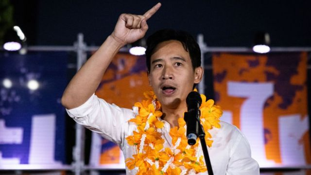
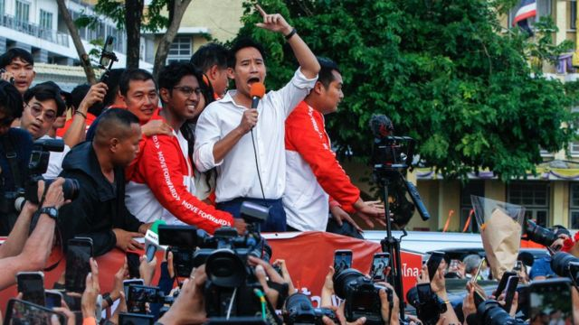
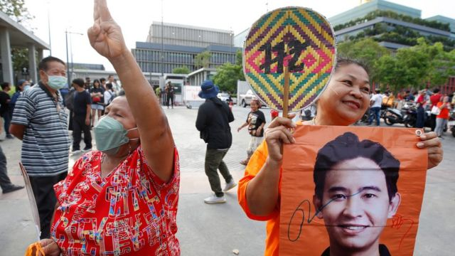

# [World] 皮塔·林家伦拉：泰国大选新贵，誓言要与众不同

#  皮塔·林家伦拉：泰国大选新贵，誓言要与众不同

  * 乔纳森·赫德（Jonathan Head） 
  * BBC驻东南亚记者 

> 图像来源，  Getty Images

**皮塔·林家伦拉（Pita Limjaroenrat）并非是一位典型的泰国政治家。**

泰国内阁部长的平均年龄为65岁，尊敬长辈仍是珍贵传统，而皮塔·林家伦拉很年轻（看起来比实际的42岁年轻得多），并且毫不掩饰地自信，这使他脱颖而出。

他所领导的改革派“前进党”（Move Forward）在最近一次选举中领先于其他政党，结果令人震惊。他将成为78年来最年轻的总理，这让大部分时间里都在统治泰国的保守派政治机构感到震惊。

与第二大政党“为泰党”（Pheu Thai）组建联合政府的艰难谈判正在进行中。为泰党自2001年以来赢得了泰国的每一次选举，并有望赢得5月14日举行的选举。

为泰党和前进党都认为自己是进步的政党，反对像2014年政变那样用军事干预政治，那场政变推翻了为泰党政府。

但是，前进党的年轻活动人士智胜老党，并击败了该党的许多候选人，他们以富有想象力的、基于社交媒体的竞选活动，为选民提供了与过去彻底决裂的机会以及不同的政治领导。

> 图像来源，  Getty Images

“我不一样，”皮塔告诉我。“我们组建联合政府不是为了寻求权宜之计，也不是为了让我成为总理。我在政府是为人民服务。世界已经变了。

“我不需要成为一个强壮的男人，带着有毒的男子气概，来确保‘人们必须听我的，我必须一直成为聚光灯下的那个人’。

“我不需要一直保持完美。我可以像泰国的普通人一样，骑摩托车，像其他人一样在街上吃东西。”

皮塔出生在一个富裕的泰国家庭。

他十几岁时在新西兰上学，后来在美国读研究生，毕业后到家族米糠企业工作，以及在叫车公司Grab担任高管，这些经历都影响了他的性格。

他欣赏脚踏实地的领导人，比如新西兰的杰辛达·阿德恩（Jacinda Ardern）和乌拉圭的何塞·“佩佩”·穆希卡（josjos“Pepe”Mujica）。

前进党拥有泰国选举史上最雄心勃勃的改革议程。

该党宣布了300项政策，其中包括推动泰国LGBTQ人群的平等婚姻，结束征兵，解决商业垄断问题，以及改革教育体系以适应21世纪的经济。

该党计划废除军方起草的宪法，并将军方的许多商业利益置于财政部之下。

皮塔说：“现在是结束军事政变循环的时候了，也是结束为政变打开大门的政治腐败的时候了。”

但该党最具争议的提议是修改《君主法》（lèse majesté law），并开始讨论君主制与泰国人民之间的关系。该法对被判侮辱王室的人处以长期监禁。

在250名参议员中，有许多人说，他们将因这个问题而阻止“前进党”的人选担任总理。这些参议员由前军政府任命，按照规定，他们必须参加议会投票选出下一任总理。

“那个时代的情绪已经改变了，”皮塔说。

> 图像来源，  EPA
>
> 图像加注文字，前进党利用社交媒体赢得了大量民众的支持。

“我认为我们现在已经可以成熟和宽容地谈论君主制。即使保守派也明白，君主立宪制在21世纪应该扮演什么角色。”

“我们赢得了1400万人的选票。他们明白，这很清楚、很透明，这是我们想要推动的议程之一。”

这位前进党领导人相信，他的联盟目前在议会下院500个席位中拥有312个席位，将得到64名参议员的支持，使他们获得所需的绝对多数。

然而，参议院内部消息人士表示，只要前进党继续致力于修改《君主法》，这将很难实现；但至少有一些参议员，他们的非选举任期只剩下一年，对于反对一个在选举中赢得明显多数的联盟感到不安。

皮塔也承诺采取新的外交政策。

过去10年，在军方政府的领导下，泰国被普遍认为在国际事务中没有发挥应有的作用，总理巴育（Prayuth Chan-ocha）对外交政策不感兴趣。

“当然，我们需要更多地与国际社会接触，”皮塔说。

“我们必须重新平衡。我们必须大声疾呼，我们必须站在以规则为基础的世界秩序一边。不说话，在外交政策上没有分量。”

“我们的许多问题，无论是经济问题、空气污染问题，还是化肥价格问题，都来自世界其他地区。”

他说，他的政府将与泰国的邻国东盟（东南亚国家联盟）更密切地合作，寻求解决缅甸内战的办法，他还会试图将更多的人道主义援助输送到泰缅边境。

这位年轻的候任总理面临着令人生畏的挑战。

一方面是持怀疑态度的参议院，另一方面是需要与为泰党达成协议。为泰党只比进步党少赢得10个席位，而且其团队中有更多经验丰富的谈判代表。

为泰党一直要求获得最高职位，以及有权力的国会议长的职位。皮塔认为，要想让他的许多新法案获得通过，这个职位是优先考虑的。

他的政党主要由首次当选的议员组成，其中一些人年龄太小，达不到担任部长的35岁门槛，还有一些人因过去的政治活动仍面临严重的刑事指控。

为泰党在意识形态上更加灵活，对君主制采取不干涉的态度，可以选择加入另一个联盟，该联盟包括即将离任的政府中的政党。

前进党排除了这种妥协，该党通过承诺不与将军们做交易赢得了许多选票。

皮塔认为，两党都不能放弃他所称的梦想和希望联盟，因为这会损害他们的声誉。

他轻松地承担着这些责任，仍然抽出时间与家人在一起，对事情会解决持轻松乐观的态度。

他告诉我：“我不想像其他泰国政客一样，七八十岁还在为职位而战。”

“我想再干十年，然后就该干点别的了。”

