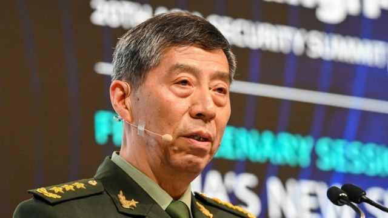
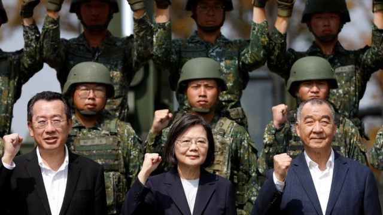
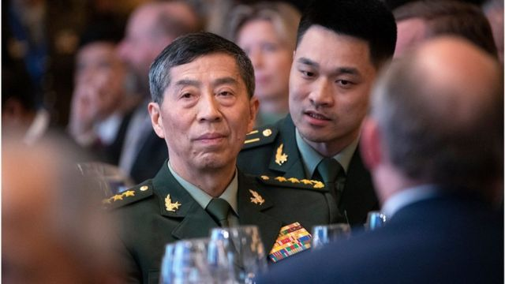
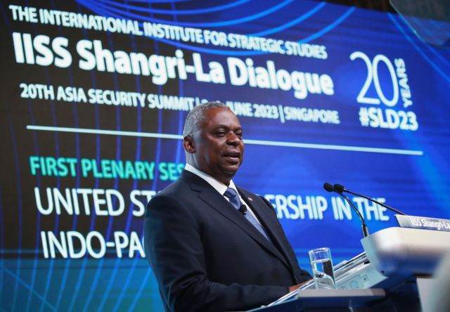
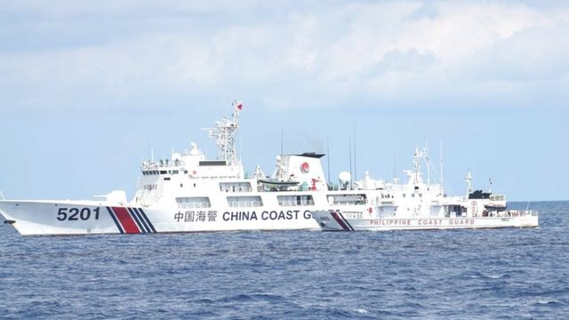

# [World] 中国国防部长李尚福香格里拉对话会上释放全方位强硬信号

#  中国国防部长李尚福香格里拉对话会上释放全方位强硬信号

> 图像来源，  AFP
>
> 图像加注文字，李尚福在三月上任中国国防部长。

**中国国防部长李尚福在香格里拉对话会上发表上任后第一次重大演讲，当中提到，中美如发生激烈冲突，将是世界“不可承受之痛”。**

在这次安全防务领域峰会上，李尚福指，“一些国家”正在亚洲加剧军备竞赛。

但是他表示，世界足够大，可以容纳中美共同发展，两个超级大国应寻求合作共赢之道。

李尚福在讲话中并未直接提及美国，而是称“有的国家肆意插手他国内政和地区事务”。

他表示，中国“决不能”让美国在多个地区发动“颜色革命”和代理人战争的事情在亚太地区重演。

美国较早前曾指控中国驱逐舰在台湾海峡靠近一艘美国军舰时有“不安全”的操作。

周六（6月3日），美国海军指，一艘中国驱逐舰“以不安全的方式”驶近一艘美国军舰，当时美国军舰正和加拿大船只一同经过台湾海峡。

中国批评美加两国“有意制造事端，蓄意挑起风险，恶意破坏地区和平稳定”。美加则称自己是在国际法允许范围内航行。

在演讲中，他表示中国不会允许美国及其盟友在南海“以航行自由之名行航行霸权之实”。

上周，华盛顿公布一段视频指，中国战机在南中国海以“非必要的挑衅性”动作靠近美国军机。

##  中国在台湾问题上“不畏惧任何对手”

被问及台湾海峡问题时，李尚福表示，是“域外国家”在加剧这一地区的紧张局势。

他重申，台湾问题是中国“核心利益中的核心”，任何“虚化”一个中国原则的行径都是“荒谬和危险的”。

> 图像来源，  Reuters
>
> 图像加注文字，台湾问题持续成为中美关系的一个矛盾点。

他批评台湾民进党“挟洋谋独”，外部势力“以台制华”干涉中国内政，称这才是台海局势紧张的根源。

“我们愿以最大诚意，尽最大努力争取和平统一，但决不承诺放弃使用武力，”李尚福说，“如果有人胆敢把台湾从中国分裂出去，中国军队不会有丝毫迟疑，不畏惧任何对手，不管付出多大代价，都将坚决维护国家主权和领土完整。”

##  批评美国“冷战思维”

今年3月上任中国防长的李尚福指控美国采取“冷战思维”，“导致安全风险大增”。

他提到美国提出的“印太战略”，表示中方认为，任何战略都不能“以意识形态划线”，以“假想威胁”构建排他性军事同盟。

他又指，试图推进“亚太北约化”的本质是绑架地区国家、渲染冲突对抗，只会令这一地区陷入撕裂、纷争和冲突的漩涡。

##  中美对话未发生

李尚福是在新加坡出席香格里拉对话会时作出上述言论。这是亚太地区唯一的年度安全防务峰会。

美国在2018年就俄罗斯武器购买问题对李尚福实施制裁。为表抗议，北京最近数次拒绝两国防长对话的请求。

> 图像来源，  HOW HWEE YOUNG/EPA-EFE/REX/Shutterstock
>
> 图像加注文字，2018年遭美国制裁的中国防长李尚福回绝了与美国防长奥斯汀会晤的邀请。

在新加坡的峰会上，美国国防部长奥斯汀（Lloyd Austin）指责中国拒绝进行军事讨论。

奥斯汀和李尚福在周五（6月2日）的峰会开幕晚宴上曾握手并短暂交谈，但是有关报道指，当中并无实质性交流。

中国一名代表团成员向法新社表示，美方解除对李尚福的制裁是进行对话的前提条件。

有专家表示，美中两国都没有兴趣与对方真正交流。

##  美国防长批评中国

较早前，奥斯汀在香格里拉对话峰会上发表题为“美国在印太地区的领导力”的演讲，对中国不愿参与军事危机管理“深表关切”。

> 图像来源，  EPA
>
> 图像加注文字，美国国防部长奥斯汀表示，“我们谈得越多，就越能避免可能导致危机或冲突的误解和误判”。

他强调，台海战争将是毁灭性的，会以“我们无法想象的方式影响全球经济”。

他批评说，中国在国际空域“对美国和盟国飞机进行危险拦截的数量惊人”，重申美方将支持盟国和伙伴对抗“胁迫和欺凌”。

他同时指，美国坚定地致力于维护台湾的现状，“冲突既不是迫在眉睫，也不是不可避免的”，会维持美国的强大威慑力量。

尽管中美之间存在外交争论，美国国务院一名高级官员还是抵达了北京，进行为期一周的广泛对话。

华盛顿和北京近年在一系列问题上出现紧张关系，包括中国对台湾的主权主张，以及南中国海的领海主权争议。

> 图像加注文字，中国在南海的主权主张是亚太地区安全问题的重大议题。

##  与英、德防长会晤

李尚福在周末的峰会期间，分别与英国、德国防长以及欧盟代表进行双边会谈。

欧盟外交与安全政策高级代表博雷利（Josep Borrell）称双方有建设性对话，德国防长皮斯托里乌斯（Boris Pistorius）则呼吁中国停止招募德国退役飞行员为中国战斗机师进行培训。

德国防长向法新社表示，李尚福在会谈中未否认这一说法，但试图从其视角淡化这一事件的重要性。

此外，李尚福还与英国防务大臣本·华莱士（Ben Wallace）有过会谈，后者向中方表明了英国对香港民主运动、国际航行自由、维吾尔族人权、台海局势等议题的看法。

