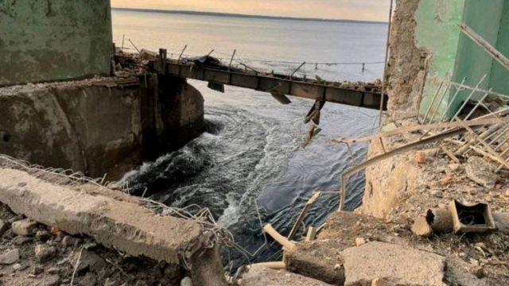
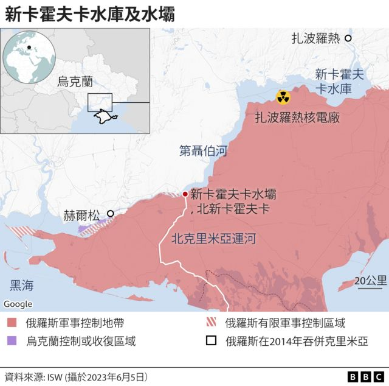
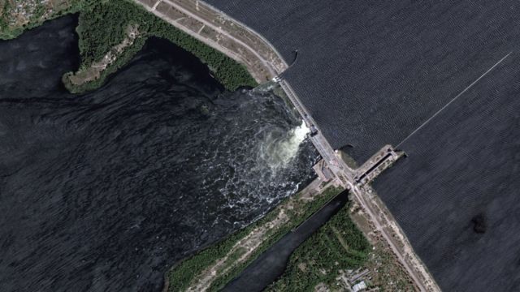
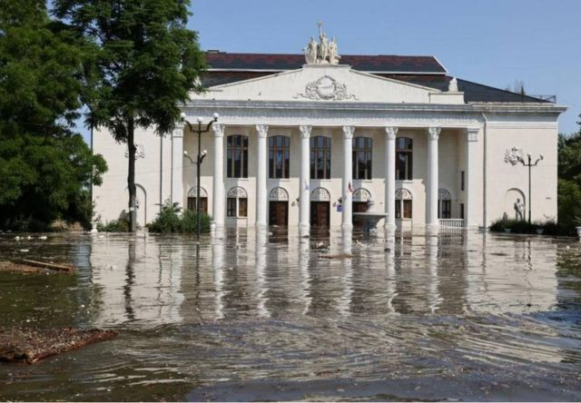
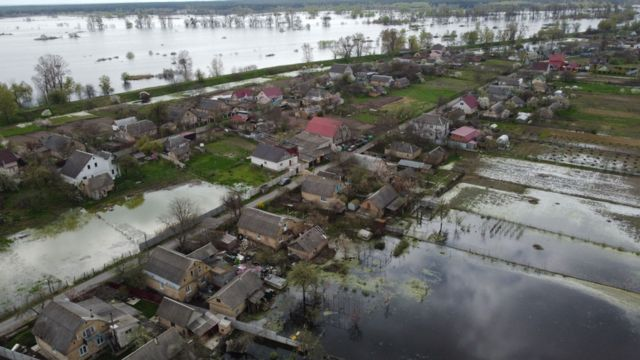
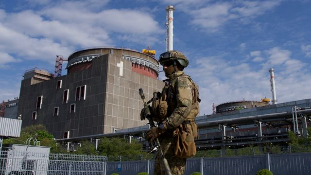
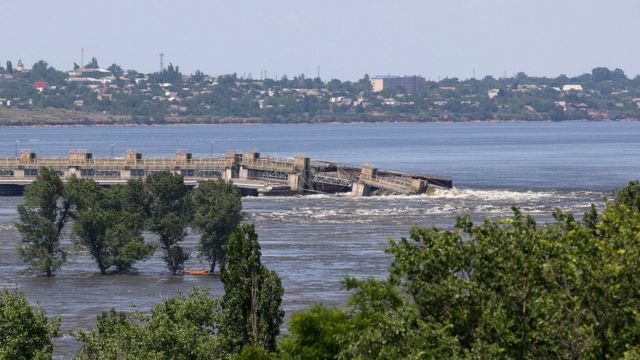

# [World] 乌克兰水坝遭炸毁：数千平民逃命 俄乌均否认发动攻击

#  乌克兰水坝遭炸毁：数千平民逃命 俄乌均否认发动攻击

> 图像来源，  Reuters
>
> 图像加注文字，由于水坝已决口，下游大片土地被洪水淹没，位于赫尔松对岸（东岸）的地区实际上对乌克兰装甲部队来说已成为禁区。

**在俄罗斯占领的一座乌克兰重要水坝被炸毁后，数千民众正从水坝下游疏散。俄乌相互指控对方是炸毁水坝的元凶。**

乌克兰总统泽连斯基表示，新卡霍夫卡（Nova Kakhovka）的水坝被毁后，可能有80个城镇和村庄会被淹没，他将此归咎于俄罗斯。滚滚河水正涌入德聂伯河，据说已经对赫尔松市构成了致命性的洪灾风险。

俄罗斯否认摧毁了这座由其控制的水坝，并指责是乌克兰炮击所致。

基辅和莫斯科就大坝决口相互指责，交战双方的说法尚未得到BBC的证实。

卡霍夫卡水坝位于巨大的卡霍夫卡水库（Kakhovka reservoir）下游，对该地区至关重要。该水库为当地农民和居民提供水源，也为扎波罗热核电厂（Zaporizhzhia Nuclear Power Plant）提供水源。它还是向俄罗斯占领的克里米亚南部输水的重要通道。

乌克兰国有水电厂管理机构警告称，预计当地时间周三（6月7日）上午水库排放下游的高峰期会到来。随后将进入一个“稳定期”，预计水位将在四至五天内迅速下降。

但是各界对意外如何影响欧洲最大的扎波罗热核电厂的情况表示关注，因为该核电厂使用水库的水进行冷却。

根据国际原子能机构（IAEA）的说法，该地的情况得到控制，核安全“目前没有立即的风险。”

视频显示洪水涌过水坝破口，几个城镇已经被淹，而下游地区的居民被迫乘坐公交车和火车逃离。

> 图像来源，  Reuters
>
> 图像加注文字，视频显示洪水涌过水坝破口，几个城镇已经被淹，而下游地区的居民被迫乘坐公交车和火车逃离。

乌克兰副检察总长利特维诺娃在乌克兰电视台上表示，约有4万人需要撤离，其中乌克兰控制的德聂伯河以西地区有1万7千人，俄罗斯控制的东部地区有2万5千人。

同样在乌克兰电视台上发表讲话的乌克兰内政部长克里门科表示，到目前为止已经撤离了约1千人，并有24个定居点被淹。他指责俄罗斯炮击了赫尔松南部地区，该地区正在撤离人员，并警告水位上升后，暴露的地雷将带来危险。

一位名为安德烈的居民住在靠近这座水坝的区域，该水坝在俄罗斯2022年2月发起全面入侵后不久被俄军占领。他表示相信俄罗斯想要“淹没”他的城市。

在乌克兰控制的赫尔松市，一位名叫苏德蜜拉的女士正在将她的物品，包括一台洗衣机，装载到连接在一辆老爷车的拖车上。她说：“我们害怕洪水。我们正把东西移到高处。”

她呼吁将俄罗斯军队“赶出这里……他们对我们开枪。他们正在淹没我们并在干其他坏事。”

该市的另一位居民塞尔吉也告诉BBC说，担心“这里的一切都要毁灭了。”他说：“所有的生物，包括人类，都将被大水淹没。”他指着附近的房屋和花园示意。

> 图像来源，  Reuters

在被俄罗斯占领的新卡霍夫卡河岸上，由莫斯科指派的市长莱昂捷夫表示该城市已经被淹没，已疏散了900人。他表示，当局将派出53辆撤离公交车将城市和附近两个定居点的人们送往安全地区。他补充说，水位已上升到11公尺以上，一些老百姓已被送往医院。

克里姆林宫指派的官员表示，小镇奥列什基（Oleshky）也受到严重的洪水影响。

位于被俄罗斯占领河岸的卡兹科瓦迪布罗瓦动物园（The Kazkova Dibrova zoo）已完全被淹没，该动物园在其脸书专页上表示，园内300只动物都已死亡。

目前还不清楚是什么原因导致在周二凌晨水坝被毁，但乌克兰的军事情报部门指责俄罗斯有意炸毁水坝。

这种说法似乎合理，因为莫斯科可能担心乌克兰军队会利用水坝上的道路进入他们控制的领土，作为反攻行动的一部分。

> 图像来源，  Getty Images
>
> 图像加注文字，莫斯科可能担心乌克兰军队会利用水坝上的道路进入俄罗斯控制的领土，作为反攻行动的一部分。

对于渴望保住在乌克兰南部占领领土的莫斯科来说，这座水坝成了一个需要面对的问题。就像去年秋天，乌军攻击水坝下游的道路和铁路桥梁，成功地孤立了赫尔松市周围的俄罗斯军队一样，莫斯科此次可能决计摧毁水坝来阻止乌克兰的反攻。

他们忧心乌克兰的反攻可能来自多个方向。

然而，一位俄罗斯官员声称是乌克兰袭击了水坝，以转移对其反攻行动失败的注意力，并剥夺克里米亚（2014年被俄罗斯非法吞并）的淡水供给。

人们一直预计乌克兰将发起一场重大反攻。基辅表示不会提前预警攻势的启动，但最近乌克兰军事活动增加被外界视为反攻可能已经开始的新迹象。

星期二晚上，泽连斯基表示，水坝的破坏不会阻止乌克兰。他发表了一段影片谈话称：“我们仍将解放我们的土地。”

在当天早些时候，泽连斯基举行了国家安全和国防委员会的紧急会议，讨论这个问题。

乌克兰副国防部长玛利亚尔（Hanna Maliar）在周一（6月5日）说，乌克兰军队在巴赫穆特的“敌人活动中心”周围的进攻有所进展。但她并未说反攻行动是否已经开始。

事实上，巴赫穆特数月来一直是激烈战斗的中心。它在战略上价值不大，但在基辅和莫斯科两方面具有重要象征意义。

乌克兰国防部顾问尤里·札克（Yuri Sak）接受BBC第四电台《今日》（Today）节目专访称，根据他们的电话窃听显示，俄罗斯希望瞄准更多的水坝。他说：“他们实际上呼吁炸毁更多的第聂伯河水坝。”

乌克兰将对水坝的袭击称为生态灾难，并表示有150吨发动机油泄漏到第聂伯河中。乌克兰水电公司表示，与水坝相关的一座发电站已被“完全摧毁......水利结构被冲走。”

> 图像来源，  Getty Images
>
> 图像加注文字，各界对意外会如何影响欧洲最大的扎波罗热核电厂十分关注，因为该核电厂使用水库的水进行冷却。

国际领导人将爆炸事件归咎于俄罗斯，一些人称之为战争罪行。英国首相苏纳克（辛伟诚）称，如果俄罗斯被发现对水坝的崩塌负有责任，那表示人们将见证“俄罗斯的侵略达到了新的低点”。

北约秘书长斯托尔滕贝格批评，水坝的破坏再次显示了俄罗斯在乌克兰战争中的残暴行径，而欧洲理事会主席米歇尔则说对这次“空前的袭击”感到震惊。

《日内瓦公约》明确禁止在战争中以水坝为目标，因为这对平民造成了危险。

过去，乌克兰的一座大坝被毁导致了灾难：1941年8月，随着德军的推进，苏军在乌克兰境内迅速撤退。军队指挥官决定摧毁扎波罗热的桥梁和水坝，以阻止敌人渡过第聂伯河。平民没有受到警告，历史学家估计至少有3000人丧生。

##  攻击水坝是战争罪吗？

伦敦国王学院国防研究系的特蕾西·杰曼教授说，水坝是民用基础设施，通常不是有效的军事目标。她说：“在武装冲突法中，假设有一个乌克兰军事单位驻扎在大坝周围。那么，俄罗斯可以将其视为军事目标。但据我所知，情况并非如此。”

国际律师协会执行董事马克埃利斯博士说：“出于军事需要，必须对大坝这样的民用目标进行攻击；但如果获得的军事优势很小，而对平民造成的损害是灾难性的，那么这将违反国际法。”

##  分析：谁会从这场水坝破坏中受益？

**BBC记者弗兰克·加德纳（Frank Gardner）**

在俄乌双方互相指责对方炮击水坝的情况下，让人联想起去年未解之谜的“北溪”天然气管道爆炸事件。

在这两种情况下，西方立即将怀疑指向俄罗斯。但莫斯科两次回应道：“不是我们干的。我们为什么要这么做？这损害我们自己利益！”

现在，在卡霍夫卡水坝被击穿的情况下，俄罗斯可以指出它对自身利益造成的两种损害。

下游土地的洪水迫使俄罗斯向东撤离军队和平民，远离赫尔松和宽阔的第聂伯罗河河岸。这将为赫尔松的居民提供一些有限的缓解，他们一直生活在俄罗斯的炮击和导弹袭击下。

其次，这可能影响俄罗斯占领的克里米亚的供水，克里米亚是一个干旱的半岛，依赖靠近这个决堤水坝的一条运河供应淡水。

自从俄罗斯在2014年非法吞并克里米亚以来，该半岛已成为一块重兵防御的土地，俄乌两国都声称对其拥有主权。

但是，卡霍夫卡水坝溃坝需要放在乌克兰战争的更广泛背景下来看，尤其是在乌克兰夏季反攻已显示出已经开始的情况下。

为了使这场反攻成功，乌克兰需要打破俄罗斯对去年占领的一大片土地的压制，这片土地将克里米亚与乌克兰东部的顿巴斯地区相连。如果乌克兰能找到一种战略，成功突破佐帕罗兹希亚南部俄罗斯军队防线，将该地区一分为二，那么就可以使克里米亚孤立起来，实现重大的战略胜利。

但自去年2月全面入侵以来，俄罗斯已经吸取了很多教训：莫斯科看了地图，计算出乌克兰最有可能进攻的地方，并在过去几个月里建造了真正强大的防御工事，阻挡了乌克兰向亚速海进攻的任何行动。

目前还不确定乌克兰是否计划将其部队派遣到这些防御工事的西侧。基辅高级指挥部明智地将计划保密，让俄罗斯猜来猜去。但是，无论是谁干的，现在炸毁了水坝使乌军反攻变得更加棘手。这是因为，第聂伯罗河在到达乌克兰南部时已经是河面宽阔，面对俄罗斯的炮击、导弹和无人机火力，让装甲旅渡过这条河流会非常危险。

> 图像来源，  Reuters
>
> 图像加注文字，由于水坝已决口，下游大片土地被洪水淹没。

现在，由于水坝已决口，下游大片土地被洪水淹没，位于赫尔松对岸（东岸）的地区实际上对乌克兰装甲部队来说已成为禁区。

有一个历史的旁注是，俄罗斯在这个地区确实有过类似的行为。1941年，苏联军队炸毁了同一条第聂伯罗河上的水坝，以阻挡纳粹部队的前进。据说数千名苏联公民在随后的洪水中丧生。

然而，现在的底线是，无论是谁现在击穿了卡霍夫卡水坝，都打乱了乌克兰南部的战略棋盘，迫使双方进行了一系列重大战略调整，可能延迟了乌克兰在其一直承诺的反攻中的下一步行动。

