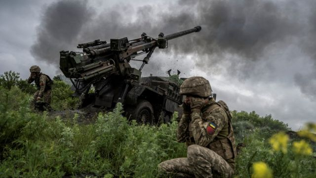

# [World] 乌克兰称对俄军反攻中 首批夺回顿涅茨克的三个村庄

#  乌克兰称对俄军反攻中 首批夺回顿涅茨克的三个村庄

> 图像来源，  Reuters

**乌克兰表示，该国军队已经解放了乌克兰东南部的三个村庄，这是外界等待已久的乌克兰反攻的首次胜利。**

社交媒体上的影片显示，其军队在位于顿涅茨克的布拉霍达特内（Blahodatne）和涅斯库奇涅（Neskuchne）附近居民区庆祝胜利。

乌克兰国防部副部长表示，附近的马卡里夫卡（Makarivka）也被夺回。

周六（6月10日），总统泽连斯基（Volodymyr Zelensky）证实乌克兰针对被俄军占领地区的反攻已经开始。

尽管乌克兰上周已开始在该国南部战线推进，但这三个村庄是泽连斯基证实反攻开始以来第一批被解放的居民区。

莫斯科尚未证实其失去了任何村庄，而是称其击退了乌克兰在该地区的进攻。

此外，乌克兰称俄罗斯在扎波罗热地区炸毁了另一座大坝。上周一，乌克兰南部赫尔松附近的卡霍夫卡大坝被毁，引发了大范围洪水。

乌克兰称，该大坝是由俄罗斯军队炸毁的。俄军自2022年2月以来一直控制着该大坝。

该国军方发言人瓦列里·舍申（Valery Shershen）表示，莫斯科选择炸毁新达尔伊夫卡（Novodarivka）附近的第二座大坝，这“导致了莫克里- 雅利河两岸的洪水”。

舍申表示，俄罗斯故意炸毁该地区的大坝，以阻止乌克兰向被占领地区推进。

俄罗斯否认其炸毁了卡霍夫卡大坝，而是将其归咎于乌克兰。

##  “再次属于乌克兰的国旗下”

在社交媒体上，亲乌克兰的账户分享的视频中，可以看到军队在布拉霍达特内一座被烧毁的建筑外升起乌克兰国旗。

国家边防军发布的视频显示，乌克兰军队宣布“顿涅茨克地区的涅斯库奇涅再次属于乌克兰的国旗下”，然后高呼战斗口号“光荣归于乌克兰”。

与此同时，国防部副部长汉娜·马利尔（Hanna Maliar）在Telegram的一则影片中声称，乌克兰军队也占领了马卡里夫卡村。

一位军队发言人说，这些胜利是反击战的第一次局部胜利。

虽然占领这三个村庄标志着最近几天的最大进展，但这些居民区相对较小。布拉霍达特内战前的人口只有1000人。

该村庄是最近几天激烈战斗的中心，位于通往马里乌波尔市的道路上，一些分析人士认为，乌克兰可能会在未来几个月内寻求夺回这座港口城市。

还有分析人士预测，基辅希望切断被占领的克里米亚和顿涅茨克之间的陆路连接，孤立克里米亚半岛上的俄罗斯军队。

再往东，乌克兰军队据说也在被毁的巴赫穆特市附近推进，那里是俄乌两国军队进行长期血腥争夺战的地方。

基辅的高级官员拒绝就推进的细节发表评论。

神秘的乌克兰情报负责人基里洛·布达诺夫（Kyrylo Budanov）周日发布了一段影片，重复了“计划喜欢沉默”的口头禅，意在强调反攻需要保密。

乌克兰的行动范围尚不清楚，但总部位于美国的智库“战争研究所”（ISW）周六表示，基辅的部队正在至少四个前线地区发动攻势。

乌克兰在向俄罗斯防御工事发动进攻时遭遇了一些挫折。一群乌克兰士兵告诉法新社，周四在扎波罗热州东南部的一次行动中，他们损失了几辆美国制造的布拉德利（Bradley）战车。

他们称，九辆车中有六辆被毁，并补充说，他们担心有人泄露了行动信息。

分析人士强调，乌克兰在试图突破俄罗斯数月来一直在加强的防线时，面临着困难。

但在其他地区，基辅的部队据报在周末的行动中突破了俄军阵线。有报道称，乌军部署了德国豹-2（Leopard-2）坦克。

与此同时，在与乌克兰接壤的俄罗斯别尔哥罗德（Belgorod）地区，周六晚上一列货运列车脱轨后，铁路交通暂停。过去几周，别尔哥罗德的边境地区遭到无人机和火炮攻击。

北边的卡卢加州（Kaluga）州长弗拉迪斯拉夫·沙普沙（Vladislav Shapsha）表示，当地发生了两起无人机坠机事件，一起发生在斯特列科夫卡（Strelkovka）村附近，另一起在森林中。

BBC尚未独立核实这些事件。

