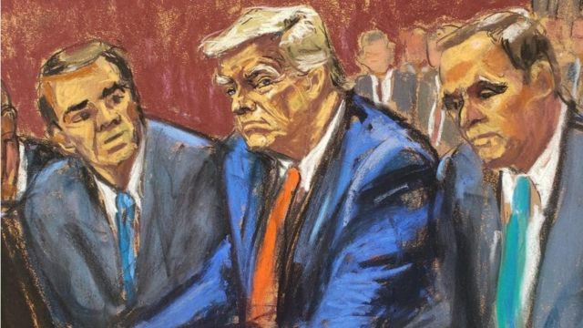
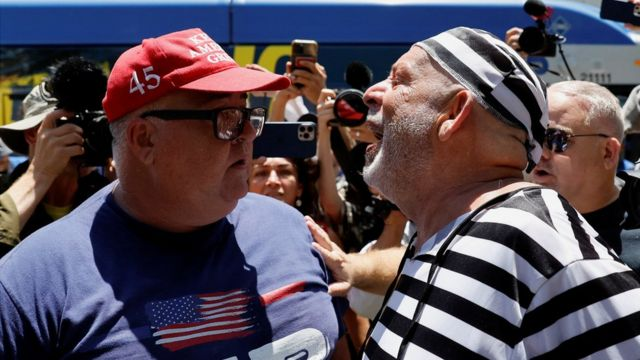
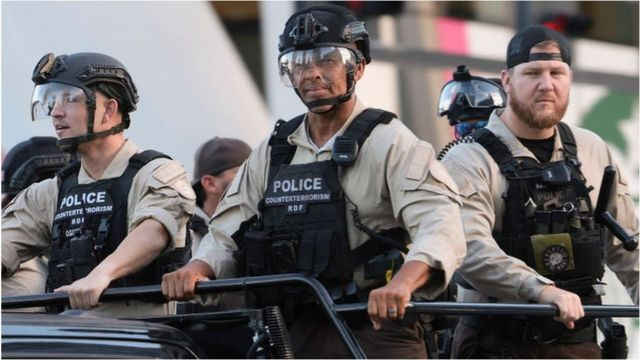
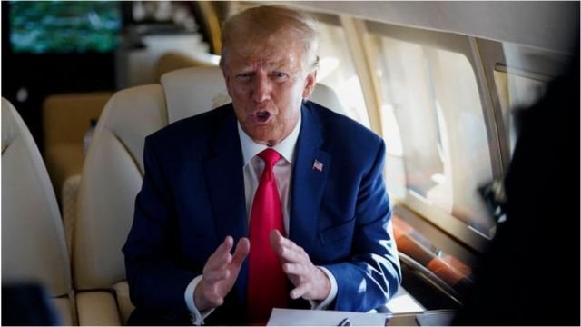

# [World] 特朗普案：被刑事起诉的美国前总统或有三种办法拖延审讯

#  特朗普案：被刑事起诉的美国前总统或有三种办法拖延审讯

  * 纳丁·优素福（Nadine Yousif） 
  * BBC记者 

> 图像来源，  Reuters/Jane Rosenberg
>
> 图像加注文字，法庭草图显示，在迈阿密法庭上，特朗普身着蓝色西装，两侧是他的律师克里斯基斯和托德布兰奇。

**美国前总统特朗普被指控在离开白宫后非法保存机密文件，成为历史上第一个被联邦刑事起诉的美国前任或在任总统。**

他面对37项罪名指控，包括对政府取回有关文件的行动进行阻碍，但他已向法庭否认控罪。

特朗普已经进行过出庭程序，现在检控官在推动加快审讯。

BBC华盛顿分部报道，特朗普出庭时面无表情，保持沉默，离开后即前往新泽西州一个高尔夫俱乐部向他的支持者讲话。

这名共和党人向支持者称，他“完全有权利”保存有关文件，但又承认自己没有全部看过文件。

之后，他再次作出一系列没有根据的指控，并批评总统拜登和他曾经的政治对手希拉里·克林顿 。

法律专家指，特朗普可能会试图尽可能拖延审讯。

“他有充分的动机去拖延，”弗吉尼亚州的里士满大学（University of Richmond）法律教授卡尔·托拜亚斯（Carl Tobias）说。他指出特朗普正在进行竞选活动，寻求赢得共和党总统候选人提名，争取在2024年再度入主白宫。

特朗普周二（6月13日）在迈阿密的聆讯是一个标准程序。他被记录在案，打上指纹，采集DNA样本，之后他对控罪作出否认。

他被允许离开法庭，而且由于他受到特勤局保护且未被视为有逃跑风险，于是保释当中也没有出行限制条款。

> 图像来源，  Reuters
>
> 图像加注文字，周二，特朗普支持者在法院外与他的反对者发生口角

下一步将是为特朗普的律师获得安全许可，因为案件涉及高度机密文件。俄亥俄州凯斯西储大学（Case Western Reserve University）的法律教授、前联邦检察官凯文·麦克穆尼加尔（Kevin McMunigal）表示：“这需要时间。”

在此之前，特朗普要先组建好他在佛罗里达州的法律团队。他的其中两名律师詹姆斯·特拉斯蒂（James Trusty）和约翰·劳利（John Rowley）在周五、也就是他被起诉之后一天辞职。

前总统特朗普在周二上庭时的代表律师是托德·布兰奇（Todd Blanche），但是专家指，他可能会试图加入在本州份执业的其他律师。

与此同时，法庭将进入下一步程序 ，挑选本案陪审团。

麦克穆尼加尔表示，联邦审讯常常很迅速，大多数案件的被告会在接受聆讯后90天之内受审。不过，特朗普的案件可能会是一个例外，因为这是一宗知名案件，需要安全许可。

法律专家仍然认为，针对前总统的指控是“出奇地有力”，任何试图撤销案件的努力都很可能会失败。

“这并不是说，他和他的律师就不会尽可能地拖延，”托拜亚斯教授说。

他们可能会通过以下三种方法阻碍案件推进。

##  1\. 声称无刑事犯罪

特朗普反复辩称，他在《总统档案法》（Presidential Records Act）之下有权从白宫带走文件，而且他已经在离任前将之解密。

他的律师可能会将这一论点摆到法庭面前，但是托拜亚斯教授说，这一做法不太可能会获得有利的裁决。

> 图像来源，  Getty Images
>
> 图像加注文字，特朗普出庭当日，执法人员在法庭外戒备。

“我不认为他不再是总统之后还有权利保留文件，”托拜亚斯教授说，“《档案法》非常清楚，我不认为这里面有什么可疑问的。”

##  2\. 声称他遭受不公平的针对

他的律师也可能会辩称，特朗普是“选择性检控”的受害者——他受到不公平针对，而且其他政客，比如希拉里·克林顿（Hillary Clinton）、迈克·彭斯（Mike Pence）和总统乔·拜登（Joe Biden）等人从未因为他们对机密文件的处理而被起诉。

> 图像来源，  EPA
>
> 图像加注文字，美国前总统特朗普的支持者聚集在多拉尔迈阿密高尔夫球场的入口附近。

但是托拜亚斯教授说，前总统特朗普的案件在好几个方面都有所不同。第一，其他几位政客当时都是“非常乐意”交还他们当时保存的文件，但是起诉书中的证据显示，特朗普拒绝这样做。

“起诉书中显示，特朗普被指做出了很多非常不负责任的事情，”他说，选择性检控的说辞在法庭面前走不远。

##  3\. 试图推翻关键证据

特朗普和他的法律团队可能尝试拖延审讯的另一个办法，是以律师与客户前的守密特权来寻求推翻大陪审团面前的证据——也就是特朗普的律师M·伊万·科克伦（M Evan Corcoran）的证词。

麦克穆尼加尔教授说：“那个或许是一个审讯前的问题，会导致一些延后。”

但是他补充，在华盛顿主审这一案件的法官已经裁定，在犯罪欺诈例外（crime-fraud exception）原则下，该证据可以被包括在起诉书中。该例外原则适用于律师与客户的对话中客户试图就如何进行欺诈或犯罪获得法律建议的情况。

专家称，即使这些辩驳理由都不太可能将案件完全推翻，也肯定会导致一些拖延，因为法庭将不得不对特朗普律师提出的问题逐一仔细衡量。

> 图像来源，  Getty Images
>
> 图像加注文字，这是特朗普三个月内的第二次出庭

##  共和党内支持度未受影响

特朗普卷入官司，似乎未令他在共和党人中间的支持度有所下降。

BBC在美国的合作伙伴哥伦比亚广播公司（CBS）发现，共和党76%的主要选民更担心诉讼是有政治动机，而不是文件是否可能危害国家安全。

程序上，美国司法部的运作应该独立于白宫。拜登自己也因为对机密文件的处理而正在接受另一宗调查。他在上周说："我从来没有——一次都没有——建议过司法部应该怎么做。"

法律专家称，刑事犯罪起诉一经定罪，可能会令特朗普入狱相当一段时间。但是他已经声称，无论裁决如何，都将继续竞选总统。

特朗普此次出庭已经是不到三个月里的第二次。他于4月曾在纽约接受法庭聆讯，他被控在2016年总统选举前就向色情片女性支付封口费一事伪造商业文件。

