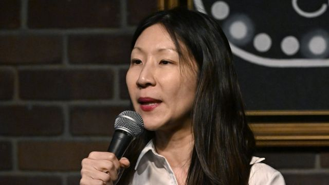
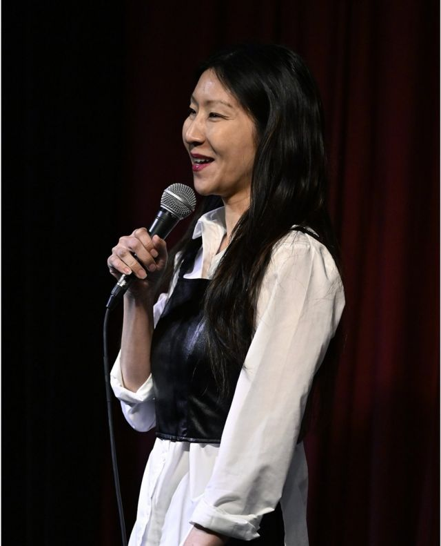

# [World] 脱口秀演员谢必孜：马来西亚因MH370笑话要求国际刑警介入很“荒谬”

#  脱口秀演员谢必孜：马来西亚因MH370笑话要求国际刑警介入很“荒谬”

> 图像来源，  Getty Images
>
> 图像加注文字，上周，律师出身的脱口秀演员谢必孜在曼哈顿一家俱乐部的演出画面在互联网上广为流传，她在演出中回顾了新加坡脱离马来西亚的历史，就此嘲讽马来西亚，并提及马航MH370空难，这在马来西亚引发轩然大波。

****美国新加坡裔脱口秀演员谢必孜（** ** ****Jocelyn Chia** ** ****）此前因在演出中拿** ** ****马来西亚航空公司** ** ****MH370** ** ****空难来开玩笑，惹怒马来西亚当局。她表示官方的反应** ** ****“** ** ****过度** ** ****”** ** ****了。** **

她对BBC说，她“并非在取笑悲剧”和受害者，而是试图在悲剧中找到幽默。

马来西亚警方表示，他们已要求国际刑警组织（Interpol）寻找到谢必孜，目前他们正在就煽动和冒犯性的网络内容对她进行调查。

在新加坡长大的谢必孜称，牵涉到国际刑警组织是“荒谬的”。

上周，律师出身的脱口秀演员谢必孜在曼哈顿一家俱乐部的演出画面在互联网上广为流传，她在演出中回顾了新加坡脱离马来西亚的历史，就此嘲讽马来西亚，并提及马航MH370空难，这在马来西亚引发轩然大波。

国际刑警组织告诉BBC，他们尚未收到马来西亚警方对此案的协助请求。

谢必孜表示，她的笑话“在社交媒体上被断章取义了”。

“我已经讲（这个段子）几百次了，甚至在新加坡还做了一个简短的版本。它总是让观众捧腹大笑。如果它效果不好，我就不会再用了。”

她还表示，“挖苦”或取笑观众是她现在所在的纽约喜剧俱乐部文化的一部分。她称，美国漫画过去曾把“9/11”袭击事件作为笑话的素材。

“美国人可以欣赏更严厉、更尖锐、更直白的幽默，而在亚洲，单口喜剧还处于起步阶段。你在亚洲找不到很多尖锐的喜剧。”她说。

在引发争议的演出中，谢必孜先用粗口调侃一名马来西亚人，并称新加坡自1965年独立以来，已经成为第一世界国家，而马来西亚“仍然是发展中国家”。

然后，她继续嘲讽马来西亚的飞机“不能飞”，并将其与马航MH370的悲剧联系起来。

“什么？马航失踪一点都不好笑，是吗？”她笑着打趣道，然后一语双关地说：“有些笑话不会落地。”

2014年3月，马来西亚航空公司的一架波音777客机在从吉隆坡飞往北京的途中神秘地从雷达上消失。

多国的搜救人员在印度洋上进行了四年的搜索，发现了一些残骸，但没有找到主机身。机上239人被宣布全部遇难。

> 图像来源，  Getty Images
>
> 图像加注文字，2022年3月29日，谢必孜在美国加州伯班克的喜剧俱乐部露面时表演脱口秀。

她的段子在社交媒体上引发马来西亚人的挞伐。她所演出的俱乐部“喜剧地下室”（Comedy Cellar）几乎一夜之间在谷歌上收到了4000条一星评价，其老板称网站也遭到黑客攻击。

该段影片也被TikTok删除，理由是违反了其仇恨言论准则。

据报道，马来西亚旅美联谊会及数十名马来西亚侨胞周日（6月11日）在纽约法拉盛焚烧其照片抗议，表示此举对马来西亚人及空难罹难者家属毫无怜悯之心，要求她公开道歉。

此前，马来西亚外交部已对此表示谴责。外交部长赞比里·阿卜杜勒·卡迪（Zambry Abd Kadir）称，她的脱口秀公然缺乏对马来西亚人和空难受害者家属的敏感性和同情心。

新加坡驻马来西亚最高专员梅农（Vanu Gopala Menon）对此表示道歉。新加坡外交部长维文（Vivian Balakrishnan）也试图平息该争议，称他对这些笑话感到“震惊”。

“她当然不代表新加坡人的观点。”维文说，并表示新加坡人“珍视与马来西亚家人和朋友的关系”。

一些互联网用户，包括谢必孜的脱口秀演员同行，批评她麻木不仁。但也有一些人认为这是可以接受的讽刺。

国际刑警组织的主要职能是共享有关逃犯的信息，并将他们带回犯罪国。

“我真希望能看到接到这一请求的国际刑警组织官员的脸。”谢女士说。

“老实说，如果国际刑警组织对这一要求采取行动，事情升级，你能想象这将使我多么出名吗？”

2022年7月，马来西亚逮捕了脱口秀演员里扎尔·范·盖泽尔（Rizal van Geyzel），原因是他发布了涉及种族和宗教敏感问题的影片。

上个月，中国脱口秀演员李昊石也因被指在演出中侮辱中国解放军，而遭到拘留。

