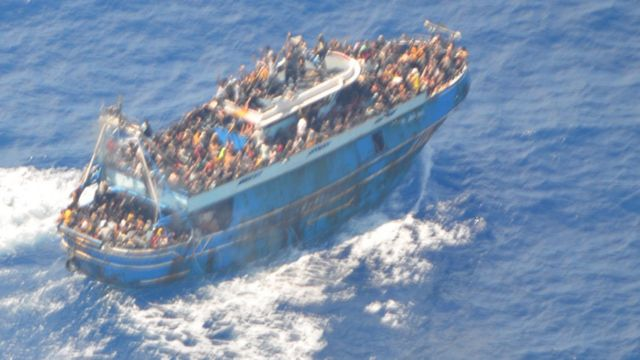
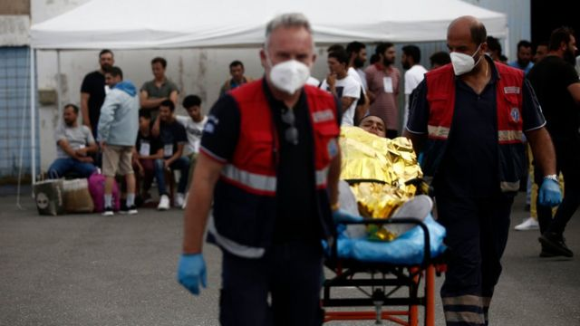
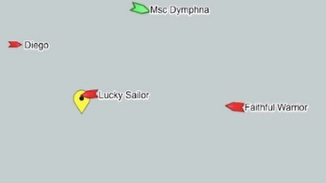
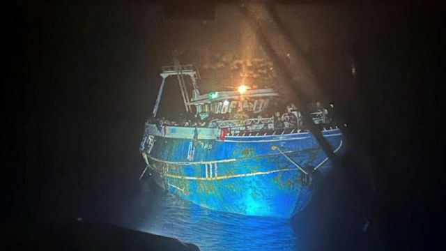

# [World] 希腊偷渡船海难：BBC调查发现海岸卫队说法与船舶追踪数据不符

#  希腊偷渡船海难：BBC调查发现海岸卫队说法与船舶追踪数据不符

  * 欧洲事务记者尼克·比克（Nick Beake）与资深欧洲制作人科斯塔斯·卡勒吉斯（Kostas Kallergis） 
  * BBC News 希腊卡拉马塔报道 

> 图像来源，  Greek Coast Guard
>
> 图像加注文字，这艘明显超载的渔船在沉没前曾多次被拍下身影。

**一艘移民船星期三（6月14日）翻沉，数以百计偷渡者生死未卜。BBC掌握证据显示，希腊海岸警卫队对事件的描述存有疑点。**

记者对有关海域内其他船只的航行轨迹作分析后认为，该超载渔船在翻沉前七个小时内原地不动。海警则坚称，在这段时间内，渔船朝着意大利航行，并不需要救助。

希腊当局迄今并未回应BBC的调查结果。

沉船造成至少78人死亡，联合国则称多达500人下落不明。有声音质疑，希腊方面早该采取更多行动，启动全面搜救。

对此，联合国呼吁调查希方处理是次船难的做法。希腊官员坚称，船上人员表明无须帮助，且直到翻沉前一刻为止，渔船并无危险。

> 图像来源，  EPA
>
> 图像加注文字，沉船有104人获救，联合国称生死未卜者数以百计。

BBC取得了一段展示 MarineTraffic  追踪数据的电脑动画，这是一家海事数据分析平台。

它们的数据显示了移民船后来翻沉的一小片海域长达数小时的活动，而这些数据给渔船导航毫无困难这官方说法带来疑问。

渔船并无配置追踪设备，因此并未在地图上显示，海警与海军舰艇亦然，因它们无须分享其位置。

##  海警官方事发时序存疑

欧盟边境管理局（Frontex）称，局方在上星期二（13日）格林尼治标准时间（GMT）08:00最先发现移民船，并知会希腊当局。

接受海上遇险移民紧急求助的热线“警报电话”（Alarm Phone）称，它们在12:17 GMT接获来电，称渔船遇上危急状况。

我们利用经BBC事实核查（BBC Verify）鉴别真伪的视频与照片，以及法庭文件和海事记录，分析接下来数小时的船舶动态。

MarineTraffic动画显示，一艘名为“幸运海员”号（Lucky Sailor）的轮船在15:00 GMT突然朝北面转向。“幸运海员”号船东，向BBC提供其航海日志（log book），并证实海警要求该船只靠近移民船，向对方提供食物和水。

约半个小时后，在15:35 GMT，海警直升机寻获该移民船。希腊官方仍宣称渔船当时仍在稳定航行。

> 图像来源，  MarineTraffic
>
> 图像加注文字，地图上黄色标记为移民船沉没位置。从该处的船舶动向所见，在沉船前数小时，渔船一直没有移动。

但再过两个半小时之后，大约18:00 GMT，另一艘轮船“忠诚斗士”号（Faithful Warrior）驶至相同海域，且同样补给了移民船。

“忠诚斗士”号船东提醒BBC该向调查当局查询。

一段据报摄自“忠诚斗士”号的视频曝光，宣称记录了轮船在海上用绳子向移民船搬运物资的情况，片段中并未看到其他船只。

BBC事实核查检验了视频，并确认船艇外貌符合照片中所见的移民船——而它在片段中并无移动——天气状况也符合当时的报告。视频的拍摄时间暂未知晓。

在19:40 GMT至22:40 GMT之间，希腊官员原本宣称，移民船维持着“稳定航路与航速”。

当局最初的声明称，它们谨慎地保持一定距离，观察移民船，但它们后来发布的一张近距离拍摄照片——而且是摄于这段时间内——显示移民船哪儿都没去。

> 图像来源，  Greek Coast Guard
>
> 图像加注文字，希腊海警星期四（15日）发布了这张照片，是渔船沉没前数小时海警以泛光灯照射之下所拍摄。

一位希腊政府发言人后来称，海警曾尝试登上移民船作风险评估，但船上有人解开缆绳，不欲受援。

在这七个小时内，一切船舶活动均聚焦于明确的一个点上，说明移民船近乎丝毫未动。

动画地图的比例显示移民船只航行了几海里，对于一艘在地中海最为水深之处瘫痪，面对着风高浪急的船舶来说，这是预期之内的。

船上焦急的人，其动作导致船舶摇摆，也会促使这样的移动、。

在这段时间内，希腊官员坚称，移民船并无险情，反而正安全地驶往意大利，因此海警并未试图上前营救。

到23:00 GMT，载着数百人的移民船下沉，船舶追踪动画显示，多艘船艇涌往现场施救。

其中一艘是邮轮“名人扬极”号（Celebrity Beyond），船上有人拍下了海难发生后的情况，并将片段发给BBC。

豪华游艇“玛雅女王”号继而受命救起104名幸存者，将他们送到岸边。

那些获救的人被送到卡拉马塔港（Kalamata），他们回到安全之地，但也为希腊的整体应对留下了连串教人不安的疑问。

关于BBC事实核查（BBC Verify）： 了解更多 

