# [World] 俄罗斯瓦格纳集团首脑被指煽动叛乱：已控制第二个城市，普京发表紧急讲话

#  俄罗斯瓦格纳集团首脑被指煽动叛乱：已控制第二个城市，普京发表紧急讲话

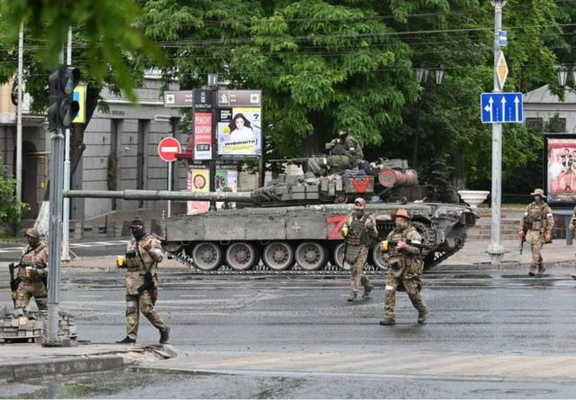

> 图像来源，  Reuters
>
> 图像加注文字，路透社发布了一些瓦格纳战士进入俄罗斯南部城市顿河畔罗斯托夫的照片。

**俄罗斯雇佣兵组织“瓦格纳集团”（Wagner Group）和俄罗斯军方之间的内斗急剧升级。**

瓦格纳集团首脑夫根尼·普里戈津（Yevgeny Prigozhin ）称，其武装部队已经从乌克兰进入俄罗斯南部城市顿河畔罗斯托夫（Rostov-on- Don，距乌东边境约100公里），并击落一架俄罗斯直升机，但他没有提供证据。

BBC消息指，瓦格纳集团已经控制第二个城市沃罗涅日（Voronezh）的俄罗斯军事设施，该城市位于顿河畔罗斯托夫和首都莫斯科中间。

普里戈津扬言，若俄军高层拒绝会见他，其部队将进占莫斯科。

##  普京发表全国讲话：武装叛变是对国家“背后捅刀”

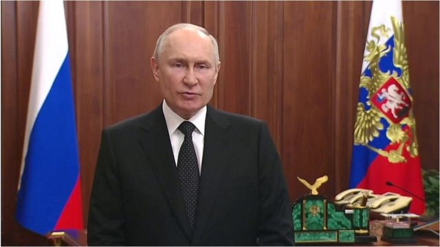

> 图像加注文字，俄罗斯总统普京周六（6月24日）在紧急电视讲话中表示，瓦格纳集团的“武装叛变”是叛国行为，对国家和人民“背后捅刀”。

俄罗斯总统普京周六（6月24日）在紧急电视讲话中表示，瓦格纳集团的“武装叛变”是叛国行为，对国家和人民“背后捅刀”，任何拿起武器反抗俄罗斯军队的人都将受到惩罚。

他表示会尽一切所能保护俄罗斯，呼吁大家团结，并指当局已迅速采取行动以控制局势。

普京在讲话中说：“我们所面对的是背叛。过度的野心和个人利益导致了叛国。”

普里戈津发布一段录音，似乎是回应普京的指控，他说其部队不是叛国者，而是为祖国未来而战的“爱国者”，并批评俄罗斯政府的“腐败、谎言和官僚主义”。

他早前称要推翻俄罗斯国防部高层，他指责俄罗斯军方向雇佣兵兵营发射导弹，导致大量战士伤亡。俄罗斯国防部否认有关指控。

乌克兰总统办公室主任顾问波多利亚克（Mykhailo Podolyak）在推特发文指，“俄罗斯的一切才刚刚开始”，“俄罗斯精英阶层的分裂太明显了，同意假装一切都解决了是行不通的”。

##  BBC消息人士：瓦格纳占领了第二座城市的军事设施

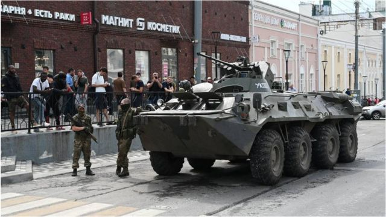

> 图像来源，  Reuters
>
> 图像加注文字，瓦格纳士兵站在顿河畔罗斯托夫一辆装甲车旁边。

BBC从俄罗斯消息人士获悉，瓦格纳武装分子已经控制了沃罗涅日市（Voronezh）的所有军事设施。沃罗涅日市位于顿河畔罗斯托夫（瓦格纳称目前已控制该市）和首都莫斯科之间的中间点。

沃罗涅日市官员尚未对这一说法公开发表评论。

与此同时，沃罗涅日州州长亚历山大·古谢夫（Aleksandr Gusev）警告说，有许多关于该地区装甲纵队活动的虚假报道。

古谢夫还表示，俄罗斯武装部队目前正在沃罗涅日地区采取行动和战斗措施，这是早先宣布的反恐行动的一部分。

目前最新的发展是，瓦格纳雇佣军叛乱士兵声称已经控制了靠近乌克兰边境的俄罗斯重要城市顿河畔罗斯托夫。

顿河畔罗斯托夫的一名居民告诉BBC俄语记者说，整个市中心都被包围并封锁。

这位不愿透露姓名的人士说，周围有士兵。他说：“当（我们）问他们是谁时，士兵们说‘我们只是好人’。”

“这座城市的局势很平静：没有恐慌，一切都像平常一样。”

他们还表示，距离瓦格纳声称占领的南部军事总部步行十分钟的街道“似乎是自由的”，但军事大楼附近的区域却“被严密包围”。

##  罗斯托夫有什么重要意义？

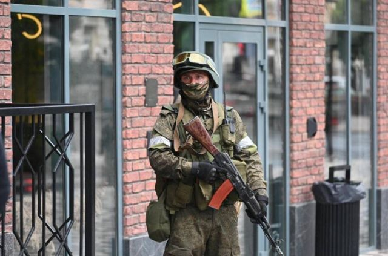

> 图像来源，  Reuters
>
> 图像加注文字，路透社发布了一些瓦格纳战士在俄罗斯南部城市顿河畔罗斯托夫的照片，瓦格纳集团首脑普罗戈津表示，他的部队现在控制着该市。

罗斯托夫是俄罗斯南部军区司令部所在地，该司令部一直在俄罗斯入侵乌克兰的战争中扮演关键角色。

美国智库战争研究所（ISW）分析指，南部军区的第58联合军“目前正果断地参与对乌克兰南部反攻的防御行动，并且是俄罗斯在整个乌克兰联合部队集团的指挥中心”。

罗斯托夫地区首长呼吁居民留在室内并保持冷静。

莫斯科的政府大楼和交通设施等地也加强了安保。莫斯科市长谢尔盖·索比亚宁宣布，正在采取反恐措施以加强首都的安全。

##  精灵从瓶子里出来了

**BBC安全事务记者弗兰克·加德纳（Frank Gardner）**

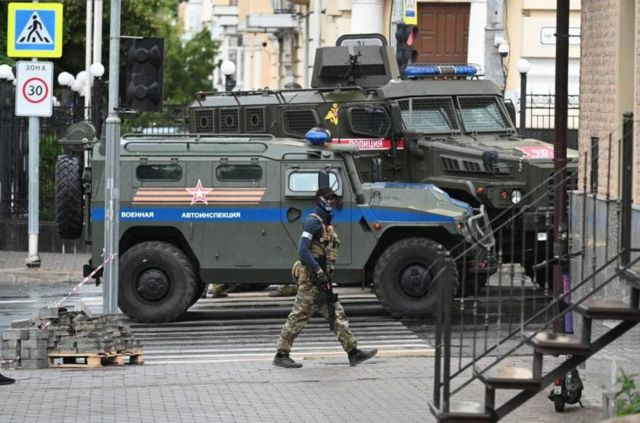

> 图像来源，  Reuters

事件可能以几种方式发展。对于乌克兰来说，俄罗斯遇到麻烦的时机再好不过。

就在基辅正在适应其长期承诺的反攻，面临不太可能在今年甚至明年将俄罗斯军队驱逐的前景时，一条生命线出现了。

由于克里姆林宫和瓦格纳现在全神贯注于内斗，这使得一些最能打的俄罗斯战斗部队退出了战场。

更重要的是，对莫斯科的这一挑战，可能会严重削弱驻守在乌克兰试图突破的所有坚固防线的俄军的士气。

在理想的世界里，这一切都会以俄罗斯取消战争并从乌克兰撤军而结束。但事情不可能那么简单。

西方一些人可能担心俄罗斯作为国家可能进一步崩溃，对于一个拥有4000多枚核弹头的国家来说，这是一个发人深省的想法。

另一个可能的结果是，普里戈津对克里姆林宫的挑战将是短暂的，他的军队将被迫投降。

但无论接下来发生什么，精灵已经从瓶子里出来了。

在巴赫穆特为俄罗斯取得几个月来唯一重大胜利的雇佣军首脑告诉俄罗斯人民，入侵的整个借口都是谎言，来自乌克兰的威胁是捏造的。

> 图像来源，  Reuters
>
> 图像加注文字，顿河畔罗斯托夫的瓦格纳士兵。

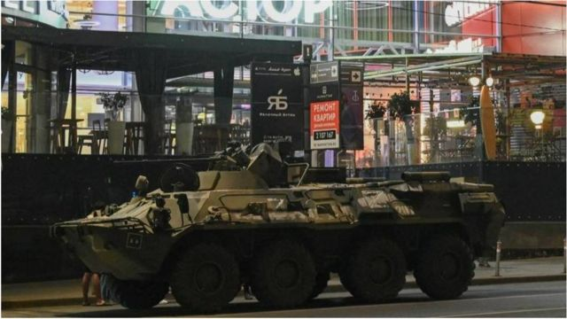

> 图像来源，  Reuters
>
> 图像加注文字，罗斯托夫（Rostov）街道上的一辆装甲运兵车。

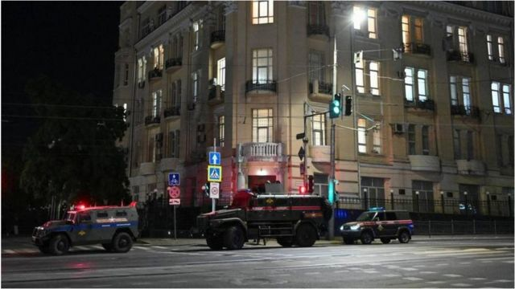

> 图像来源，  Reuters
>
> 图像加注文字，罗斯托夫街头。

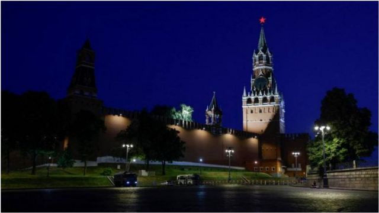

> 图像来源，  Reuters
>
> 图像加注文字，莫斯科克里姆林宫外停泊的安全车辆。

俄罗斯总统普京和美国总统拜登正在了解局势的最新情况。

俄罗斯塔斯社报道说，俄总检察院宣布，已对瓦格纳领导人普里戈津提起武装叛乱诉讼。他将面临最高20年监禁。

> 图像来源，  Reuters
>
> 图像加注文字，瓦格纳集团首脑叶夫根尼·普里戈津（Yevgeny Prigozhin ）

##  反克里姆林宫大亨敦促俄罗斯人支持瓦格纳首脑

反克里姆林宫人物米哈伊尔·霍多尔科夫斯基（Mikhail Khodorkovsky）敦促俄罗斯人支持瓦格纳首脑普里戈津——他发誓要推翻莫斯科的军事领导层。

曾经是俄罗斯最富有的寡头霍多尔科夫斯基表示：“我们现在需要提供帮助，如果有必要，我们也会抗争。”

霍多尔科夫斯基与普京闹翻后在俄罗斯监狱里度过了十年，他最近呼吁对俄罗斯总统实施更严厉的制裁。

他表示，如果决定对抗克里姆林宫，那么“即使支持的是魔鬼”也很重要。

他说：“是的，这只是开始。”

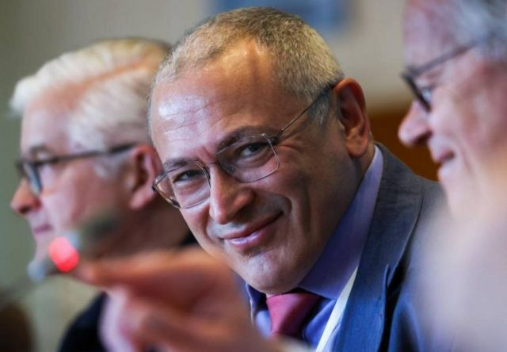

> 图像来源，  EPA
>
> 图像加注文字，反克里姆林宫人物米哈伊尔·霍多尔科夫斯基敦促俄罗斯人支持瓦格纳领导人普里戈津。

##  专家：对普京的严峻挑战

**BBC记者** **小贝恩德·德布斯曼** **（Bernd Debusmann Jr）** **、** **海伦娜·汉弗莱（Helena Humphrey）发自华盛顿**

世界各地正在密切关注俄罗斯内斗的急剧升级，其中包括美国前副助理国防部长和中央情报局官员米克·马尔罗伊（ Mick Mulroy）。

马尔罗伊告诉BBC， 瓦格纳集团首脑普里戈津现在向普京总统提出了严峻的挑战。

他说：“这充分说明了俄罗斯不得不依靠雇佣军来挽救其对乌克兰的入侵，而这在战略上是个灾难。它更说明了，普里戈任现在承认，它（入侵行动）实际上是在未遭挑衅的情况下发生，俄罗斯人民被欺骗了。”

他告诉我，如果瓦格纳的军队确实能够威胁普京对俄国的控制，俄罗斯可能不得不“重新调整其军事力量，以求自保，而不是阻止乌克兰的反攻”。

他还表示，“即使这次政变未遂，它也说明，最接近这场战争的人知道这是一个可怕的错误。”

前美国驻乌克兰大使泰勒（Bill Taylor）告诉BBC，普里戈津这次号召叛变的行动，“几乎可以肯定是一场企图的政变”，“这对普京来说是严重的，俄罗斯非常认真地对待此事”。

泰勒上月曾在乌克兰，他研判瓦格纳这次不太可能成功。“国防部有装备，有飞机，有坦克，他们有大量的军事装备，可以击溃普里戈津的部队。”

但他认为，俄罗斯的内讧有可能帮助乌克兰击退俄军的入侵。“如果俄军现在担心他们内部的指挥链，那么本应与乌克兰人作战的俄罗斯军人可能会分心，甚至可能会逃跑。”

##  瓦格纳首脑说了些什么？

普里戈津周五在网上发布了一系列充满愤怒的录音，他指责俄罗斯国防部长谢尔盖·绍伊古（Sergei Shoigu）周五下令对瓦格纳在乌克兰的营地进行火箭袭击。

他说：“今天他们对我们的后方营地进行了火箭袭击，我们的大量战友被杀。”

“他们奸诈地欺骗了我们，”他补充道。

俄罗斯国防部否认对瓦格纳部队发动火箭袭击。

普里戈津随后表示，他的部队将驱逐绍伊古，并呼吁俄罗斯军队闪开一边。

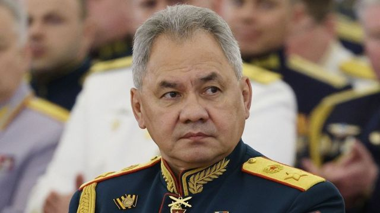

> 图像来源，  EPA
>
> 图像加注文字，普里戈津公开批评俄罗斯国防部长绍伊古。

“这不是军事政变，而是正义的进军，”他说。

普里戈津还声称绍伊古亲自指挥了所谓的袭击，然后逃跑了。

“必须制止该国军事领导层所展现的邪恶举动，”他喊道。

此后普里戈津还声称他的部队已从乌克兰进入俄罗斯，但没有提供证据。

早些时候他发布了一段视频，称俄罗斯没有理由入侵乌克兰，这个战争是一场灾难。

##  瓦格纳集团是什么？

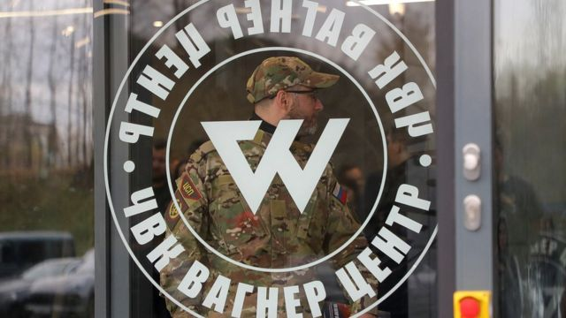

> 图像来源，  Reuters
>
> 图像加注文字，瓦格纳集团圣彼得堡办事处。

瓦格纳集团最早被发现是在2014年，当时是一个秘密组织，支持乌克兰东部的亲俄分离主义势力，协助俄罗斯吞并克里米亚。

该组织也在非洲和中东地区活动，据了解起初只有约5000名战士，大部分是俄罗斯精英兵团和特种部队的退伍军人。

时至今天，该组织已壮大。根据英国国防部1月的说法，瓦格纳目前在乌克兰指挥着5万名战斗人员，已成为乌克兰战役的关键组成部分。由于俄罗斯正规军队人力短缺，该组织在2022年开始大量招募。

美国国家安全委员会今年初表示，瓦格纳在乌克兰的部队约80%来自监狱。

尽管雇佣军在俄罗斯是非法的，但瓦格纳集团在2022年注册为公司，在圣彼得堡开设新总部。

英国皇家国防安全联合研究所的拉马尼（Samuel Ramani）博士说：“它在俄罗斯的城市公开招募人员，在广告牌上打广告，并在俄罗斯媒体上被称为爱国组织。”

在俄罗斯入侵乌克兰的前几周，人们认为瓦格纳集团实施“假旗”袭击，让克里姆林宫有入侵的藉口。

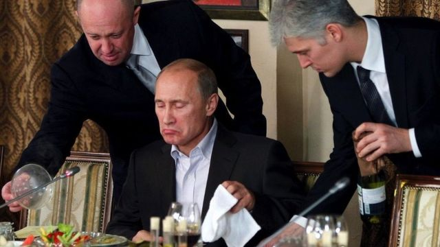

> 图像来源，  Reuters
>
> 图像加注文字，普里戈津最著名的照片之一是他正在为普京上菜（2011年11月11日，莫斯科郊外一家餐厅）。随后他获得“普京大厨”这个昵称。

瓦格纳在很大程度上参与了俄罗斯占领乌东巴赫穆特市的行动。俄罗斯国防部起初没有提到瓦格纳的角色，但后来赞扬其雇佣兵发挥了“勇敢和无私”的作用。

该组织现任领袖普里戈津本身是富商，为克里姆林宫提供餐饮服务，有“普京大厨”之称。

