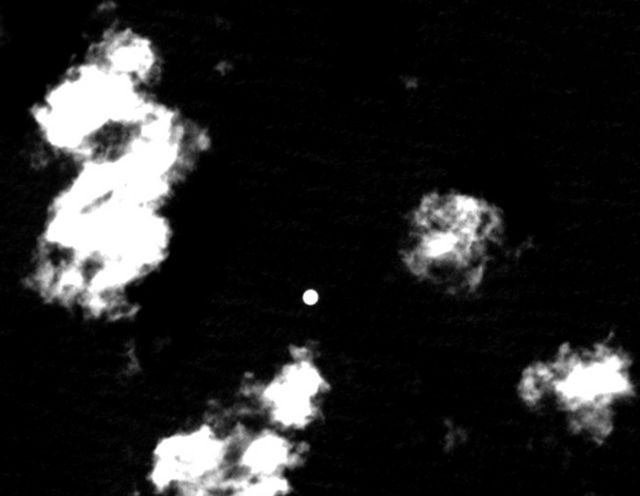
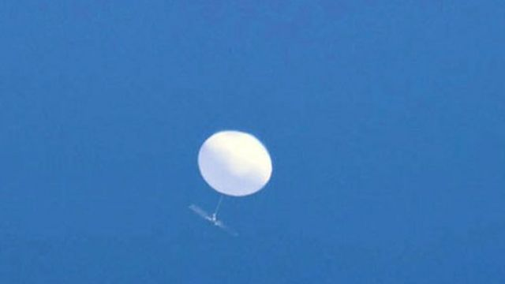
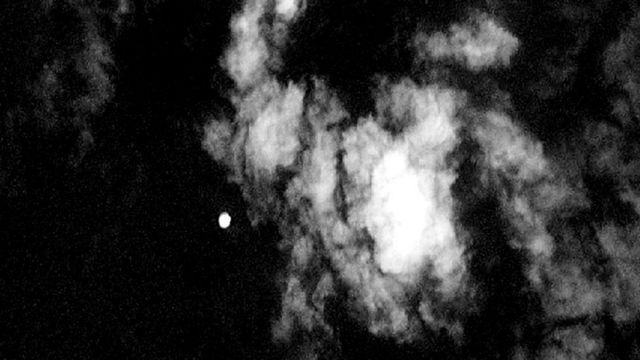

# [World] BBC调查：新卫星图像显示中国间谍气球曾飞越日本台湾

#  BBC调查：新卫星图像显示中国间谍气球曾飞越日本台湾

  * 戈登·科雷拉（Gordon Corera） 
  * BBC安全事务记者 

> 图像来源，  Synthetaic/Planet Labs PBC
>
> 图像加注文字，疑似间谍气球飞过日本上空的卫星图像。

**BBC《广角镜》（Panorama）栏目揭露了关于中国间谍气球计划的新证据——包括它在日本和台湾上空的飞行。**

日本已证实，有气球曾经飞过其领土上空，并表示准备在未来将其击落。

中国未对BBC提供的证据进行直接回应。

今年早些时候，一枚被指来自中国的间谍气球在美国海岸附近被击落，导致中美关系陷入困境。

中国声称，一月底在美国西北部上空看到的气球是民用飞艇，用于气象等科学研究——并指这是一起意外的个别事件。

美国中央情报局前东亚分析家约翰·卡尔弗（John Culver）向《广角镜》节目表示，这已经“不是单次事件，而是至少可以追溯到五年前的持续行动”。他说，中国的气球是“特别为这一类长途任务设计”，而且有一些“似乎已经环绕了地球”。

> 图像来源，  Tyler Thompson/US Navy
>
> 图像加注文字，2023年2月，美国海军人员在北大西洋找回了疑似间谍气球的残骸。

BBC与人工智能公司Synthetaic合作，通过筛查卫星捕获的大量数据，发现多个气球穿越东亚的图像。

该公司创始人科里·贾斯科尔斯基（Corey Jaskolski）发现了一个气球在2021年9月穿越日本北部的证据。这些图像过去未被公开过。

贾斯科尔斯基还相信，证据表明，该枚气球是从蒙古以南的中国内陆发射。BBC无法核实这一点。

日本是美国的亲密盟友。美国驻扎在日本的军队比在任何其他国家都多。

> 图像加注文字，在台湾上空被拍下的疑似中国间谍气球。

日本防卫省的村上裕子向BBC表示，日本政府正“采取各种预案措施每日监察有关状况”，甚至准备击落气球以保护“日本领土内人民的生命与财产”。

美国国务院表示，相信中国的气球装备有收集信号情报的能力。它表示，在美国发现的飞行器具有“多根天线，很可能有能力收集和定位通讯”。

为了调查中国是否还发射了其他气球，《广角镜》团队首先搜索了该地区社交媒体和新闻报道中有关天空不明飞行物的目击报告。

他们发现，两张由台湾天气部门拍摄的照片，似乎显示一枚气球在2021年9月末在首府台北上空飞过。

贾斯科尔斯基之后将这些照片与卫星影像做交叉比对。“我们发现气球在90秒内就飞出了台湾海岸线之外，”他说。

##  中国政府在监视你吗？

从间谍气球到秘密警察再到逃亡异见者，《广角镜》（Panorama）调查报道中国的全球监控行动。我们揭露了有关北京间谍气球舰队的新细节，还黑进了一台中国制造的监控摄像头，显示我们街头上的类似设备可以如何被利用。

BBC中文稍后将刊登该报道的完整视频版本，敬请关注。

台湾政府向《广角镜》表示，他们相信那是一个气象气球，但是贾斯科尔斯基不同意。

“仅以气球的直径判断，以及其运行高度似乎相似这一点看来……它很像是美国还有日本上空飞过的那种气球，”他说。

民主政府主政的台湾长久以来都是中国的目标。

去年，中国军队进行了一次全面进攻的演练。

美国总统乔·拜登（Joe Biden）过去曾表示，如果中国发起进攻，美国将会保卫台湾。

##  人工智能如何帮助定位气球？

科里·贾斯科尔斯基先是想像从太空看到的气球会是怎样，将轮廓画出。然后，他将此轮廓输入到他的AI软件，加入最后一次见到气球时的坐标。

他还加入了风力模型分析，来追踪气球的路径和寻找它的起点。

> 图像加注文字，科里·贾斯科尔斯基

借助行星实验室公司（Planet Labs）提供的卫星图像，科里将所有信息输入到他的软件RAIC（快速自动图像分类），来给气球定位。

监控气球很巨大——相当于几辆巴士的大小——并且装有先进的装置，能够搜集它下方各个目标的大量数据。

不过，从太空中通过卫星拍摄，它们看起来只是小小的白点。

贾斯科尔斯基的研究显示，2月份在美国上空飞过的气球，曾一度离蒙大拿州一个核空军基地只有80英里（130公里）远。

他还将气球的飞行路径倒退回它最有可能的发射地点——南中国海的海南岛。

“看起来……在发射地点有云层，”他说，“而如果我要发射气球，我会选择一个多云的日子，以将被探测到的机会降到最小。”

> 图像来源，  Synthetaic/Planet Labs PBC
>
> 图像加注文字，贾斯科尔斯基通过这样的卫星图像来追踪气球路径。

在一份声明中，中国驻伦敦大使馆指控美国自己就释放过大量高空气球，持续环绕地球，且非法飞越中国领空。

大使馆还表示，“中国是一个负责任的国家”，始终“严格遵守国际法，并尊重所有国家的主权及领土完整”。它还补充说，拒绝“抹黑和攻击中国的无端指控”。

