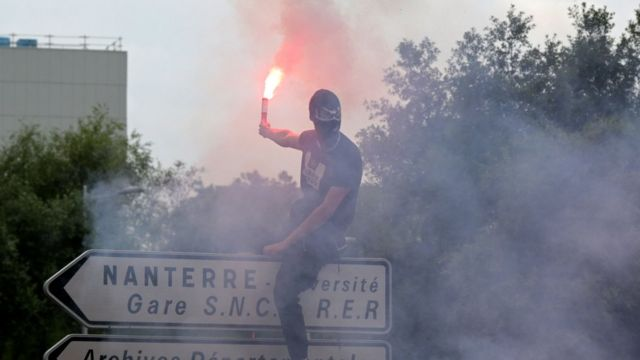
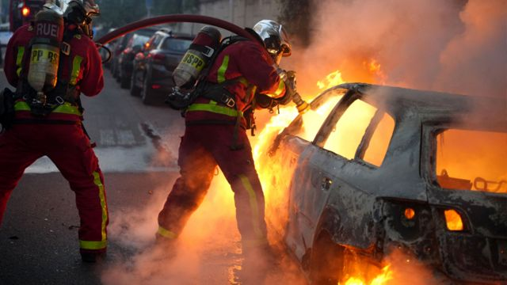
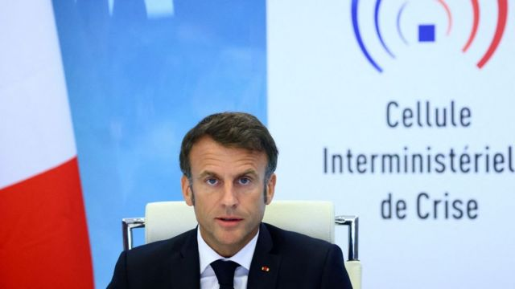
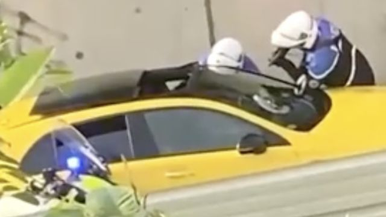
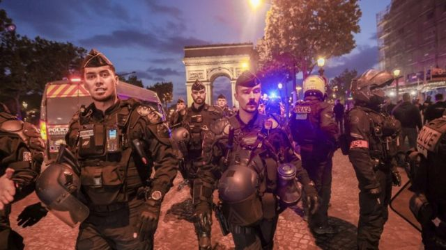
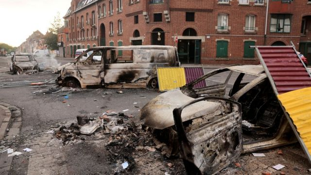

# [World] 法国骚乱：一名少数族裔少年被警察枪杀如何引发大规模持续危机

#  法国骚乱：一名少数族裔少年被警察枪杀如何引发大规模持续危机

> 图像来源，  Getty Images
>
> 图像加注文字，巴黎郊区楠泰尔（Nanterre ）的骚乱尤其严重。

**本周二，法国警察在巴黎郊区楠泰尔（Nanterre ）枪杀了一名17岁的阿尔及利亚裔男孩，他的名字叫纳赫勒(NahelM)。**

开枪的警察目前正在接受调查，罪名是故意杀人。纳赫勒在驾车逃离警察时被近距离射杀。法国检察官认为，使用枪支在法律上是没有道理的。

这名少年的死再次引发了人们对法国种族问题的不满。

骚乱从周二开始，持续到周末。法国从南到北，从巴黎到马赛多个城市出现打砸抢烧事件，市政厅、学校和警察局被放火烧毁。

周四晚，法国内政部说，公共道路上发生了超过3880起火灾，而周三是2391起。

在巴黎郊区的拉伊莱罗斯，袭击者将一辆汽车撞向市长的房子，当他的妻子试图带着他们的两个孩子逃离时被撞伤。

在马赛，约30名年轻人闯入一家枪支店，至少偷走了四支猎枪。马赛市长呼吁国家政府立即增派军队。

里昂市长格雷戈里·杜塞(GrégoryDoucet)称该市发生“前所未有”的骚乱，呼吁警力增援，他在市政厅开完危机会议后表示，该市“被前所未有的烈度、堕落和暴力的骚乱所困扰”。

> 图像来源，  AFP

法国内政部长热拉尔德·达尔马宁（Gérald Darmanin）透露，法国部署了4.5万名警察。从周二开始，每晚都有人被捕，少则三四百，多则上千人。

达尔马宁要求父母不要让他们的孩子参与骚乱，有些参与骚乱的孩子只有13岁。

政府还要求关闭通宵巴士和电车服务，并表示将使用装甲车来协助执法。

##  警察、母亲、马克龙

周二，法国总统马克龙(EmmanuelMacron)说，枪杀纳赫勒的行为是“不可原谅的”。

但他的言论引起警察工会的愤怒，指责他急于评判涉案警察。警察工会呼吁，在发现有罪之前，应假定他们是无辜的。

另有法国警察团体发布了一条推文称，“向一个年轻罪犯开火”的警察“了不起”，并将少年的死亡归咎于他的父母，声称他们“无法教育他们的儿子。”

内政部长达尔马宁称该推文“卑鄙且不可接受”，并将采取法律行动。这条推文现已被删除。

纳赫勒的母亲莫妮亚（Mounia）在社交媒体上流传的视频中称，他们带走了她的孩子，并敦促人们参加游行，纪念她的儿子。

“他还是个孩子。他需要母亲，”她说。“他早上和我吻别，说：‘我爱你，妈妈’。”

“一小时后，我被告知有人向我儿子开枪。我应该怎么做？他是我的生命。他是我的一切。”

> 图像来源，  EPA

马克龙总统在马赛对记者说：“没有什么能证明一个年轻人的死亡是合理的，”他呼吁，“保持冷静，以实现正义。”

“我想表达整个国家对所发生的事情和年轻的纳赫尔的死亡的感受，并告诉他的家人我们的声援和国家的情绪。”

“我们有一个少年被杀害了。”他说：“这是令人费解的，不可原谅的。”他补充说，该案件已被立即移交给法院，他希望司法将“迅速完成其工作”。

##  2017年修法争议

纳赫勒是今年法国第二个在交通执法期间被警察开枪打死的人。去年，有13人以这种方式死亡，创下纪录。

> 图像来源，  Reuters
>
> 图像加注文字，枪击现场的截屏画面

人权组织批评了法国2017年修改的一项法律，扩大了警察用枪的范围，允许警察在司机无视停车命令的情况下开枪。官方统计数据显示，法律修改后，每年警察对行驶中的车辆开枪的数量一直在增加。

路透社称，自2017年以来，法国警察在交通拦截过程中的致命枪击事件中，大多数受害者是黑人或阿拉伯人。

当事警官说他开枪是因为觉得自己有生命危险。但网上发布并经法新社核实的录像显示，一名警察通过车窗用枪指向司机，并在他试图开车离开时似乎在近距离开枪。

法新社还报道，视频中可以听到一个人说“你将被射中头部”，但不清楚是谁说的。

枪击事件发生时，还有两人在车上。其中一人逃走了，而另一人也是未成年人，被警方逮捕并扣留。

##  法国警察是种族主义者吗？

> 图像来源，  EPA
>
> 图像加注文字，香榭丽舍大街上的警察

这些抗议活动针对的核心问题是， 法国警察是种族主义者吗？

上街游行的骚乱者认为如此。BBC采访的许多来自巴黎的楠泰尔少数族裔社区的人都有同样的感觉。

起初是对警察杀害17岁纳赫勒的抗议，现在已经代表了对更深层次问题的关注。

周五，联合国安理会呼吁法国“认真解决执法中的种族主义和歧视的深层问题”。

作为回应，法国政府表示这些指控没有任何依据。

但对抗议者来说，这就是问题所在。

他们说，除非法国政府承认并开始就他们的关切进行对话，否则他们将继续走上街头。

然而，社区的企业主和居民们正在付出代价，他们的财产每天都遭到破坏，他们希望骚乱停止。

> 图像来源，  Reuters
>
> 图像加注文字，法国城市街道上一片狼藉。

##  社交媒体短视频助长骚乱

许多评论说，过去几天的景象让人想起了2005年的班列骚乱。

那时，骚乱是由“局外人”拍摄的——大多数是在现场记录的摄影师或记者。

这一次，通过TikTok、Instagram和Snapchat的粗略观察，就能看到最新的骚乱的第一人称视角。

通过“Nahel”和“骚乱”等标签进行简单的搜索，可以看到数百个视频，显示青少年在法国城市中奔跑，闯入商店，放火烧毁汽车和垃圾桶。

在其中一个视频中，蒙面人拿着圆锯接近一台自动取款机，几十个人欢呼着。

在另一则新闻中，一位年长者无助地问正在拍摄的人：“你为什么要这样做？”

第三段视频显示，一个店面被一群人砸碎，还有许多人用手机拍摄。

许多视频都有幽默的语气，甚至还有几个视频以说唱来表现骚乱的场景。

马克龙总统指责社交媒体平台在煽动暴力和促进组织抗议活动方面发挥了作用。

