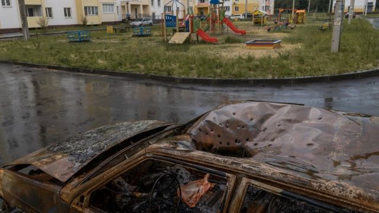
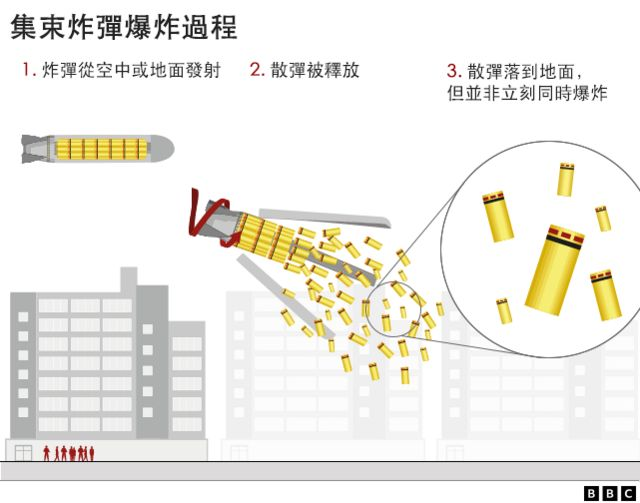
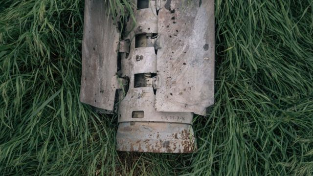

# [World] 乌克兰战争：美国军援基辅集束炸弹 引发人权争议

#  乌克兰战争：美国军援基辅集束炸弹 引发人权争议

  * 法兰克·加德纳（Frank Gardner） 
  * BBC防卫记者 

> 图像来源，  Joel Gunter/BBC
>
> 图像加注文字，它们的作用是在与外物发生撞击时爆炸，但其中相当一部分是"失效弹"，这意味着它们最初不会爆炸，尤其是当弹炮降落在潮湿或软土地上时。

**美国已宣布，因应乌克兰的请求，同意向该国提供具有争议性的集束弹药（cluster bombs）。此举受到人权组织的批评，因为该武器已被100多个国家禁止使用。**

##  什么是集束炸弹？

集束炸弹是一种从火箭、导弹或炮弹中散射大量小型弹药的武器，弹药在飞行过程中分散在广阔的区域内。它们作用是在与外物发生撞击时爆炸，但其中相当一部分成为“哑弹”，这意味着它们最初不会爆炸，尤其是当弹炮降落在潮湿或软土地上时。

它们随后可能在被捡起或踩踏时爆炸，导致受害者死亡或残废。从军事角度来看，当用于对抗壕沟和堡垒阵地中的掩体地面部队时，它们可能具有可怕的效果，使大片区域变得极危险，人们亦无法在经过仔细清理之前四处走动。

##  为什么它们被禁止使用？

包括英国、法国和德国在内的100多个国家签署了一项国际条约 《集束炸弹公约》（Convention on Cluster Munitions）；该公约禁止使用或储存这些武器，因为它的使用会让平民人口受到不加选择性的伤害。

由于弹药可能与居民区或农田区域中的小玩具相似，常常因为好奇心而被拾起，儿童因此特别容易成为受害者。人权组织将集束炸弹描述为“令人憎恶”，甚至是战争罪行。

> 图像加注文字，据报导，俄罗斯集束弹药的“失效弹”概率约为40％，意味着大量弹药仍然对地面造成威胁，而平均失效弹率据信接近20％。

##  还有哪些国家在使用它们？

自2022年2月俄罗斯入侵乌克兰以来，俄罗斯和乌克兰一直在使用集束炸弹。它们都没有签署相关的条约。美国也没有，但曾批评俄罗斯广泛使用该武器。据报导，俄罗斯集束炸弹的“失效弹”概率约为40％，意味着大量弹药仍然对地面造成威胁，而平均失效弹率据信接近20％。

五角大厦估计其自身的集束炸弹的失效率低于3％。

> 图像来源，  Getty Images
>
> 图像加注文字，集束弹药是一种可怕的、不加选择性的攻击武器

##  乌克兰为什么要求它们？

乌克兰军队的火炮弹药极度匮乏，主要原因是与俄罗斯一样，它们以非常快的速度使用弹药，而乌克兰的西方盟友无法以所需速度补充弹药。在乌南和东部几乎静止而艰难的战线上，火炮已成为关键。

乌克兰现在面临着一项艰巨的任务，试图从俄罗斯入侵者沿着1000公里战线伸展设下的防御阵地中驱逐他们。但由于火炮弹药不足，乌克兰已要求美国重新补充其集束弹药库存，以打击那些担任这些防御壕沟的俄罗斯步兵。

这对白宫来说并非一个容易的决定，并且在许多民主党人和人权倡导者中极不受欢迎。这场辩论已经进行了至少6个月。

##  这一美国决定会产生什么影响？

立即产生的影响将是，美国在这场战争中的道德高地将大受影响。

俄罗斯被指控犯下许多战争罪行，这已有充分的证据；但美国这一举动可能会引来对美国虚伪的指责。因为集束弹药是一种可怕的、不加选择性的攻击武器，出于充分的理由，它在世界上许多地区都被禁止使用。美国的举动将不可避免地使其与其西方盟友产生分歧，而盟友之间的任何分裂，都是普京希望且需要的。

