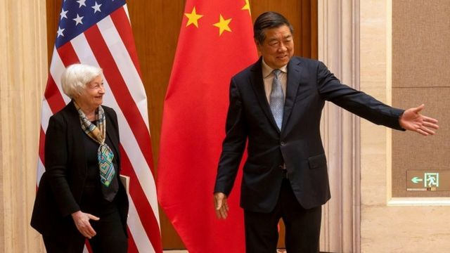
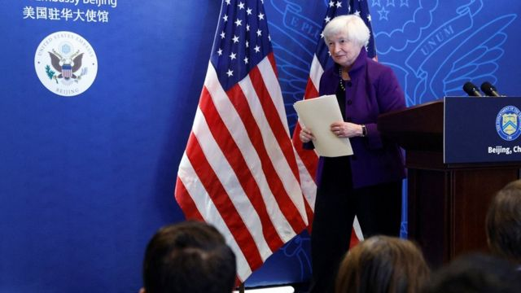

# [World] 耶伦访华：美国财长中国行改善了中美关系吗

#  耶伦访华：美国财长中国行改善了中美关系吗

  * 傅东飞（Rupert Wingfield-Hayes） 
  * BBC亚洲事务记者 

> 图像来源，  Reuters
>
> 图像加注文字，耶伦（左）与中国新财金主管何立峰（右）的首次会晤在一片彬彬有礼的气氛中举行。

**美国财政部长耶伦（Janet Yellen）刚刚结束了四天对华访问，她此行的目的是要重建两国之间的桥梁。**

这次北京之行是否成功？要是我们只看一项最基本的指标，是的。

美国与中国再次实现了对话，面对面的，哪怕不算热情，也算是彬彬有礼和互相尊重。

这跟特朗普（Donald Trump）执政年间，大多依靠社交媒体作为喊话筒的跨太平洋沟通比较，可谓大相径庭。

双方的语调和内容都比之前正面、慎重。在耶伦此行之前，尚有美国国务卿布林肯（Antony Blinken）6月份那次事关重大的访问， 两国当时均承诺要稳定彼此关系  。

星期天（7月9日）行程结束之际，耶伦表示，建立“与中国新经济团队之间适应性强且有建设性的沟通渠道”将会有所帮助。此言不能被低估。

今年3月，中国政府顶层的大部分人被替换，新人的首要条件是忠诚于最高领导人习近平，而其中的关键人物这一正是该国新的经济事务主管官员何立峰。

星期六（8日），耶伦大部分时间都花在与何立峰会谈上。她说两人的会谈“直接、实质和卓有成效”，但同时承认双方有“显著分歧”。

##  耶伦的深鞠躬引发议论

**BBC** **中文**

耶伦星期六在钓鱼台国宾馆会晤首次以“中美经贸中方牵头人”头衔露面的中国副总理兼何立峰，两人见面之际，耶伦的肢体语言在中美两国社交媒体上引起议论。

在Twitter上，美国亚裔评论人士 张千里（Ian Miles Cheong）  形容耶伦向何立峰“深深鞠躬”，而这是“前所未见”的。 小报《纽约邮报》（New York Post）  形容，何立峰当时向后退了一点，给耶伦“更多卑躬屈膝（kowtow）的空间”。

比利时布鲁塞尔智库俄罗斯、欧洲和亚洲研究中心（CREAS）主任 方娴雅（Theresa Fallon）  描述：“耶伦可是鞠了三个躬。”，并辅以“脑爆炸”的颜文字。中国评论人士 利里克·休斯·哈勒（Lyric Hughes Hale）  跟帖说：“我想耶伦部长把日本、中国打招呼的礼仪搞混了。”

美国智库德国马歇尔基金会（GMF）亚洲项目主任 葛来仪（Bonnie Glaser）  说：“我期望有谁能告诉美国官员，他们跟中国官员握手的时候，该站直腰板。”

中国网民的评论似乎显示耶伦此举“两面不讨好”。在上海左派网站 观察者网的微博帖文下  ，一位北京网民说：“姿态显得低，心态一如既往的傲慢。”一位重庆网民说：“这种鞠躬在中国人眼里是没有诚意的。”一位陕西网民说：“日本人式的鞠躬，那是黄鼠狼！”

耶伦在会晤何立峰的开场白中重申，美国将采取针对性措施，以保护美国国家安全，但同时称，中美不应让分歧导致误解。

在整个行程中，耶伦试图游说东道主中国，在总统拜登（Joe Biden）治下，美国并非从根本上敌视中国。

她说，“我们不把我们的关系视定义为大国冲突”，而且“我们不寻求脱钩”彼此的经济。

拜登政府似乎在试图证明，其中国政策并不是单纯延续特朗普政府对北京的公开敌视。她成功了吗？我们还在等中方表态。

但正所谓行胜于言，从北京的视觉看，拜登政权最近的一些动作毫不友善。其中最为关键的，要算是对个别用于开发人工智能的美国电脑芯片施加出口管制。

##  北京强调耶伦访问的正面结果

> 图像来源，  Reuters
>
> 图像加注文字，耶伦向中方强调拜登政府无意让美中经济“脱钩”。

中国财政部星期一（10日）就耶伦访华情况发表新闻通报，从四个方面总结其四天行程的正面结果。
 财政部的通报形容  ，“中美加强合作是两国的现实需求和正确选择”，并称两国同意“后续保持中美经济领域的高层交往和各层级沟通交流”。

不过，声明还提到：“中方再次重申了在取消对华加征关税、停止打压中国企业、公平对待两国双向投资、放宽对华出口管制、取消涉疆产品禁令等问题上的关切，希望美方切实采取行动，回应中方在两国经济关系中的重大关切。”
 耶伦星期天在北京向记者总结其行程时称  ，她就美方对中国“不公平经济手段”——例如市场准入、知识产权问题——向中方“施压”，以及就中方最近针对美国企业的强制行动有所增加表达关切。

美国并没有打算放宽这种禁令，反而着手扩大管制到其它对华高科技出口之上，同时拉拢其盟友，从日本到德国 到荷兰  ，不向中国提供生产最尖端芯片的技术及设备。

美国的动机很简单，它不希望中国轻易取得美国科技，从而在人工智能等领域取得优势，以及在军事科技上领先，有朝一日能用来在冲突中反制美国，例如说在台湾。

这一切意味着，尽管对话重启，且似乎准备在未来几个月里加速，这仍是个如履薄冰的过程。

再来一个“气球事件”，或者是美中军舰、军机擦肩而过，便足以轻而易举地让过去几天所取得的进展打回原形。

哪怕是最乐观的专家们也相信，这已成为一段非常艰难的关系，需要双方谨慎、长期管理，方可维持稳定。

