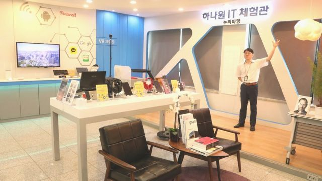
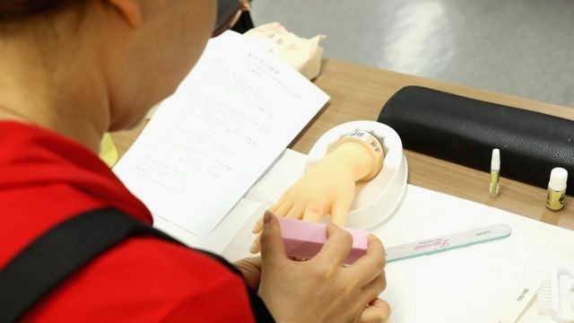
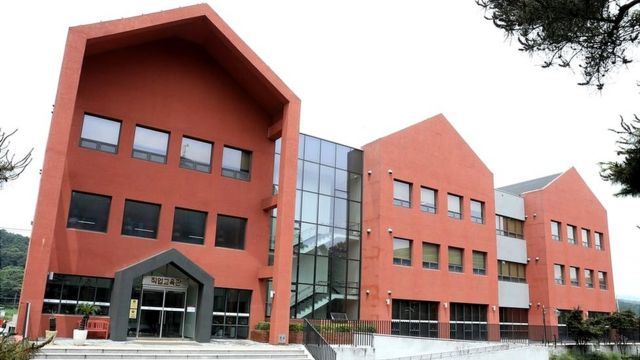

# [World] 从创伤到新生：走进迎接朝鲜脱北者的韩国统一院

#  从创伤到新生：走进迎接朝鲜脱北者的韩国统一院

  * 白麦克（Michael Bristow） 
  * BBC记者，发自首尔 

> 图像来源，  Unification Ministry
>
> 图像加注文字，韩国统一院的设施为朝鲜难民提供包括烹饪等各类课程

**距离韩国首都首尔大约两个小时的车程，在一个充满丛林山丘和稻田的乡村，有一个看起来格格不入的建筑群。**

这座俯瞰着周边乡村的多层建筑群，周围围上了高墙和有警卫守护的门。这个地方与世隔绝、安全而又隐秘。

既是培训基地，又是医疗设施，也是再教育中心，这里是朝鲜脱北者抵达韩国之后被送去逗留三个月的地方。

它的名称是“统一院”（Hanawon），全称为“朝鲜离脱住民定着支援事务所”（Settlement Support Centre for North Korean Refugees）。

近年，通过艰难的旅途逃往韩国的朝鲜人数量大幅下降，他们冒着被捕就有可能处死的风险逃亡，以摆脱贫困和压制。

十来年前，每年大约有3000朝鲜人抵达韩国。之后那些年，这个数字下降到了约1000人，然后在新冠疫情期间，随着朝鲜关闭边境，又降至不到100人。

尽管如此，韩国还是重申，不仅要继续开放统一院，而且还要对设施进行扩大。

> 图像来源，  Unification Ministry
>
> 图像加注文字，这个与世隔绝的地方有一个展示科技产品的区域。

首尔政府认为，随着朝鲜方面放宽新冠疫情的管控措施，会有更多的朝鲜人能够逃出来。那样的话，统一院就将再次满员。

韩国统一部长权宁世表示，韩国需要准备好迎接这些新来者。

“我们不要将脱北者视为异类，而要把他们看作是来自北方家乡的邻居，”他说。

那些树篱、鲜花和修剪整齐的树木在周一的夏日阳光下令统一院显得很受欢迎，韩国政府在这一天难得地让记者参观设施的内部。

我们参观了一个培训中心，那里为脱北者提供了22门课程，包括美发、美容、烘焙和服装制作等等。

一个房间被布置成了一个美甲店，脱北者在这里学习精细的美甲手艺。他们使用模型手来练习涂甲、上光和修整。

> 图像来源，  Unification Ministry
>
> 图像加注文字，支援中心提供美甲、美容等培训课程

这里还散发着烘焙的香气，那是从隔壁的烹饪课里飘过来的。

其他课程旨在帮助朝鲜人适应这个国家的生活，这里的科技比他们的国家要领先数十年。

其中一个教室被布置成一个卖高科技产品的小商店。平板电脑、智能手机和电脑摆放在展台上。

另一座建筑的地板看起来则像一家现代医院。那里有一个小病房，有诊室，还有穿白袍的医生走来走去。

这里不仅要照顾这些朝鲜人身体上的需要，许多人来到这里时还带有严重的心理问题，需要紧急协助。

BBC

> 我的一位患者......擔心人們如果知道他來自朝鮮會怎麼想。 >
> **全振勇醫生**  
>  曾在統一院工作的精神科醫生

全振勇医生是一名在统一院工作过的精神科医生。他听设施里的朝鲜人讲述过一些可怕的创伤经历。

他说，他们必须应对逃亡带来的压力，还有在到达韩国之前都有可能被捕遣返的持续恐惧。

很多人难以克服内疚感，他们将亲人留在朝鲜，可能再也不能相见。

一些人在韩国遭受偏见，于是选择隐瞒自己来自朝鲜的事实。

“我的一位患者曾在一家餐馆吃午饭，当时电视上正播放朝鲜发射导弹的新闻，”全医生说。

“他感到非常不适，就快快地吃完离开了餐厅。他担心人们如果知道他来自朝鲜会怎么想。”

> 图像来源，  Unification Ministry
>
> 图像加注文字，用围栏围起来的设施内，有一个职业培训中心。

在接受记者采访时，现在在统一院的三名女性脱北者透露了她们正在努力克服着怎样的困难。

她们害怕透露姓名，仅以A、B和C来指代。其中一名女子还躲在一个屏障后面与我们对话。

三人都是先逃到了中国，然后再抵达韩国。她们在中国的生活比在朝鲜好，但仍然充满焦虑和危险。

B女士说她没能获得中国的身份证，意味着她无法去医院，无法办理银行卡，甚至也不能乘坐火车。

C女士表示，她的工资只有中国工人的一半，因为她的处境令她无力争取更多。

她们还讲述了，中国越来越紧密的监控网络迫使她们到韩国去寻求庇护。

“当我决定叛逃时，我什么都不怕，因为我是孤身一人，”A女士说，“但是后来我在中国生了一个孩子，这才意识到我没有合法身份。”

三位女性都谈到了她们对未来的希望——以及忧虑。其中一人还说，她甚至担心交税的问题。

BBC

> 終於來到韓國，我鬆了一口氣，抱著女兒開始哭泣。 >
> **金成慧**  
>  統一院畢業生

有一个了解她们处境的人，是金成慧。她十多年前从统一院毕业出来，现在经营着自己的生意，生产一种在朝鲜很受欢迎的米酒。

在朝鲜，金女士曾被告知，韩国人一开始会欢迎她，然后她就会被虐待和杀害。

“直到我从统一院毕业的时候，我才真正意识到自己安全了，”她说。

金女士说，真正的教育在离开统一院之后才开始。

“对于所有脱北者来说，在外面的第一个晚上都是难忘的。终于来到韩国令我松一口气。我抱着女儿开始哭泣——不是因为我伤心或者孤独，而是因为我们活了下来，”这位现年49岁的女士说。

金女士记得，在外面的最初几个星期，那些韩国的志愿者是如何善待她和帮助她适应新生活的。

她走进新家的时候，他们就在那里迎接她，还带她去看周围的商店，还帮她付了第一趟出租车的费用。她仍然与其中一些人保持着联系。

那些仍然身在统一院里的人，会希望自己也有这样的好结局。

