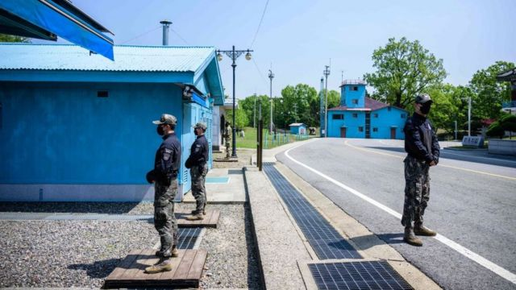
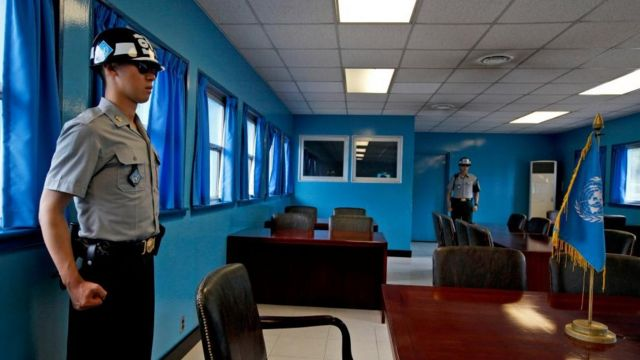
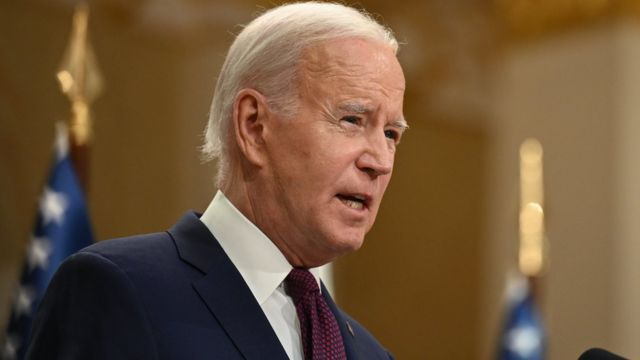
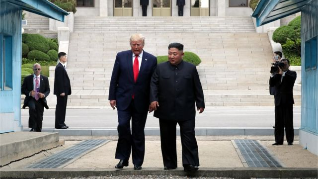
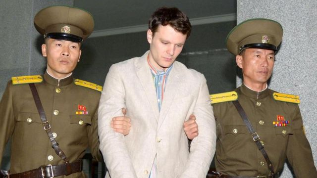
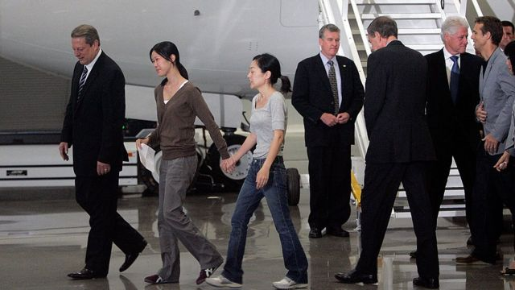

# [World] 美军士兵越境朝鲜被拘留，拜登政府或面临危机

#  美军士兵越境朝鲜被拘留，拜登政府或面临危机

  * 安托瓦內特·雷德福（Antoinette Radford）、西蒙·弗雷泽（Simon Fraser） 
  * BBC记者 

> 图像来源，  AFP
>
> 图像加注文字，韩国士兵（左）在板门店休战村面向北方站岗，该村位于分隔朝鲜和韩国的非军事区（DMZ）的联合警备区（JSA）。

**据报道，朝鲜已扣押一名现役美军士兵，他在未经允许之下越过重兵守卫的朝韩边境。**

该名男子当时正在联合国管理的朝韩两国分隔区，参加一个有组织的参观团。

此次危机发生在各方与朝鲜关系特别紧张的时刻，这是世界上最封闭的国家之一。美国告诫本国公民不要前往那里。

美国一名高级指挥官指，与该名士兵未曾联系。

美国印太司令部海军上将约翰·阿奎利诺（John Aquilino）表示，他并未“追踪”与朝鲜方面的联系。他说，该名士兵是自愿行动，在未经授权之下“出逃”。美军驻韩国部队正就事件进行调查。

该士兵被扣留几小时后，朝鲜向附近海域发射了两枚疑似弹道导弹。

导弹发射已得到韩国军方的确认，此时朝鲜半岛的紧张局势正十分高涨。没有迹象表明此次发射与士兵被扣留有关。

目前尚不清楚该男子是否叛逃到朝鲜，以及是否希望返回。朝鲜一方尚未发表评论。

五角大楼认定这名士兵特拉维斯·金（Travis King），属二等兵（PV2）。五角大楼发言人在一份声明中表示，这名士兵自2021年1月起在军队服役。

他是一名骑兵侦察兵，原先隶属于美军第一装甲师的一个单位，正在与美军驻韩部队进行轮换。

美联社报道，二等兵特拉维斯·金似乎曾因袭击指控而在韩国被拘留，正面临纪律处分。

据BBC的美国合作伙伴哥伦比亚广播公司新闻（CBS News）报道，特拉维斯·金在首尔机场通过了安检，但以某种方式成功离开了航站楼，并加入边境参观团，然后在期间越过了边境。

美国军方表示，他是“自愿行动且未经授权”。据报道，朝鲜已扣押一名现役美军士兵，他在未经允许之下越过重兵守卫的朝韩边境。

> 图像来源，  EPA
>
> 图像加注文字，韩国士兵在韩国板门店边境村庄“非军事区” (DMZ) 军事分界线站岗。

同一个参观团中的一名目击者向CBS表示，他们参观了边境地带的一座建筑物——据当地媒体报道称是板门店的“停战村”——当时“这个人哈哈大笑着从一些建筑物中间跑了”。

“我一开始以为是恶作剧，但是他没有回来，我意识到这不是开玩笑，然后每个人都反应过来，情况就乱了，”目击者说。

负责管理非军事区（DMZ）和联合警备区的联合国军司令部表示，较早前他们的团队已经与朝鲜军方取得联系，试图通过谈判令他获得释放。

“我们相信他目前已被朝鲜扣押，并正与我们的朝鲜人民军（朝鲜军方）对应方努力解决这一事件，”联合国军司令部表示。

目前尚不清楚特拉维斯·金被关押在何处，以及状况如何。

##  分析：可能是拜登政府的大危机

_**——BBC驻北美记者安东尼·泽克尔（Anthony Zurcher）**_

> 图像来源，  Getty Images
>
> 图像加注文字，拜登总统将被迫应对美朝紧张局势升级。

美军士兵特拉维斯·金越过朝韩非军事区，可能会成为拜登政府的重大危机。

这一事件发生在美国核导弹潜艇抵达韩国釜山港的当天——这本就是美国在明确显示军事实力，此举激怒了朝鲜。

虽然特拉维斯·金进入朝鲜的意图尚不清楚，但他的存在给朝鲜及其领导人金正恩提供了与美国交涉的新筹码。

如果该士兵是非自愿被拘留，拜登就可能面临更多压力来安排他的释放。而朝鲜肯定会将他出现在自己国境内一事作为宣传工具。

位于华盛顿的朝鲜人权委员会（Committee for Human Rights in North Korea）秘书长格雷格·斯克尔勒托尤（Greg Scarlatoiu）向BBC表示，朝鲜当局很可能会“试图从他那里榨取信息”，了解他的军队服役情况，并且“试图逼迫他成为宣传工具”。

非军事区将朝韩彼此隔开，是世界上最防卫最森严的区域之一。

那里布满地雷，并且被电网、铁丝网和监控摄像头围绕。武装警卫须24小时全天候保持警觉。

> 图像来源，  Getty Images
>
> 图像加注文字，2019年，时任美国总统特朗普与朝鲜领袖金正恩在朝韩边境高调会面。

自1950年代朝鲜战争以来，朝韩两国一直以非军事区彼此分隔。战争以休战结束，意味着两个国家在理论上仍处于战争状态。

每年都有数十人试图从朝鲜逃亡，以逃离贫困和饥荒，但越过非军事区的行为极其危险且罕见。该国在2020年新冠疫情爆发开始时就关闭了边境，且目前尚未重新开放。

最近一次有士兵在联合警备区叛逃是在2017年。据韩国当时称，一名朝鲜士兵先是驾车，然后步行越过军事分界线，后来这名士兵被开了40枪，但幸存了下来。

根据韩国政府公布的数据，在新冠疫情爆发之前，每年有1000多人从朝鲜逃往中国。

##  过去被朝鲜扣留的美国人

> 图像来源，  Reuters
>
> 图像加注文字，奥托·瓦姆比尔在获释返回美国后不久去世。

自1996年以来，曾多次出现过美国公民在朝鲜被拘留的事件，当中包括游客、学者和记者。

2017年7月，美国政府禁止美国公民访问该国，这一禁令已延长至今年8月。

美国囚犯在朝鲜监狱通常会受到残酷对待。

2018年，朝鲜释放被扣留的美国弗吉尼亚大学的学生生奥托·瓦姆比尔（Otto Warmbier）。他因偷窃旅馆标牌而被监禁。他在返回美国时处于昏迷状态，之后去世。

以下是近十年来美国人被朝鲜扣留的著名事例：

  **2016年，奥托·瓦姆比尔（Otto Warmbier）** ——访问期间被捕并判15年劳教，被拘留17个月后重病回国，但回国六天后去世 

  **2018年，布鲁斯·拜伦·劳伦斯（Bruce Byron Lowrance）** ——非法从中国入境朝鲜后被拘留，约一个月后被释放，当时正值金正恩与特朗普高调会谈之后 

  **2014年，马修·米勒（Matthew Miller）** ——24岁的加州教师在参观团期间被控进行“敌对”间谍活动，判6年劳教。他表示曾试图留在朝鲜，后来向美国政府求助 

  **2012年，裴埈皓（Kenneth Bae）** ——韩裔美国传教士被控“敌对行为”并判15年劳教，在囚期间健康恶化，后来在美国情报机关努力下，与米勒一起获释 

  **2009年，李云娜（Euna Lee）和凌志美（Laura Ling）** ——两名驻加州的美籍记者台湾华人凌志美（Laura Ling）和美籍韩裔人李云娜（Euna Lee）在拍摄中朝边境人道主义纪录片期间被捕，被判12年监禁，当年8月在前总统比尔·克林顿对朝的“私人任务”访问后获释 

> 图像来源，  Getty Images
>
> 图像加注文字，李云娜（Euna Lee，右）和凌志美（Laura Ling，中）在2009年随访问朝鲜的克林顿回国。

