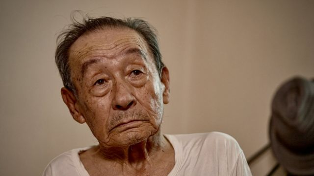
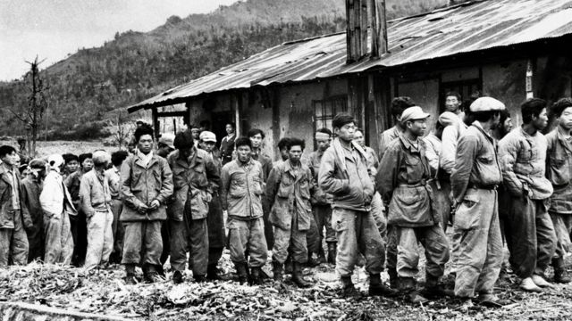
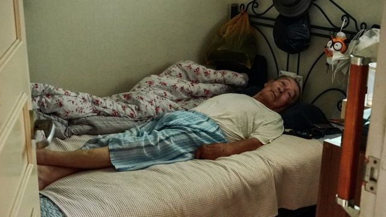
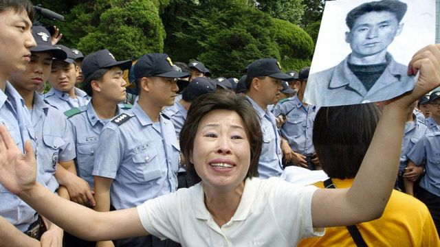

# [World] 韩朝停战70周年：那些被留在朝鲜并自行逃离的韩国战俘

#  韩朝停战70周年：那些被留在朝鲜并自行逃离的韩国战俘

  * 吉恩·麦肯锡（Jean Mackenzie） 
  * BBC驻首尔记者 

> 图像加注文字，李大奉在朝鲜做了半个世纪的战俘之后，终于通过河流涉水逃往中国。

**92岁的李大奉（ Lee Dae-bong）并不特别愿意离开床。他这辈子经历得够多了。当他调整着身上的睡衣时，露出缺掉三根手指的左手。**

他受的伤并不是打仗导致的，而是源自之后的54年里，他被迫在朝鲜一个煤矿里做苦力。

这个前韩国士兵在朝鲜战争期间被中国军队俘虏，当时中国军队是与朝鲜一同作战。那是1953年6月28日，也就是箭头山战役的第一天，离三年的残酷战斗以停战协议告终不到一个月。

那天，除了他那个排的三个人之外，其他人全部牺牲。就在他和其他两个幸存者被装上货运火车时，他以为自己要回韩国了，但是火车却转向北方，驶向阿吾地煤矿。他后来在那里度过了余生的大部分时间。他的家人被告知，他已在战斗中阵亡。

朝鲜战争以一份停战协议将朝鲜半岛被划分为南北两边而告终，战后被囚禁在朝鲜的韩国士兵在5万至8万之间。

之后双方从未订立和平条约，战俘也从未归还。李大奉就是极少数能够成功策划逃脱的人之一。

> 图像来源，  Getty Images
>
> 图像加注文字，在朝鲜被俘的数万韩国老兵当中，仅有80人成功回到家乡。

数十年来，除了一些小规模冲突外，停战协议大体上得以维持，使之成为史上历时最长的停火协议。

但是，没有和平条约使得李大奉还有他的战俘同伴及其家人生活充满苦难。在朝鲜与韩国停战协议签署70周年之际，他们的故事提醒着人们，朝鲜战争并未结束。

在被囚禁的最初几年里，李大奉每星期被迫在煤矿里工作一周，然后接下来一周学习朝鲜意识形态，直到1956年，他和其他被囚者被剥夺了军衔，然后被告知要结婚，融入社会。

但是，他们和他们的新家庭被定性为社会边缘人，并安置在朝鲜严酷社会阶层体系的最底层。

超过50年的时间里日复一日地挖煤，这是一项极其痛苦的工作，但李大奉说，最难以忍受的是如幽灵般笼罩的受伤和死亡。

有一天，他的手被卡在了一台煤炭加工机器里，但是他失去几根手指已经算是轻微，因为他看见过很多朋友在一连串的气体爆炸事件中丧生。

“我们将整个青春都给了那个煤矿，时刻等待并害怕着就那么毫无意义地死去，”他说，“我非常想家，特别是我的家人。就算是动物，在快要死的时候，也会回到自己的洞穴里。”

> 图像加注文字，李大奉被迫在朝鲜煤矿当苦力，并因此失去了三根手指。

在朝鲜和韩国纪念半岛上得以仍然持续的和平时，许多战俘和他们的家人将苦难归咎于双方。

多位韩国总统已经与朝鲜领导人会面过，但是争取将他们带回国这件事，在议程表上一直都排在很后面。

朝鲜在释放了仅8000名战俘之后，就拒绝承认尚有更多的战俘存在。

在2000年的一次峰会上，时任韩国总统金大中和朝鲜领导人金正日会面时，这个话题甚至都没有被提及。

李大奉说，他就是在那一刻感到失去了所有希望，他意识到，回到家乡的唯一办法就是逃跑。

他的妻子早已去世，而在他的独子在一宗矿难中丧生的三天后，李大奉开始了他的旅程。当时已经77岁的他秘密地涉水穿过河流进入中国，当时水淹到了他的脖子。

他是80名逃脱并回到韩国的战俘之一，而这些逃脱者当中只有13人仍然健在。其他的数以万计战俘都被留在了矿场里死去。仍然活着的人寥寥无几——只是他们的子女还在。

BBC

> 之所以有今天的韩国，就是多亏了像我父亲這樣的人，但是我们所受的苦难还没有得到解决。 >
> **蔡雅仁**  
>  韓國戰俘的女兒

父亲在朝鲜矿场一次瓦斯爆炸中死去时，蔡雅仁（Chae Ah-in）只有六岁。不久后，她的姐姐们被派去代替父亲的工作。

还在上学的她遭受了无情的殴打和欺凌。她无法理解她的一家为什么受到诅咒。直到后来，她偷听到姐姐们的窃窃私语时，才知道了父亲原来是一名韩国士兵。

“很长一段时间里，我都恨他，”她在首尔郊区的家中回忆说——她2010年来到了这里，“我怪他令我们所有人都受苦。”

28岁时，蔡雅仁也选择了逃离朝鲜的痛苦生活，先是越境逃到中国，在那里生活了10年。直到她到了韩国，才意识到她的父亲原来是一位英雄。

“现在我尊敬他，并努力地回忆他，”她说：“我感觉自己和其他脱北者不一样，因为我是一位光荣的韩国参战老兵的女儿。”

但是，作为一名为国家捐躯的参战老兵的女儿，蔡女士却没有得到韩国政府的承认。

当年没能返回家乡的战俘，会被记录为失踪，假定已死，然后被尊奉为战斗英雄。

“韩国之所以能有今天，就是多亏了像我父亲这样的人，但是我们受的苦难还没有得到解决，”她说，想要让自己和父亲都得到应有的承认。

> 图像来源，  Getty Images
>
> 图像加注文字，战俘的亲属多年来一直要求他们的亲人回国，并期望他们被承认为战争英雄。

成功逃脱到韩国的战俘子女约有280人。孙明花（Son Myeong-hwa）也是这样的一个。她是朝鲜战争战俘家属协会（Korean War POW Family Association）会长，正在代表他们维权。

“战俘子女在朝鲜因为牵连而承受了负罪的痛苦，而在韩国，我们却没有被承认。我们希望能够得到与其他阵亡老兵家属相同的尊重，”她说。

韩国政府向我们表示，他们没有计划改变对退役军人的划分。

李大奉回到家乡时，已经是一个老人，父母兄弟已经去世。尽管韩国的变化已经令他认不出来，但是他的妹妹还是带他回到了他原来的故乡。

李大奉回忆，他在朝鲜的那些朋友们，临终前都乞求子女将他们带回故乡安葬。他们的愿望尚未实现。朝韩之间没有和平条约，使得这些家庭也难以找到属于自己的平静。

李大奉和蔡雅仁仍然梦想着朝鲜和韩国的统一。

蔡女士希望能够将父亲的遗体带回韩国安葬。

对于朝鲜和韩国来说，和平与统一仍然是官方表述的目标。但是停战已经有70年了，这个梦想却仿佛遥遥无期。

