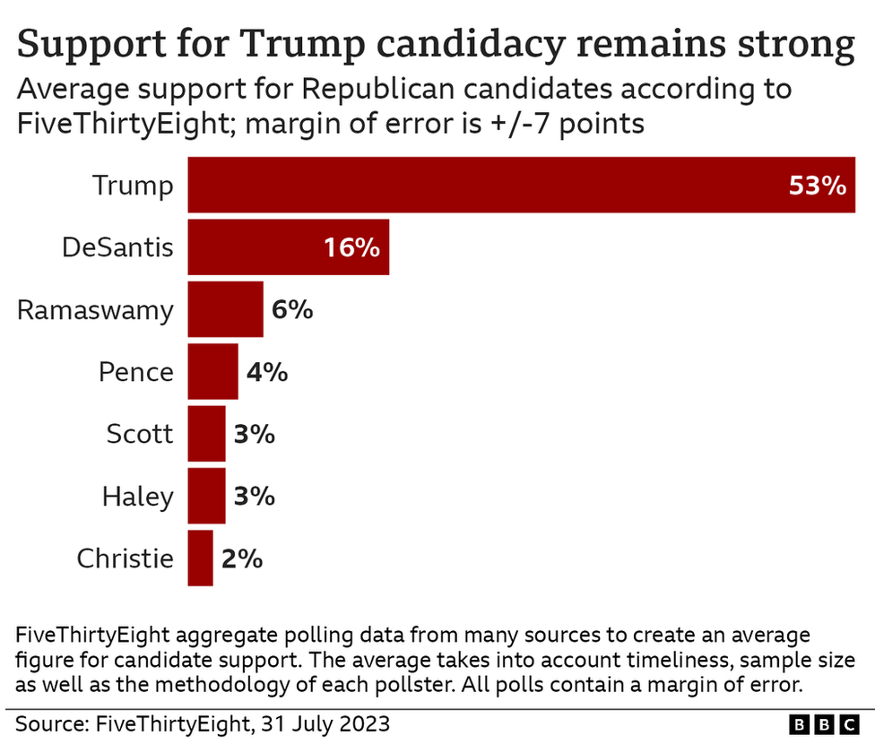
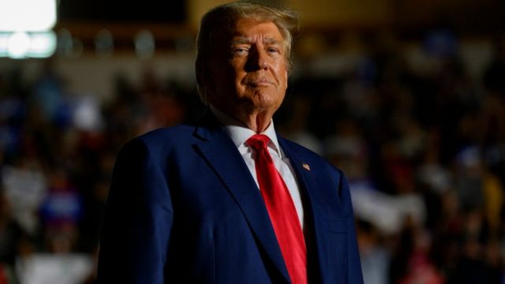
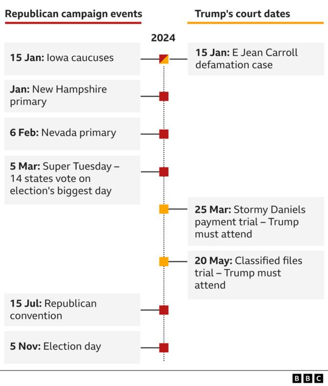

# [World] 美国大选2024：屡遭起诉的特朗普党内民调支持率为何不降反升

#  美国大选2024：屡遭起诉的特朗普党内民调支持率为何不降反升

  * 安东尼·泽克尔（Anthony Zurcher） 
  * BBC驻北美记者 

> 图像来源，  Getty Images
>
> 图像加注文字，7月，特朗普的支持者在宾夕法尼亚州的一场集会上。

**唐纳德·特朗普（Donald Trump）惹上的越来越多的麻烦官司并没有损害他在2024年大选共和党总统提名中的显著领先地位。事实上，这些刑事指控还巩固了他的位置。这是为什么？**

这位美国前总统在过去四个月里已经被两度起诉——一次是在纽约被指涉嫌金融犯罪，另一次则是在联邦法庭被指控对敏感的政府文件处理不当并阻碍调查。

他可能会面临第三宗起诉——企图推翻2020年选举结果；还有第四宗——在乔治亚州，被指向官员施压，试图推翻他2020年在该州败选的结果。

尽管面对所有这些，但是特朗普的竞选活动势头不仅没有减弱，相反还越来越强劲。

截至7月31日的民意调查平均数显示，他以37个百分点的绝对优势领先于最接近的对手、佛罗里达州州长罗恩·德桑蒂斯（Ron DeSantis）。

其他14个势均力敌的候选人中，没有人得票率超过6%，过半数候选人甚至得票率不到1%。

2月中旬时，特朗普在民意调查平均数中对德桑蒂斯的领先优势仅为两个百分点（41%对39%）。但事实证明，那是佛州州长迄今为止的最高点。在德桑蒂斯的光芒开始褪色、民意支持率大幅下滑时，特朗普的支持率却稳如磐石。

事实上，从4月初第一宗起诉令特朗普成为首个被刑事检控的前总统以来，支持率还上升了。

根据民意调查的平均值，在第一次被捕和出庭之后，特朗普一直是大多数共和党选民的首选。

##  共和党选民多数认为指控出于政治动机

市场研究公司益普索（Ipsos）的美国公共事务总裁杨恩（Clifford Young）指，特朗普与他的支持者——约占共和党选民的40%至45%——之间的纽带将很难打破。

“他们是通过他的眼睛来看世界，”他说，“他的支持者阵营认为他是受到了不公对待。他们相信这些起诉是出于政治动机。”

在特朗普因非法保留机密文件而被起诉后，BBC采访了一个小组的共和党选民，了解他们对这位前总统的看法——我们发现了类似的观点。

“这显然是赤裸裸地要将特朗普挤出总统竞选之外，”亚利桑那州61岁的特朗普支持者罗姆·索雷恩（Rom Solene）说，“这对我们的国家来说是个悲哀的日子，想想其他人，包括拜登在内，都被抓到过持有机密文件。”

即使是像卢克·戈登（Luke Gordon）这样不支持特朗普重新入主白宫的共和党人，也对起诉持怀疑态度。

“我不怀疑起诉书中那些指控的合法性，我也不维护特朗普的行为，”这名21岁的纽约人说，“不过，他被起诉和调查背后的动机，还是很值得担忧。”

BBC在美国的合作伙伴哥伦比亚广播公司新闻网（CBS News）在6月进行的调查说明了这一点：

  * 可能会参加共和党初选投票的选民中有76%表示机密文件指控是“出于政治动机”； 

  * 这些选民中有36%认为，如果前总统在离任后仍保存核武或军事文件会有国家安全风险。在美国全民中间，这个数字则是80%； 

  * 61%的共和党选民表示，特朗普的起诉没有影响他们对这位前总统的看法。14%的人表示，这让他们对他的看法更正面。 

“我们其实是面对着两个美国和两个不同圈子的故事，”杨恩说，“有一个圈子认为特朗普的行为无法无天。另一个圈子则把他看作是他们的捍卫者——而他正是因此而受到攻击。”

> 图像来源，  Getty Images

##  审判和定罪会否影响特朗普的支持率？

在这样一种格局下，就没有什么证据能够表明，第三或第四宗起诉会明显改变共和党总统竞选的局面。

例如，因为特朗普挑战2020年的选举结果而起诉他，大概不会引起共和党人的共鸣。根据美国有线电视新闻网（CNN）在3月的一项调查，84%的共和党人认为拜登没有“合法”地赢得2020年的大选。

这对于特朗普的共和党内对手来说，是一个严重的问题。他们不得不为争取大约60%的共和党选民而斗个你死我活——这些就是在民意调查中表示自己有可能被说服去支持其他候选人，或者永远不会支持特朗普的人。

大多数候选人并不愿意为那些刑事指控而批评前总统，因为他们知道这样会惹怒他的基础选民，但这样一来，他们也难以给出理由，为何选民应该选择他们而不是特朗普。

如果对特朗普的起诉无法动摇这个政治形势，那么到明年，重大的问题就可能是相关的审讯和可能的定罪判决，最终是否能够令美国公众围绕特朗普的尖锐党派分裂产生改变。

2024年的整个上半年，特朗普将不得不在竞选活动和出庭日程之间来回周旋，后者可能持续多个星期。

他在周五表示，即使他被判有罪并且被判刑，也不会停止参选总统。

这在美国政治当中是从未出现过的状况，但是杨恩说，需要关注的关键“领先指标”将是特朗普在民意调查中的支持率以及他的“可选性”是否会发生明显变化——也就是人们认为他是否能赢回白宫。

如果是那样的话，这可能带来他的支持率下降，而这是一系列起诉和过去八年他在公众领域的各种争议都没有做到的事。

只不过，目前初步的民意调查直接对比显示，特朗普与现任总统之间的差距近在咫尺。最近《经济学人》（Economist）与民调机构“YouGov”合作的一项民意调查显示，拜登以44%领先特朗普的40%。晨间咨询公司（Morning Consult）的调查则显示，民主党人以43%对41%领先2个百分点。两个统计的差距均在误差范围之内。

这表明，熟悉的党派对立形势已经被划分出来——2024年的选举，就像过去两届有特朗普参加的选战一样，决定胜负的将是微弱的差距。

