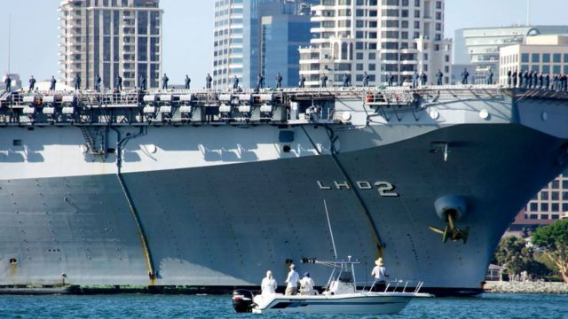
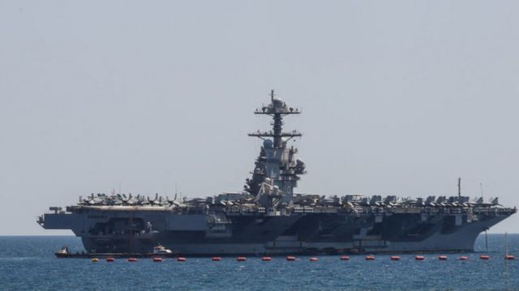

# [World] 美国逮捕两名涉嫌向中国提供机密的华裔海军水兵 北京斥为抹黑

#  美国逮捕两名涉嫌向中国提供机密的华裔海军水兵 北京斥为抹黑

  * 温德宁 (MikeWendling) 
  * BBC记者 

> 图像来源，  Getty Images
>
> 图像加注文字，加州检察官称，魏金超曾在登陆攻击船USS Essex上担任机械师，具有安全许可证，可以接触有关军舰的敏感信息。

**美国官员周四（8月3日）表示，两名美国海军水兵因涉嫌向中国提供军事情报而被捕。**

22岁、已经归化为美国公民的魏金超（Jinchao Wei Thomas；音译）被美国指控密谋将国防机密信息给了中国特工。另外一名26岁的美国海军下士赵文恒（Wenheng Zhao Patrick；音译），因为接受金钱换取敏感照片和视频而被美方逮捕。

目前尚不清楚是不是同一名中国特工联系了这两人。两人于当地时间周三（8月2日）在加州被捕。魏金超是在前往圣地亚哥海军基地工作途中被捕的。

加州检察官在周四的圣地亚哥新闻記者会上公布了指控。他们说，魏金超曾在两栖攻击舰“埃塞克斯号”（USS Essex）上担任机械师，具有安全通行证，可以接触有关军舰的敏感信息。

起诉书又指称，2022年2月，他在归化为美国公民的过程中被中国特工接触，后者支付了魏先生数千美元的报酬，用以换取该舰的照片、影片、操作手册和蓝图。

美国司法部官还说，魏金超还向该中国特工提供了参加海上训练演习的美国海军陆战队员的详细资料。联邦检察官葛罗斯曼（Randy Grossman）表示：“当一名士兵或海军选择金钱而不是国家，出卖国家防卫信息，这是一种终极的背叛行为，我们必须做好准备并采取行动。”

北京否认对这起间谍逮补案知情。

> 图像来源，  Getty Images
>
> 图像加注文字，赵文恒曾在洛杉矶附近的文图拉县海军基地工作。他是在2021年被一名冒充研究人员、寻求投资讯息的中国特工接触。

中国驻美大使馆发言人刘鹏宇在《华尔街日报》上撰文批评说：“美国政府和媒体经常炒作与中国有关的所谓间谍案件。中方坚决反对美方无端中伤和抹黑中国!”

赵文恒曾在洛杉矶附近的文图拉县海军基地（Naval Base Ventura County）工作。根据起诉书，他是在2021年被一名冒充研究人员、寻求投资讯息的中国特工接触。

司法部说，该名特工支付了赵文恒约1.5万美元的费用，以换取位于美军在日本冲绳基地上雷达系统的照片、影片、图表和蓝图。

如果被定罪，魏金超将面临20年至终身监禁的重罪，而对赵先生的指控最高可判20年。

魏赵二人分别因不同的案件被起诉。

司法部将这次所谓间谍活动，描述为中南海为获取美国军事机密正在计划即积极行动的一部分工作。今年二月，一个飘过美国上空的中国“间谍气球”，让美中关系降到冰点，尽管美方后来称，从该气球并未搜集到任何敏感讯息。

针对这起间谍案，助理司法部长奥尔森（Matthew Olsen）说，司法部将继续使用我们的每一个工具来应对来中国威胁，并阻止那些帮助中国违法并威胁我们国家安全的任何人”。

目前尚不清楚魏赵二人是否已经聘请了律师代表他们发言。

