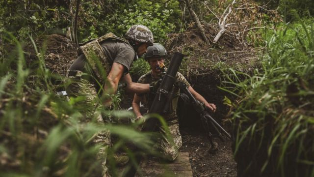
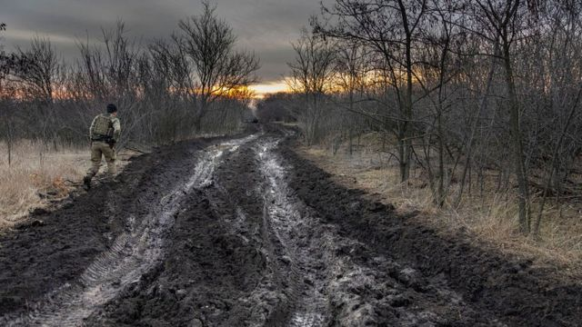
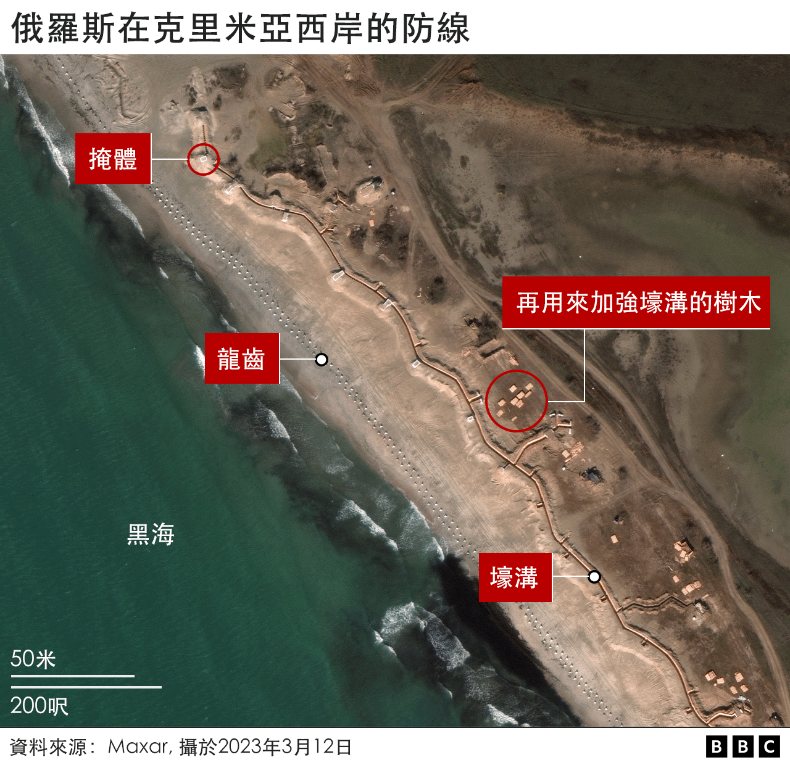
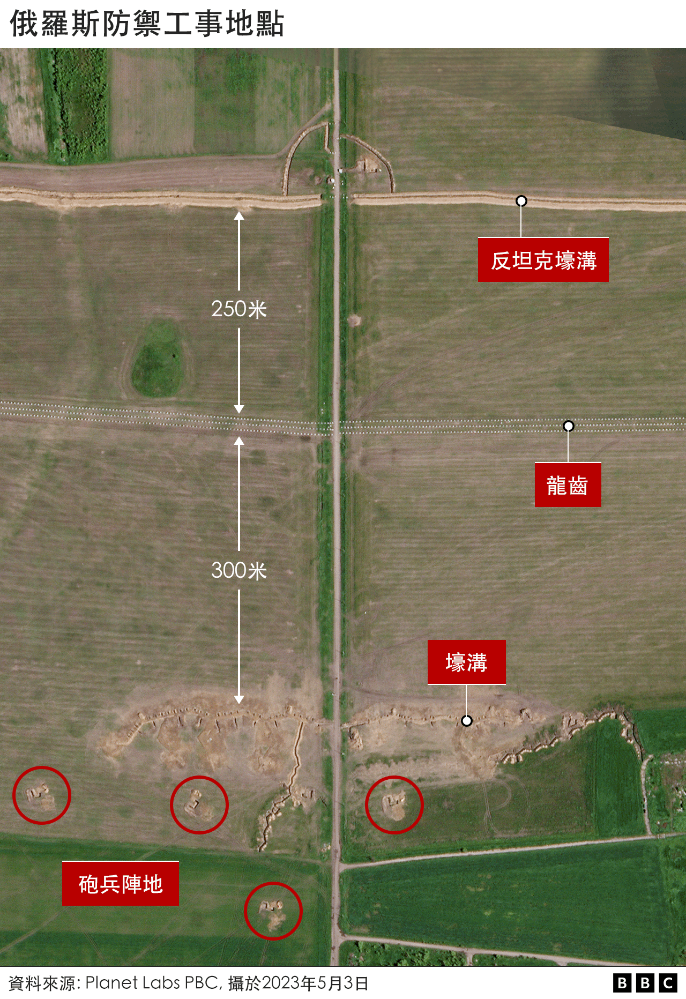
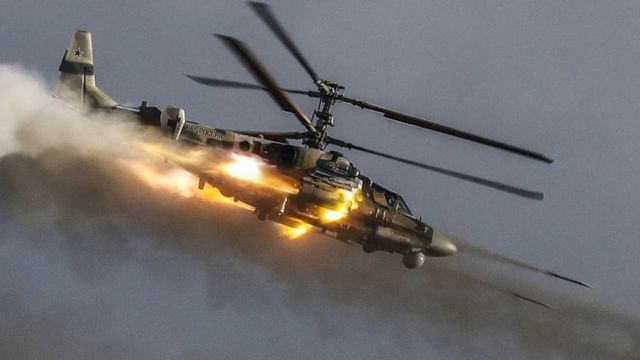
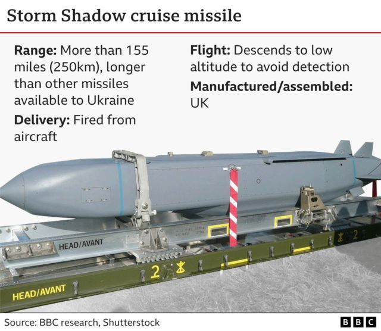
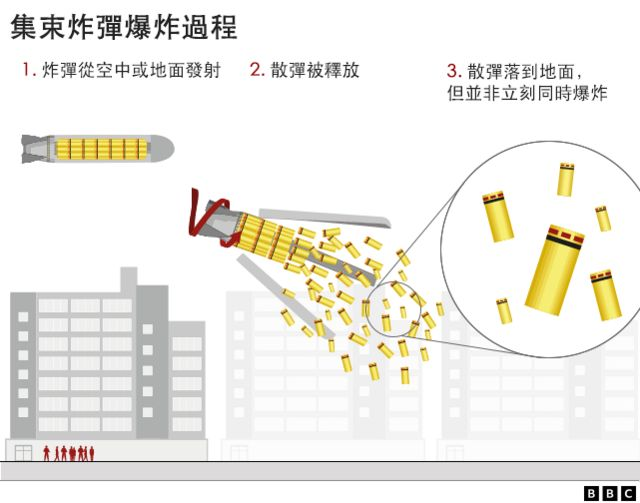

# [World] 乌克兰反攻两个月后，为何进展如此缓慢？

#  乌克兰反攻两个月后，为何进展如此缓慢？

> 图像来源，  Getty Images
>
> 图像加注文字，在今年夏天，在西方提供的数十亿英镑的军事装备支持下，乌克兰采取了进攻行动

**乌克兰的战争已经达到了一个关键时刻。现在战争的走向将决定这个国家的未来，并影响欧洲的安全。事实上，俄罗斯入侵乌克兰的18个月里，乌军大多处于防御状态，阻止莫斯科军队夺取更多领土。**

然而，在今年夏天，在西方提供的数十亿英镑的军事装备支持下，乌克兰发动攻势，试图将俄罗斯人从该国东部和南部被占领域赶出去。在这场反攻行动进行了2个月后，在冬季来临之前，乌克兰的军队是否取得了任何实质性的进展呢？

BBC通过分析了战争影片并与专家进行了交流，试图回答这个问题。

> 图像来源，  Getty Images
>
> 图像加注文字，到了秋天，雨季将会来临，未铺设的道路会变成泥泞，军事推进将变得困难。

##  反攻行动

看一看乌克兰东部和南部的大比例地图，可以发现自从反攻行动开始，几乎没有太多变化。事实上，自从2022年11月以来的九个月里，乌克兰取得的最后一个重大胜利是在南部城市赫尔松夺回大片的领土，在乌国东北部和东部也取得了一些小规模的收复。

但对于乌克兰来说，这并不都是坏消息。

乌军称，最近夺回了顿涅茨克地区的斯塔罗迈尔斯克村（Staromaiorske）。BBC已查核并支持这一说法的影片。

在东部的巴赫穆特（Bakhmut）地区，曾经经历了激烈战斗的地方，乌克兰也夺回了一些之前在夏季失去的小片区域。并且在南部的扎波罗热区（​​Zaporizhzhia）亦取得了一些小规模的收复，这是乌克兰真正需要有所作为的关键区域。

乌克兰希望穿越俄罗斯控制的广袤领土，直抵亚速海以扰乱俄罗斯的供应线路，并切断莫斯科吞并的克里米亚和更西部地区的军队路线。

下面的地图显示了乌克兰收复的地区。大片红色区块是俄罗斯现在控制区域，紫色区域是乌克兰占领或收复的领土。黑点是俄罗斯在这个地区的防御工事。

例如，托克马克市（Tokmak）周围有一圈防御工事，正如BBC在今年五5月份揭示的那样。

##  为何乌克兰的进展如此缓慢？

> 图像加注文字，大片红色区块是俄罗斯现在控制区域，紫色区域是乌克兰占领或收复的领土。黑点显示俄罗斯人在这个地区的防御工事。

根据独立分析，两个月来，乌克兰军队在该地区长达160公里的前线上，最多只前进了约10英里（16公里）。

虽然有进展，但比乌克兰及其西方盟友所希望的速度要慢。

乌克兰军队在3个战线上发动了攻击，使用了西方提供的装备和培训，并探查长达1,125公里前线上的俄国军队的脆弱点。但莫斯科预见了乌军的意图，花了数个月时间建造了近代史上最为广泛的防御工事。

战壕、碉堡、混凝土金字塔式的坦克障碍物（所谓的“龙齿”）和沟渠构成的三层防护，以及数千个地雷。对于乌克兰的任何进攻都构成了巨大的障碍，就像下面的卫星图像所示，这是在托克马克附近拍摄的。

卫星图像显示了一个反坦克壕沟，距离一个龙齿阵列约250米，进一步有一个约300米的战壕网络。在战壕后面标有炮兵位置。

伦敦大学国王学院的军事专家玛丽娜·米伦（Marina Miron）博士说，乌克兰不得不调低其在乌国南部的雄心，包括夺回克里米亚的愿望。 “我认为这不会很快发生。”

米伦还告诉BBC，对乌克兰来说，最好的期望的是有可能重新夺回托克马克市。因为，这座城市位于该国东南部的一个关键路线上，这个地区是俄罗斯军队的后勤中心。

在今年6月，乌克兰向托克马克市派遣了一支装甲车队，但很快就遇到了麻烦。

社交媒体上分享的影片（BBC进行了交叉核实以比较位置和军事车辆的类型）显示，西方提供的豹式坦克和布莱德利战车行进中，碰到了一片地雷区，然后被俄罗斯炮兵袭击。

俄罗斯军队似乎已经从入侵的头12个月中犯下的一些错误中有所醒悟，并在防御方面表现出惊人的创新和效能。例如，使用许多反坦克地雷。

##  俄罗斯的防御策略

通常，西方供应的排雷车可以承受这些地雷的一次打击，但不能承受两次。因此，据报导，俄罗斯人正在将一个地雷放在另一个地雷的上面，以增加效果。

俄罗斯人还开始在战壕中布置陷阱。

在一个视频中，经过BBC查核（但由于太血腥而不提供），可以看到乌克兰步兵进入扎波罗热南部的空旷战壕，然后隐藏的爆炸物被引爆，炸毁了一些士兵。

俄罗斯军队还利用了自己的空中力量 ，例如使用其Ka-52鳄鱼攻击直升机。这些直升机可用于向进入地雷区后被迫减速或停止的乌克兰装甲车发射火箭。

值得注意的是，乌克兰在战场上并没有空中优势。

> 图像来源，  EPA
>
> 图像加注文字，俄罗斯军队还利用了自己的空中力量 ，例如使用其Ka-52鳄鱼攻击直升机（2018 资料照片）

##  乌克兰下一步反攻

在俄罗斯建立其防御工事的同时，乌克兰正在组建一个装甲旅，其中许多在欧洲接受了训练并且配备比俄罗斯更好的装备。

乌克兰现在有能力向俄罗斯的深处发射导弹、火箭或炮弹，打击敌军的燃料库、弹药集散地和指挥控制中心，这可能会从内部削弱俄罗斯的防御。

譬如，一种由英国供应的“风暴暗影导弹”（Storm Shadow）的射程超过240公里，使乌克兰能够将迫使俄罗斯防线后退。

> 图像加注文字，英国供应的"风暴暗影导弹"（Storm Shadow）的射程超过240公里，使乌克兰能够将俄罗斯的一些阵地推远离前线。

乌克兰还在使用美国供应的集束弹。其中许多在撞击时不会爆炸，而且将造成对平民长期的潜在危险，但白宫表示它们对攻击一些固守的俄罗斯阵地有效。

然而，詹氏防务（Jane's Defence）的分析师卡波文（Gian Luca Capovin）向BBC说，集束炸药或能帮助但不会是改变“战争走向”。

因为，俄罗斯也有自己的集束武器，并且去年BBC也报导过莫斯科使用了它们。

最后一点，时间不在乌克兰一方。

到了秋天，雨季将会来临，将未铺设的道路变得泥泞，军事推进将变得困难。此外，明年春季结束，美国总统选举周期将会开始：如果乌克兰在战场上不能取得任何决定性的进展，那么美国和北约的支持很可能不会继续保持目前的高水平。

对于基辅来说，时钟在滴答作响。与此同时，俄罗斯只需要守住它非法占领的领土。

> 图像加注文字，据报导，俄罗斯集束弹药的“失效弹”概率约为40％，意味着大量弹药仍然对地面造成威胁，而平均失效弹率据信接近20％。

_**法兰克·加德纳（​​Frank Gardner）BBC安全事务记者 & 杰克·霍顿 （Jake Horton​​）BBC查核团队报导 **_

_**班内迪克特·加曼（Benedict Garman）、汤马斯·斯宾塞（Thomas Spencer）、杜拉尔·艾米查德（Tural Ahmedzade）和菲莉帕·席尔维奥（Filipa Silverio）也参与了此项调查报导。**_

