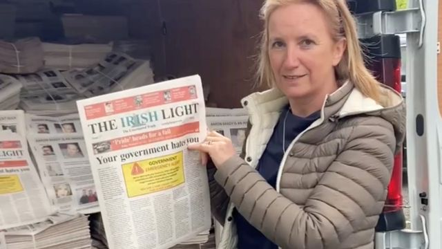
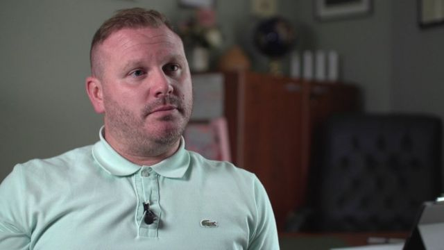
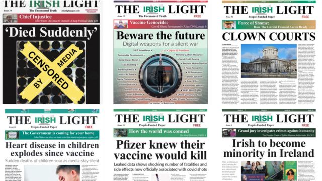

# [World] 新冠疫苗：爱尔兰母亲指认儿子死于注射疫苗是虚假报道，对报纸提出起诉

#  新冠疫苗：爱尔兰母亲指认儿子死于注射疫苗是虚假报道，对报纸提出起诉

  * 玛丽安娜·斯普灵（Marianna Spring） 
  * BBC虚假信息与社交媒体事务记者 

> 图像来源，  Gemma O'Doherty Telegram Channel
>
> 图像加注文字，《爱尔兰光明报》主编杰玛·奥多尔蒂（Gemma O'Doherty）在网帖中否认骚扰死者母亲。

**一位仍在哀悼中的母亲与她的律师在起诉一份主张阴谋论的报章后，遭到一场极端霸凌行动的针对。这份报章错误宣称其儿子死于新冠疫苗。**

《爱尔兰光明报》（The Irish Light）多次在网上对埃德尔·坎贝尔（Edel Campbell）作出骚扰行为，该报支持者还威胁“处决”其律师。

阴谋论者迄今利用了数十起死亡悲剧来散播与疫苗相关的虚假信息。

据信这是首次有死者家属据此提起诉讼。

《爱尔兰光明报》在去年的一篇报道中提及坎贝尔女士的儿子迭戈·吉尔森南（Diego Gilsenan）与另外41人，宣称他们死于“未经测试且危险”的新冠疫苗。然而，BBC得知吉尔森南于2021年8月自杀身亡，终年18岁，生前从未接种新冠疫苗。

坎贝尔女士的律师夏兰·穆赫兰（Ciaran Mulholland）告诉BBC电台第四台 《阴谋论乐园里的玛丽安娜》（Marianna in Conspiracyland）播客节目  ，在她提起诉讼后，她面对着“让人极其震惊”的霸凌行动，而这也许说明了为何其他家属并未采取行动。

他说：“你能明白，当他们看见埃德尔·坎贝尔所遭受的反弹后，为何许多人极不情愿去寻求律师帮助。”

坎贝尔女士告诉BBC，《爱尔兰光明报》让她“犹如活在地狱”，她再也不敢公开发声。

为保障其安全，BBC同意不在本报道中使用她或她儿子的照片。

《爱尔兰光明报》及其主编杰玛·奥多尔蒂（Gemma O’Doherty）在持续数个星期的社交媒体贴文中指控坎贝尔女士“令人发指地撒谎”，称她“精神状况不稳定”，并参与“规模巨大的诈骗活动”。贴文还对坎贝尔女士提出了好些与自杀相关的极端指控。

据穆赫兰律师所称，《爱尔兰光明报》的支持者要求处决或枪杀他，甚至匿名致电其办事处，威胁其他员工。

在该报于头版刊登坎贝尔女士的儿子吉尔森南等人的照片，并辅以标题“突然死亡”后，她与律师决定民事起诉奥多尔蒂女士“带诽谤意图的骚扰”罪。

这句标签继而被阴谋论活动人士广泛应用于社交媒体上，暗示年轻人的非正常死亡都跟新冠疫苗有关。

在提到坎贝尔女士儿子的文章中，《爱尔兰光明报》宣称政府当局对这些“神秘死亡案例”不闻不问，因为“他们心知肚明：他们给爱尔兰人民强加未经测试且危险的注射”。

> 图像加注文字，坎贝尔女士的律师夏兰·穆赫兰指出，其当事人所承受的严重骚扰或许使得其他家属选择噤声。

新冠疫苗导致的死亡案例极其罕见。英国数据中，在至少接种了一针疫苗的超过5000万人中，有55人起死亡被认定基本原因是疫苗。

据家属透露，《爱尔兰光明报》所提及的其他死者中，一人死于游泳池事故，一人死于头部创伤，还有一个死于脑膜炎。

坎贝尔女士称，《爱尔兰光明报》在出版前没曾接触她评论吉尔森南的情况。BBC也了解到，《爱尔兰光明报》没曾就其文章所提到的数名年轻人接触各自家属。

穆赫兰律师说，提诉并非为了“复仇”或索赔。他说：“埃德尔·坎贝尔纯粹希望保护吉尔森南以至于整个家庭的尊严。”

坎贝尔女士依靠捐款支撑这起诉讼，律师也提供了无偿服务。

律师告诉BBC，他们多次要求奥多尔蒂移除吉尔森南的照片但未获成功，因而提起诉讼，这还导致网络霸凌行为升级。

今年7月，位于都柏林的爱尔兰高等法院颁令禁制《爱尔兰光明报》主编接触坎贝尔女士，并禁止在取得其同意前采用或发表其儿子的照片。

针对坎贝尔女士的骚扰贴文仍在社交媒体上继续，包括来自《爱尔兰光明报》的X账号——前称推特（Twitter）——主编奥多尔蒂承认在运营该账号。

坎贝尔女士有就骚扰行为报警，但穆赫兰律师说，警察仍未就此接触或查问主编奥多尔蒂。

爱尔兰共和国警察机关——和平卫队（Garda Síochána）——对BBC称，警察“不评论个别被点名人士”或“正在进行中调查的细节”。警察将继续“主动调查（爱尔兰共和国）西北地区某人士遭骚扰的指控”。

奥多尔蒂与《爱尔兰光明报》并未回应BBC的评论请求，但《爱尔兰光明报》在社交媒体上宣称，BBC将“人格谋杀”奥多尔蒂，因为“她曝光了一场疫苗种族屠杀”。

> 图像来源，  The Irish Light
>
> 图像加注文字，在《爱尔兰光明报》网站的头版集中，刊登了吉尔森南照片的一张头版（上行左一）在法庭限制令颁发后以“遭审查”字样示人。

奥多尔蒂女士在网帖中否认骚扰坎贝尔女士，并持续暗示其儿子之死在某些方面是险恶或神秘的。她称已指派律师为自己辩护。

《爱尔兰光明报》与英国《光明报》属姐妹报纸，但各自编采独立。BBC此前曝光该英国版报章主张公开处决个别政客与医生。该报与英国极右翼阵营，以及德国一份涉嫌与一起失败政变有关联的出版物有联系。

《爱尔兰光明报》在发表较为无害的专题报道外，也发表了宣扬阴谋论的报道，例如《辉瑞早知疫苗能杀人》、《自来水氟化正拖低爱尔兰人智商》、《为何人为气候变化是场骗局》和《爱尔兰人将成为爱尔兰的少数民族》等。

坎贝尔女士据信是首位针对疫苗致死的虚假信息提告的当事人，但其诉讼与其他阴谋论受害人案件有相似之处。

曼彻斯特竞技场（Manchester Arena）爆炸案幸存者正就有人宣称该袭击不曾发生而提出诉讼，美国桑迪胡克小学枪击案（Sandy Hook）遇害学生家长则在一起标志性诉讼中成功告倒Infowars网站主持人亚历克斯·琼斯（Alex Jones）。

