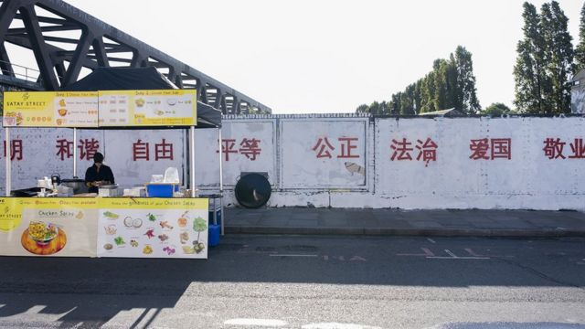
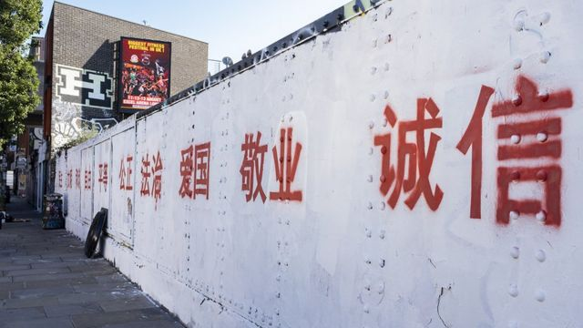
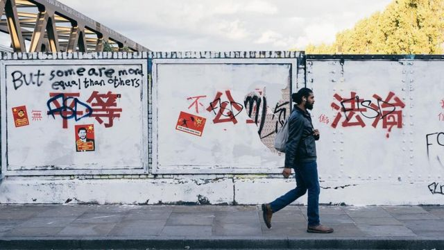
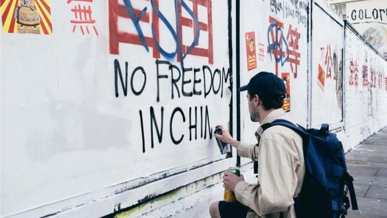

# [World] 中国留学生伦敦东区涂鸦写社会主义核心价值观引争议

#  中国留学生伦敦东区涂鸦写社会主义核心价值观引争议

> 图像来源，  @lei_uk
>
> 图像加注文字，伦敦东区的一面墙上用白底红字写下了在中国司空见惯的24字政府宣传标语。

**在伦敦东区的红砖巷（Brick Lane），几名中国留学生因把当地一面涂鸦墙刷成白色，并喷涂上中国的“社会主义核心价值观”红色标语而引发争议。**

周日（8月6日），几名中国留学生在小红书和Instagram等社交媒体表示，他们在伦敦的一面墙上用红色颜料写下了在中国司空见惯的24字政府宣传标语。

“我们在伦敦刷了一面墙。”一位名为“不跑糯辣”的博主在小红书上写道，“充分弘扬社会主义核心价值观……欢迎大家打卡！”

这一事件迅速在中文社交媒体引发讨论和争议。有网民称赞“一秒回中国”、“文化输出”，但亦有不少网民批评“强化中国负面印象”、“文化入侵”。

该活动的策划、英国皇家艺术学院（Royal College of Art）的中国留学生“一鹊”（网名）对BBC表示，他在事后收到了很多指责，但该事件的发酵和他“想表达的并无任何关系”。

在现场拍摄的画面中，红砖巷的一部分——一段长约百米的道路——两侧都被刷成了白色，其中一侧的墙壁上喷上了12个汉字词语：富强、民主、文明、和谐、自由、平等、公正、法治、爱国、敬业、诚信和友善。

> 图像来源，  @lei_uk
>
> 图像加注文字，该活动的策划“一鹊”（网名）对BBC表示，他在事后收到了很多指责，但该事件的发酵和他“想表达的并无任何关系”。

根据参与者晒出的影片，约有9名年轻人在晚上来到这里参加了喷涂。他们将事先准备的有打印字体的镂空纸板贴在墙上，随后喷上红漆。

一张罚单照片显示，他们似乎还因“涂鸦和胡乱张贴海报”，被执法人员开出800英镑罚单。

该活动的策划者“一鹊”在Instagram上将他们的涂鸦命名为“反者道之动”，目的是“用社会主义的构建方式来反殖民西方的虚假自由”。

他直言不讳地地解释说：“借自由民主之名彰显着西方的文化中心，这是伦敦的自由”，“这样的自由便是西方对东方主义的建构，其内里隐藏着极大的文化阶段的权利不平等和剥削”。

“对我来说这件作品并没有太多政治意味，只是作为外衣，而在讨论不同环境本身。”他在社交媒体上写道。

该事件周末在中国社交媒体上迅速成为热门讨论话题，也引发了两极化的激辩。

支持者认为，街头艺术本身就是别具一格的，这些年轻人的行为是“创作自由”。还有人称，在西方传播自身价值观的同时，也应该允许中国价值观的输出。

但反对者表示，这是“威权主义价值观的入侵”，“这是对中国的高级黑”。还有人问：“你们敢去北京的街头这样涂鸦吗？”

> 图像来源，  @lei_uk
>
> 图像加注文字，有人在这些涂鸦上面又加上了自己的观点。

很多批评者尤其强调，他们覆盖了一些精美的创作，其中似乎包括一幅致敬逝者的绘画。

“他们本可以只用一面已经喷绘的墙，但却如此贪婪地盖过这么多优秀作品。这是问题所在。”在伦敦的艺术家苏西·卢雅德（Susi Luard）批评道。

此前，“一鹊”在帖子中表示，很遗憾遮住了很多艺术家的作品，但是“可能这就是自由的代价”。

他对BBC说，他认为这24个字是全球共同的目标，而非只是中国，他想通过“对环境本身做一个辩证的引发”。

“对我来说现在这件事完全被上升到了反应（映）个人或群体的价值上了，和我想表达（的）并无任何关系。”他说道。

他还表示，自己已因为该事件成为网络暴力的目标：“越来越多的人在解（借）题发挥和施展恶意，这并非我的本意。”

“社会主义核心价值观”最早由中国当局在2012年的中共“十八大”报告中提出。

在中国领导人习近平的推动下，这24个字被作为宣传口号，遍布中国各地的大街小巷，包括政府机关、街道、学校、商场和公园等，一些巴士和地铁等交通工具上也有展示。

2014年底，正在申请“全国文明城市”称号的中国中部城市武汉要求1000万市民都要背诵“社会主义核心价值观”，甚至组织抽查背诵情况。

在该事件引发争议后，8月6日（周日）有一些反对者前往该涂鸦墙，在这些学生所喷涂的“社会主义核心价值观”上喷写其他内容以示抗议。例如，有人在“自由”下写道“No freedom in China”（中国没有自由），还有人贴上了反对习近平的标语。

红砖巷位于东伦敦，是许多孟加拉移民的大本营，也是伦敦的潮流集散地之一。该地区以街头涂鸦、艺术精品店、古董和集市而闻名。这条街属于陶尔哈姆莱茨区（又称塔村区；London Borough of Tower Hamlets）。

> 图像来源，  @lei_uk
>
> 图像加注文字，当地规定，未经事先明确许可，市政当局不同意在其财产（包括人行道）上进行任何绘画、书写或其他标记。擅自涂鸦者可能会因轻度违法，而被处以80镑的定额罚款。

根据该区规定，未经事先明确许可，市政当局不同意在其财产（包括人行道）上进行任何绘画、书写或其他标记。擅自涂鸦者可能会因轻度违法，而被处以80镑的定额罚款。

不过，根据该区区议会2019年批准的一项区分“涂鸦”和“街头艺术”的新政策，执法人员在去除难看的涂鸦的同时，也将“采取平衡观点”以保护优秀的壁画创作。

通过Google街景可以发现，事发道路两侧自2017年以来便成为涂鸦和绘画的场地。据报道，每隔几周，这里的绘画就会被更新一遍。

陶尔哈姆莱茨区议会尚未回应BBC的置评请求。

