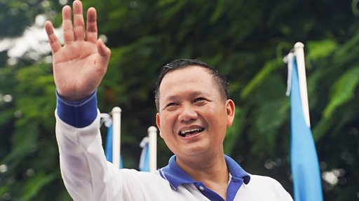

# [World] 洪玛奈：子承父业的柬埔寨新首相

#  洪玛奈：子承父业的柬埔寨新首相

**洪玛奈：子承父业的柬埔寨新首相**

柬埔寨国王西哈莫尼周一（8月7日）发布皇家法令，任命洪玛奈（Hun Manet）为柬埔寨王国新首相，接替他已经执政近四十年的父亲洪森(HunSen)。

这一时刻具有特殊意义，因为在过去近40年里，柬埔寨一直由政治强人洪森所统治。

1985年，32岁的洪森成为总理，是柬埔寨在位时间最长的领导人。洪森上个月毫无悬念地在大选中获胜后宣布辞职，将权力移交给自己的长子洪玛奈。

在他的领导下，柬埔寨走出红色高棉的阴影，实现了经济发展。但与此同时，柬埔寨的政治环境逐渐走向独裁。

现年45岁的洪玛奈曾在美国西点军校和英国布里斯托尔大学就读，作为接班人，他曾担任柬埔寨军队副总司令兼陆军司令，他的领导风格和政治观点备受关注。

与父亲相比，洪玛奈的领导方式是否会有所不同？他将如何应对柬埔寨面临的挑战？

