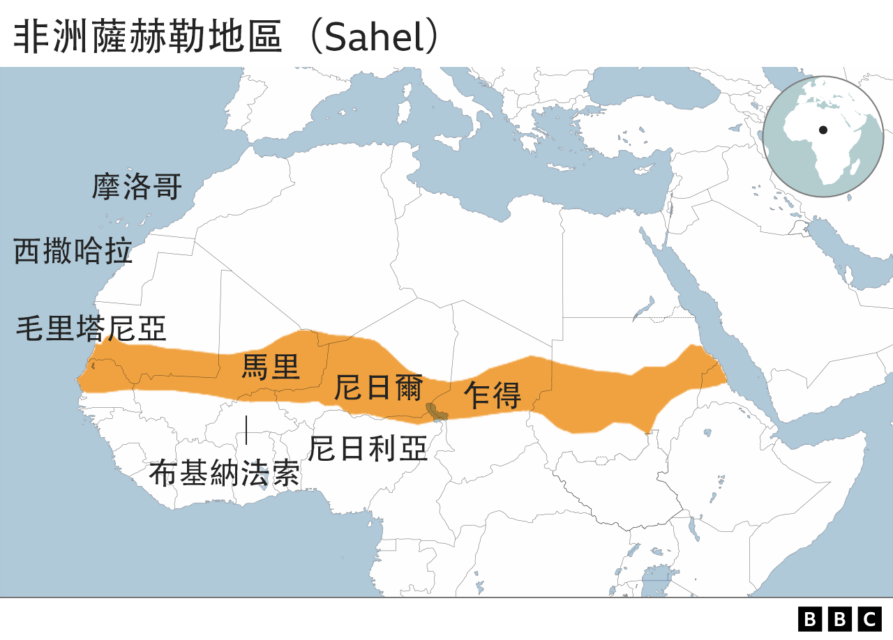
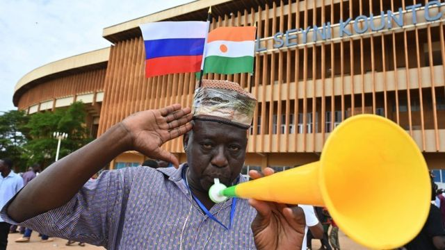
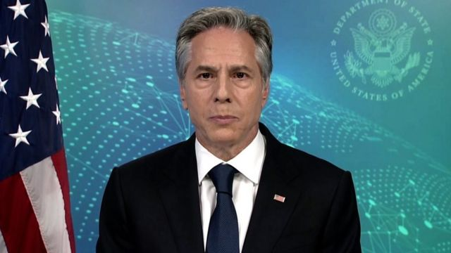
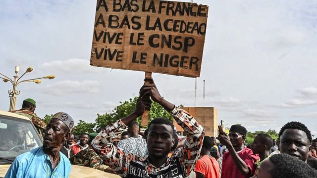
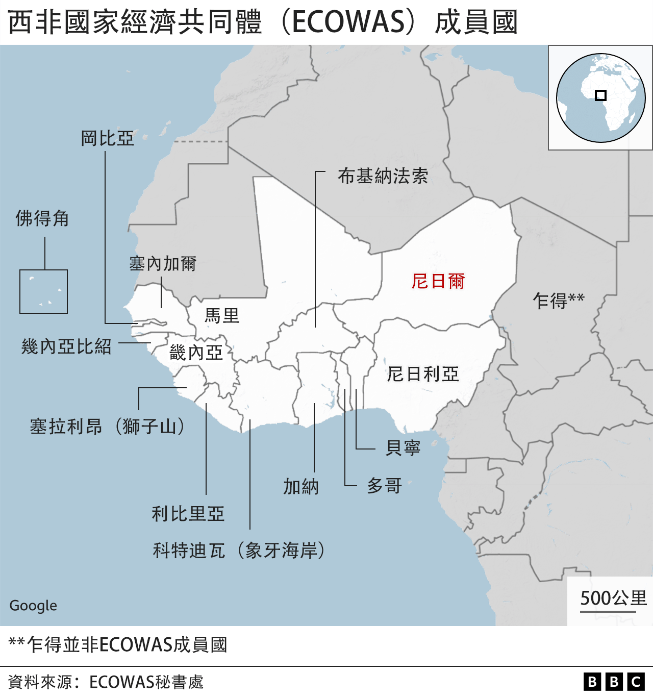

# [World] 尼日尔政变：俄罗斯扩张等世界该关心西非政局的五个原因

#  尼日尔政变：俄罗斯扩张等世界该关心西非政局的五个原因

  * 优素福·阿金佩鲁（Yusuf Akinpelu） 
  * BBC记者 拉各斯报道 

6 小时前

> 图像来源，  AFP
>
> 图像加注文字，一些支持政变的群众走上尼日尔首都尼亚美街头示威。

**尼日尔（Niger）所发生的军事政变，让其邻国担忧不稳定局势扩散于非洲萨赫勒地区（Sahel）——一条从大西洋横跨至红海的地带。继马里（Mali）与布基纳法索（Burkina Faso）之后，尼日尔成为了此地区三年来又一个遭军事夺权的国家。**

然而，尼日尔局势的影响并不止于萨赫勒地区，对世界政局也有影响。

##  1\. 武装叛乱四起

尼日尔本是萨赫勒地区所余无几的民主政体，在西方国家眼中也是这一忧患处处，近期暴力袭击正在增加的地区之中，一个相对稳定的国家。如今军方夺取权力，人们担心稳定局面濒临瓦解。

尼日尔设有法军与美军基地，两国军队在当地协助打击“博科圣地”（Boko Haram）与所谓“伊斯兰国”（IS）的关联组织。它们的未来如今成了问号。马里与布基纳法索的军事政变导致极端分子的暴力袭击增加。外界担心尼日尔也将变成这些团伙的温床。

##  2\. 政变文化成型

尼日尔政变意味着，从西面的马里到东面的苏丹（Sudan），非洲有一整片土地受军事政权所控制。萨赫勒地区的专制政权崛起是这一地区民主进程的挫败。尼日尔政变或会给其它国家的军队壮胆，夺取权力。

这说明了为何西非国家经济共同体（ECOWAS）对尼日尔军政府施加制裁，并威胁要是总统巴祖姆（Mohamed Bazoum）不获复位，将对其动武。此举获得美国、欧盟和联合国的广泛支持。

> 图像来源，  AFP
>
> 图像加注文字，外界担忧俄罗斯瓦格纳雇佣兵趁机在非洲“大展拳脚”。

##  3\. 俄罗斯影响力日趋明显

政变过后，马里与布基纳法索与俄罗斯的盟友关系日趋密切，尼日尔军政府获得的印象是，他们也能依样画葫。

目前没有任何证据证明俄罗斯参与了尼日尔的军事夺权，克里姆林宫一名发言人促请释放巴祖姆，和平解决当前危机。

然而，亲克里姆林宫的评论人士在国营媒体与电报（Telegram）群上赞扬这场政变，支持政变的示威者挥舞着俄国国旗，谴责前殖民强权法国。还有人担心俄罗斯瓦格纳集团（Wagner Group）雇佣兵在尼日尔扩张其影响力。

要是尼日尔跟随其邻国投向俄罗斯，尤其是投向瓦格纳集团，将导致暴力攻击、人权侵害与矿业剥削加剧。

##  布林肯：瓦格纳乘人之危前进尼日尔

美国国务卿布林肯（Antony Blinken） 本周接受BBC专访时称  ，他不认为俄罗斯或瓦格纳集团雇佣兵鼓动了尼日尔的军事政变，但两者正在“乘人之危”，在萨赫勒地区“自我彰显势力”。

布林肯警告说：“凡是瓦格纳集团所到之地，死亡、破坏与剥削随之而来……不安不减反增。”

他还说，已发生在其他国家的情景将在尼日尔重现。

瓦格纳集团据信有数以千计战斗人员派驻于中非共和国（CAR）和马里，除了集团自身在当地拥有利润丰厚的商业利益外，也在支撑着俄罗斯的外交与经济联系。

##  4\. 铀原素落入坏人之手

核能发电依赖放射性金属铀，尼日尔的铀矿占全球供应将近5%。据欧盟核子机关欧洲原子能共同体（EURATOM）数据，尼日尔去年是欧盟第二大天然铀来源。法国也有15%铀供应源自尼日尔。

EURATOM称，要是尼日尔削减铀供应，欧洲核能生产不会面临即时风险，因为核电站已备妥三年库存。

即便如此，在伊斯兰武装分子活跃，俄罗斯与瓦格纳集团正在扩张势力的这一地区，ECOWAS及其西方伙伴都不希望放射性物质落入坏人之手——它既可民用，也可军用。

> 图像来源，  AFP
>
> 图像加注文字，支持政变的尼日尔群众纷纷把矛头指向法国。

##  5\. 移民危机

巴祖姆政府一直与欧洲国家合作，阻止移民（偷渡者）横渡地中海，并答应从利比亚（Libya）各拘留中心接回数以百计移民。

他还打击人口贩子活动。尼日尔是西非与北非国家之间的关键中转站。

在军政府统治下，此等承诺能否维持成疑，尤其当法国与英国等欧洲盟友表态将停止援助尼日尔之后。这也许会给涌往欧洲的移民潮造成重大影响。

