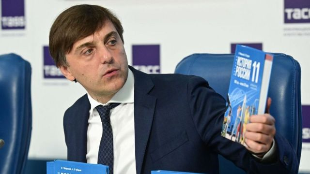
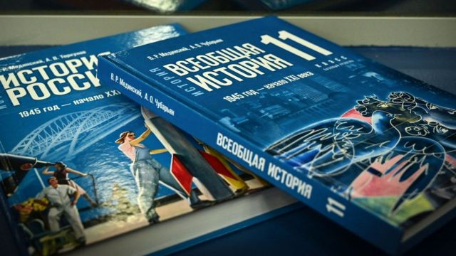

# [World] 乌克兰战争后首部提及该事件的俄教科书上线 试图将军事入侵正当化

#  乌克兰战争后首部提及该事件的俄教科书上线 试图将军事入侵正当化

  * 维塔利·舍甫琴科（Vitaly Shevchenko） 
  * BBC国际媒体观察部（BBC Monitoring） 

> 图像来源，  AFP
>
> 图像加注文字，这是首部提及2022年2月俄罗斯入侵乌克兰的历史教科书。俄罗斯教育部长谢尔盖·克拉夫佐夫（Sergei Kravtsov）出席了新教材的媒体推介会。

**莫斯科当局公布一部新教科书，旨在将乌克兰战争正当化，并指责西方试图摧毁俄罗斯。**

据俄国媒体刊登的书摘，学童将被教导，要不是总统普京（Vladimir Putin）对乌克兰采取其“特别军事行动”，人类文明将走向终结。

教科书名为《俄罗斯历史，1945年至21世纪》，由总统顾问弗拉基米尔·梅金斯基（Vladimir Medinsky）参与编著。他曾是俄罗斯文化部长。

俄罗斯全面入侵乌克兰始于2022年2月，而这是首部获准在俄国学校中使用，提及了这些近期事件的历史教科书。

从9月起，俄罗斯中学最后一年——11年级，即介乎17至18岁的学生（相当于中国高三）——将学习这些内容。

这部教科书宣称“西方顽固寻求破坏俄罗斯内部稳定”，为达到此目的，西方列强散布“赤裸裸的恐俄症”。

教科书还说，他们继而将俄国“拉扯”进各种各样的冲突，西方的终极目标是要摧毁俄罗斯，控制其丰富矿产。

该书将克里姆林宫的各种政治宣传老调重弹，将乌克兰描绘成一个由极端民族主义分子掌控，野心勃勃，同时受西方操控的国家，又指控西方以之作为反俄“攻城锤”。

据该书所称，乌克兰不过是西方炮制来恶心俄罗斯的玩意，就连其蓝黄色国旗都是奥地利人编造出来，旨在说服乌克兰人他们跟俄国人并不一样的。

这部教科书还充斥了各种各样的扭曲与操弄。

举例说，该书形容2014年俄罗斯进攻乌克兰是东部顿巴斯（Donbas）地区的群众“为保持俄国人身份”而起义，期间得到了俄国“志愿者”参与其中。课文并未提及俄罗斯在当时以及此后八年，向顿巴斯地区输送的军事硬件与人员。

课本还辩称，2022年全面入侵乌克兰的关键原因，是乌克兰可能加入北约组织（NATO）。

课文称，要是乌克兰加入了北约，然后“在克里米亚（Crimea）或顿巴斯挑起冲突”，则俄国将被迫对整个北约宣战。

课文称：“这很可能会是文明的终结，而这绝不可能被允许成真。”

然而，乌克兰加入北约，无论在当时还是在今天，都是遥不可及的事。

> 图像来源，  AFP
>
> 图像加注文字，新历史教材覆盖相当于高三的课程内容。

课本也错误宣称，在2014年俄罗斯吞并克里米亚以前，乌克兰有计划将塞瓦斯托波尔（Sevastopol）——俄罗斯黑海舰队常驻地——变成北约组织基地，又称基辅试图获取核武器。

书中另一项错误的断言是，直到2014年为止，80%乌克兰人口视俄语为母语。据口碑颇佳的拉祖姆科夫中心（Razumkov Centre）2006年发表的一项民意调查，只有30%乌克兰居民认为其母语是俄语，52%认为乌克兰语是其民族语言。

课文提醒学生警惕“制造摆拍短片与假照片假视频的全球产业”，似乎是回应网上有诸多暗示俄军部队涉嫌在乌克兰犯下暴行的材料。

在有关“特别军事行动”的章节中，这部教科书称：“西方社交网络与媒体对于散步假信息乐此不疲。”

俄罗斯当局此前将一些指责俄军针对乌克兰平民的活动人士投狱，例如，长年批评克里姆林宫作为的伊利亚·雅辛（Ilya Yashin）因在网络直播串流中谈论 俄军在乌克兰布查镇（Bucha）怀疑犯有战争罪行  ， 于2022年12月被判囚8年半  。

课文严厉批评在俄罗斯入侵乌克兰之初，西方所实施的制裁措施，并将之呈现为“摧毁俄罗斯经济”的企图，并错误宣称该等制裁“违反一切西方念兹在兹的国际法惯例”。

与此同时，西方商号在全面入侵开展后不久从俄罗斯撤资，也被呈现为对俄罗斯商人的“绝好机遇”。

音频加注文字，

【BBC时事一周（粤语）——记者来鸿】战云密布，俄罗斯总统普京坚称“乌俄一家亲”，乌克兰人民心底里的身份认同挣扎可十分复杂。

**BBC** **国际媒体观察部（** **BBC Monitoring** **，前称** **BBC** **监听部）报告与分析来自世界各地电视、广播、网络和印刷媒体的新闻。欢迎到** Twitter  **与** LinkedIn  **点赞关注** **BBC** **媒体观察部。**

