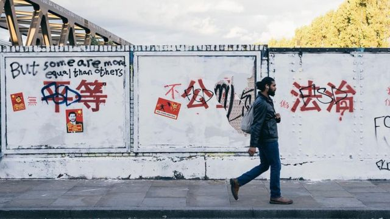
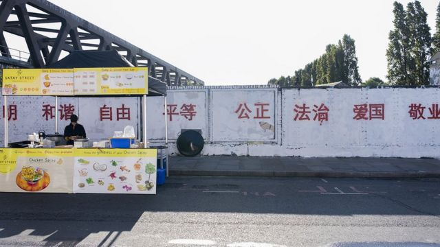
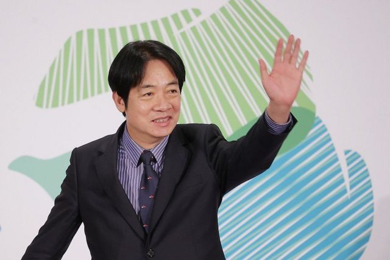
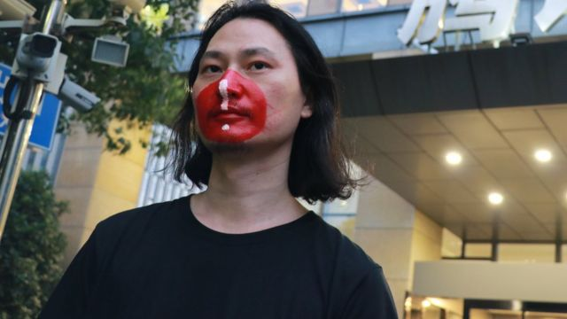

# [World] 伦敦涂鸦墙、成蕾案、赖清德访美等本周重要新闻故事

#  伦敦涂鸦墙、成蕾案、赖清德访美等本周重要新闻故事

> 图像来源，  @lei_uk
>
> 图像加注文字，有人在这些涂鸦上面又加上了自己的观点。

**8月第二周，几名中国留学生在伦敦把一面涂鸦墙刷成白色，涂上中国“社会主义核心价值观”红色标语，引发争议。**

中国国家统计局发布数据，7月份居民消费价格指数（CPI）同比下降0.3%，为2021年2月以来首次下跌。

澳大利亚籍记者成蕾在中国被关押之后首次公开发言，她已经失去自由接近三年。

刚刚过去的一周，BBC中文有以下新闻内容受到读者的关注。如果你错过了，带你一一回顾。

##  1\. 中国留学生伦敦东区涂鸦写社会主义核心价值观引争议

> 图像来源，  @lei_uk
>
> 图像加注文字，伦敦东区的一面墙上用白底红字写下了在中国司空见惯的24字政府宣传标语。

在伦敦东区的红砖巷（Brick Lane），几名中国留学生因把当地一面涂鸦墙刷成白色，并喷涂上中国的“社会主义核心价值观”红色标语而引发争议。

周日（8月6日），几名中国留学生在小红书和Instagram等社交媒体表示，他们在伦敦的一面墙上用红色颜料写下了在中国司空见惯的24字政府宣传标语。

“我们在伦敦刷了一面墙。”一位名为“不跑糯辣”的博主在小红书上写道，“充分弘扬社会主义核心价值观……欢迎大家打卡！”

这一事件迅速在中文社交媒体引发讨论和争议。有网民称赞“一秒回中国”、“文化输出”，但亦有不少网民批评“强化中国负面印象”、“文化入侵”。

##  2\. 中国通缩：消费价格指数罕见下跌引发担忧

> 图像来源，  Getty Images

中国国家统计局周三（8月9日）发布数据，7月份居民消费价格指数（CPI）同比下降0.3%，为2021年2月以来首次下跌。

分析称，这将给正在力争重振需求的中国政府带来压力。

##  3\. 成蕾案：在华被关押三年后首次公开发声称“怀念阳光”

> 图像来源，  Nick Coyle
>
> 图像加注文字，成蕾自2020年起一直被扣押。

一名将在本周末被中国关押满三年的澳大利亚籍记者首次公开发言。

成蕾在一封致澳大利亚人民的公开信中说：“我怀念阳光。在牢房里，阳光透过窗户照进来，但我一年只有10个小时能站在它底下。”信函经由获准每月探视她的外交官笔录。

“我实在难以相信，当我还在澳大利亚居住的时候，总在躲避阳光。”

##  4\. 赖清德访美：台美断交40多年来的“过境外交”如何成为“深思熟虑的妥协”

> 图像来源，  Taiwan President Office
>
> 图像加注文字，台湾副总统赖清德将在8月12日启程出访台湾邦交国巴拉圭，18日返台。

台湾副总统赖清德即将8月12日启程出访台湾邦交国巴拉圭，他此行计划18日返台，期间将先后过境美国纽约、旧金山。

此次赖清德以现任副总统身份出访巴拉圭，途中也会再次过境美国，加上台湾大选在即，赖清德是代表执政党的参选者，这次访问再次让台湾以“过境外交”维系对美外交，开拓生存空间的种种挑战浮上台面。

##  5\. 容海恩现象：国安法下香港议员的“大义灭亲”与家庭关系变迁

> 图像来源，  Reuters
>
> 图像加注文字，容海恩指若知悉家翁袁弓夷的行踪“必定毫无疑惑”向警方举报

最近一个多月，香港社会很关心一位女性公众人物的家庭婚姻状况，甚至不时传出她离婚的假消息。

她并不是娱乐圈明星，而是“爱国者治港”下的两届立法会议员、现年42岁的建制派新民党副主席容海恩。

7月24日清晨，她和丈夫、政治学者袁弥昌仍在睡梦中，十多名警员突击登门搜查，检取寓所内的电脑和手机，并带两人到警署问话，历时三小时。

这是因为她身在海外的家翁（公公）、现年74岁的“香港议会”发起人袁弓夷，7月初被香港警方国安处悬红100万港元通缉。

##  6\. 高温与气候变化：中国行为艺术家用“赎罪券”对抗碳排放

> 图像来源，  Provided by Nut Brother
>
> 图像加注文字，坚果兄弟

近几个月来，热浪席卷中国从北到南多个省份，许多地方的气温甚至超过40度，频频有报道传出中暑致死案例。在这种情况下，中国行为艺术家“坚果兄弟”发起为高碳排放公司“赎罪”的倡议，希望帮助那些必须直面高温天气的户外劳动者防暑降温。

他把这项倡议发布在中国社交媒体账号上，但不到一个星期就被封锁。

“在中国做项目有一个特点，很多事情要随机应变，”坚果兄弟接受BBC采访时说。

坚果兄弟仅以此名为人知晓，他在过去十年左右从事自由艺术创作，专注环境问题，擅长用戏谑的手法引导公众关注和参与。

