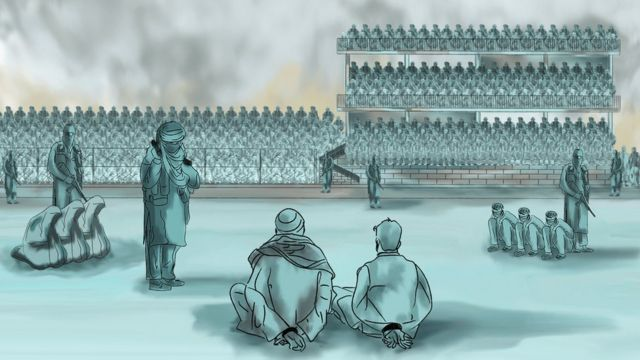
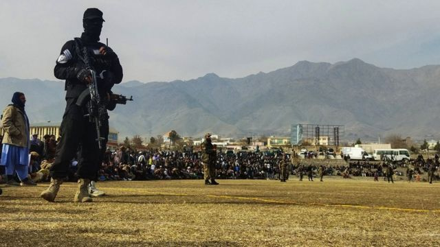
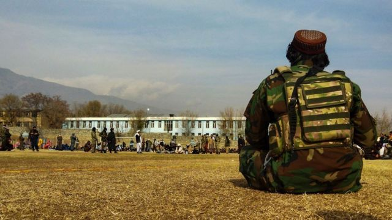
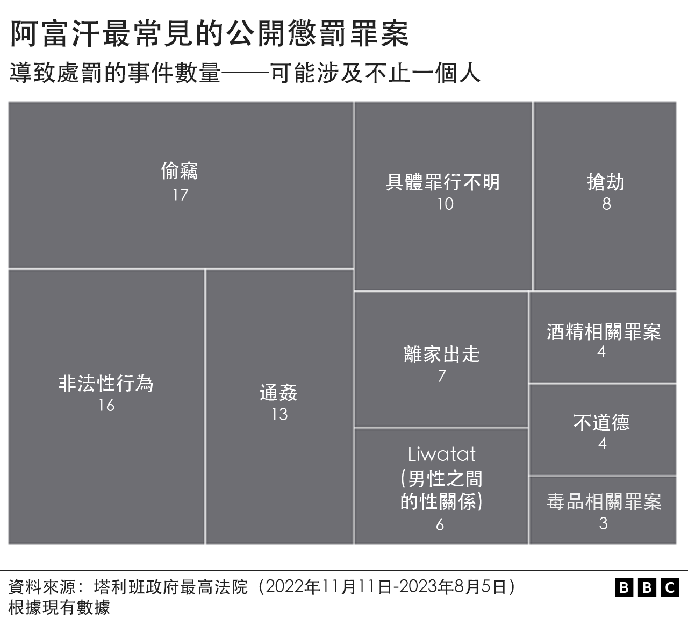
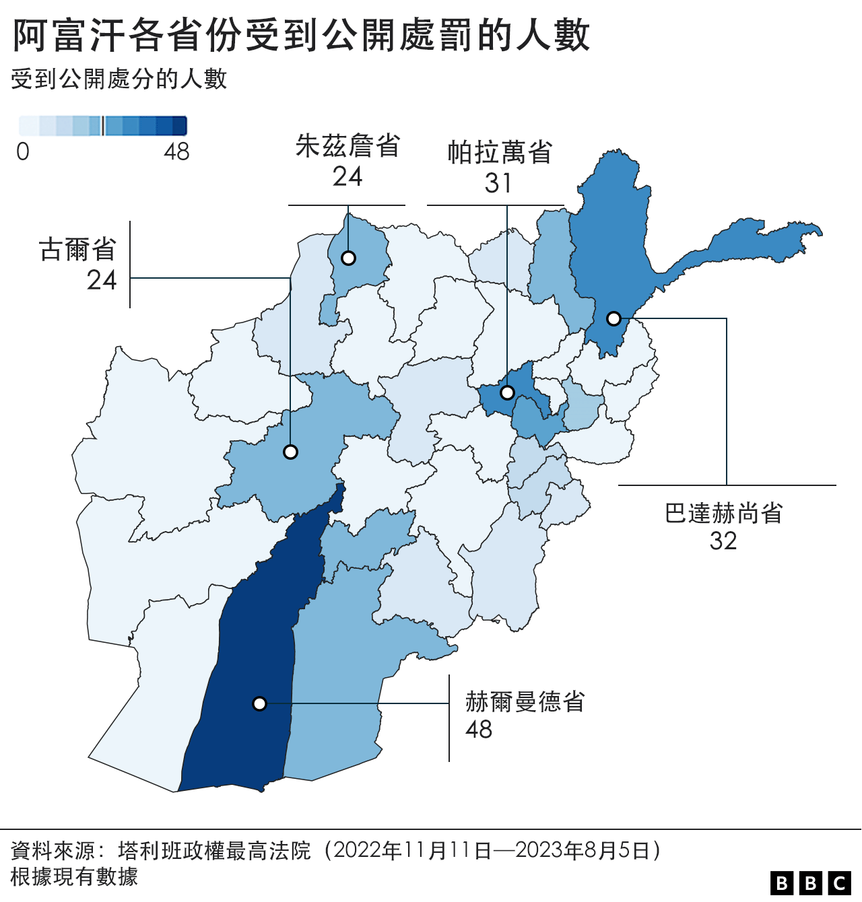

# [World] 阿富汗塔利班政府如何重新利用公开执行刑罚杀一儆百

#  阿富汗塔利班政府如何重新利用公开执行刑罚杀一儆百

  * 努尔·居尔·沙法克（Noor Gul Shafaq） 
  * BBC国际台记者 

**警告：以下内容可能引起读者不安，请斟酌阅读。**

**“当塔利班当局在足球场鞭打第一个人时，我的心跳得很快，快得都能听见。我简直不敢相信，我是在现实生活中看到这一切，而不是在电影或梦境中。”**

这是朱马·可汗（Jumma Khan）说的话，他是一名21岁的阿富汗人，为安全起见，我们替他起了化名。

2022年12月22日，他目睹塔利班政府将22人带到中部塔林科特市（Tarinkot）一个足球场，在数千名群众面前施行鞭刑。这22人有两人是女性，他们被控违反各种“罪行”。

当局前一天在全城的清真寺和电台广播中宣布此事，促请公众前来观看这个壮观场面“以学会教训”。

##  在哪公开处罚？

> 图像来源，  AFP
>
> 图像加注文字，阿富汗塔利班政权通常在体育场举行公开执行体罚大会。

公开惩罚一般在大型体育场馆内施行。这个传统始于1990年代，当时塔利班刚在阿富汗掌权。

塔林科特足球场可容纳1.8万名观众，但可汗说，当天到场的人更多。

“被告坐在体育馆中央的草地上。那是一个阳光明媚的星期四。人们在祷告忏悔，祈求上帝拯救他们，”可汗告诉BBC。

塔利班最高法院在推特证实曾执行鞭刑，并公布受罚者的人数和性别。

塔利班政府发言人扎比胡拉·穆贾希德（Zabihullah Mujahid）接受BBC采访时说：“根据伊斯兰教法，我们的领导人有义务执行这种惩罚。在《可兰经》中，阿拉说人们应该公开目睹这些惩罚，从中吸取教训。根据伊斯兰教法，我们有义务执行惩罚。”

可汗说，18至37岁的男子全部都挨了25至39鞭。

“他们有的在哭喊，有的在默默忍受鞭打，”可汗说。“我一位亲戚因盗窃被打了39鞭，他告诉我，打了20鞭后，他的身体就麻木了，再也感觉不到痛楚。”

但他说，塔利班当天没有公开殴打两名妇女。

可汗出生在9·11事件两年后，该事件导致美国和北约进攻阿富汗，结束了塔利班武装的第一个执政时期。

他从长辈口中听说过塔利班士兵在1990年代当众殴打人丶砍断人的四肢或处死人。但这是他首次亲眼目睹暴力事件。

可汗说，人们很快就想离开足球场。

“他们大多数人都很年轻，就像我一样。塔利班士兵不准我们离开，但许多人设法爬上了围墙和栏杆。”

塔利班政府试图树立合法统治者的形象，但似乎对这种惩罚可能在国外引起的负面反应感到紧张，最高领袖穆拉·希巴图拉·阿胡恩扎达（Mullah Hibatullah Akhundzada）禁止任何人记录或曝光这些事件。

但可汗秘密拍摄了一段影片并传送给BBC，其他目击者也将这些影像上载到社交媒体，迅速流传。

可汗说，当天的所见所闻仍让他恐惧，他担心自己遭到同样惩罚。

“现在，我对自己说的每句话都非常谨慎。我留了胡子。”他说。

##  有多少人受罚？

> 图像来源，  AFP
>
> 图像加注文字，自2022年11月，阿富汗至少举行了50场公开处罚大会，包括公开处决。

BBC发现，自2022年11月塔利班政府正式宣布进行公开惩罚，最高法院开始就此发表声明以来，至少发生了50起类似事件，涉及346人。

最高法院没有透露涉案人士的性别，但至少有51起案件被确认为女性，233起案件被确认为男性，另有60起案件尚不确定。

所有人都受到鞭笞，有些人被判处监禁。

有两名男子被执行死刑，一人在阿富汗西南部的法拉省（Farah），另一人在东部的拉格曼省（Laghman）。

11月13日，塔利班最高领导人下令其司法机构“认真”监督身负多项控罪人士的案件，并对他们“执行法律”，此后，公开惩罚的频率增加了。

##  什么“罪行”要受罚？

塔利班政府称，他们是根据阿富汗的伊斯兰司法制度——一种对伊斯兰教法的极端解释——来执行此类惩罚。

应受罚罪行共有19类，包括盗窃、谋杀、通奸、男性之间的性关系、“非法性关系”、贪腐、离家出走、谋杀和不道德。

但这些罪行的定义并不清晰，有些似乎可以有多种解释。

许多人因盗窃受罚，通常是鞭笞39下，有些人会被额外判囚3个月到一年。

被塔利班政府归类为“Zina”（婚外性行为）、“非法性关系”或“不道德关系”的性罪行也是常见的受罚原因。

人权倡议者和国际社会特别关注的，是7例离家出走事件，这些惩罚很可能是针对遭受家庭暴力或强迫婚姻、未成年婚姻的弱势妇女。

最高法院的声明中还六次提到“Liwatat”，根据阿富汗伊斯兰教法，这是男性之间性交的罪行。

##  哪些省份的惩罚最多？

BBC发现，在阿富汗34个省份中，有21个省曾执行公开惩罚，部分省份较其他省份施行得更多。

阿富汗东部的拉格曼（Laghman）省最多，有7次，其次是帕克蒂亚（Paktia）、古尔（Ghor）、帕尔万（Parwan）和坎大哈（Kandahar）。

就受罚人数而言，赫尔曼德省（Helmand）最多，有48人，巴达赫尚省（Badakhshan）有32人，帕尔万省（Parwan）有31人，古尔省（Ghor）和朱兹詹省（Jawzjan）有24人，坎大哈省（Kandahar）和罗兹甘省（Rozgan）有22人，首都喀布尔则有21人。

这些数字只包括塔利班最高法院在官方声明公布的资料，可能还有其他不在记录上。

联合国、不同人权组织和世界多国均呼吁塔利班停止此等做法，但没迹象显示塔利班有意改变政策。

在官方声明中，他们继续说公开惩罚是对其他人的“教训”，并称这可以防止罪案。

朱玛·可汗等目击者说，目睹这种恐怖场面令他们精神创伤。可汗说，那些受罚者受尽凌辱，无法离开家门。

对此，塔利班发言人扎比胡拉·穆贾希德告诉BBC：“真主会看顾人民的精神健康。我们不能违背伊斯兰教法。”
 BBC普什图语（BBC News Pashto）  **整理了塔利班政府最高法院的声明，主要来自该法院在X（前称推特）上的社交媒体账户。这些事件的时间跨度为2022年11月塔利班最高领导人正式宣布恢复公共惩罚至2023年8月5日，即大约8个月。**

**阿富汗最高法院的数据是主要资料来源，另外也引用了联合国阿富汗援助团（UNAMA** **；简称联合国援阿团或联阿援助团** **）在2023年5月发布的** 《阿富汗的体罚和死刑》报告  **，以及具公信力的新闻报道。**

**并非所有资料都列明地点丶人数丶性别和惩罚类型。我们根据现有资料报道相关数据。**

