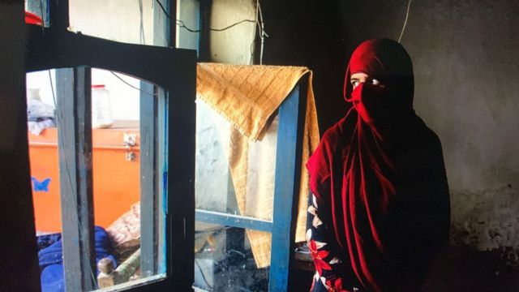
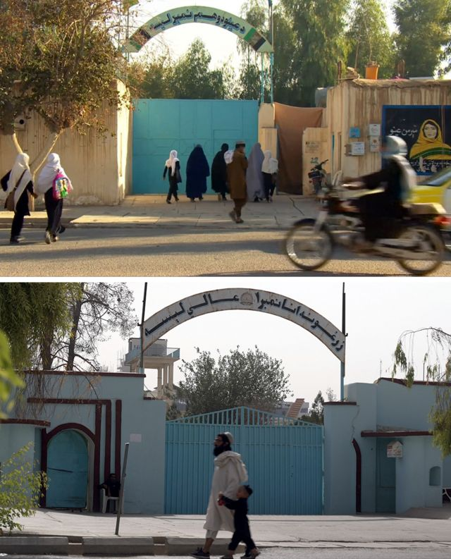
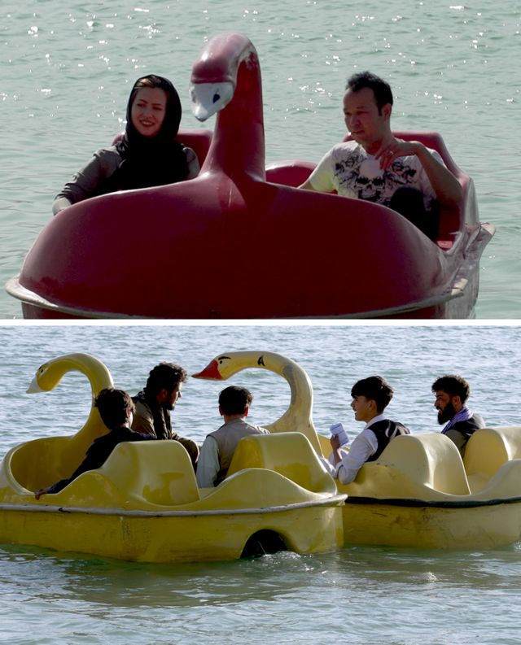
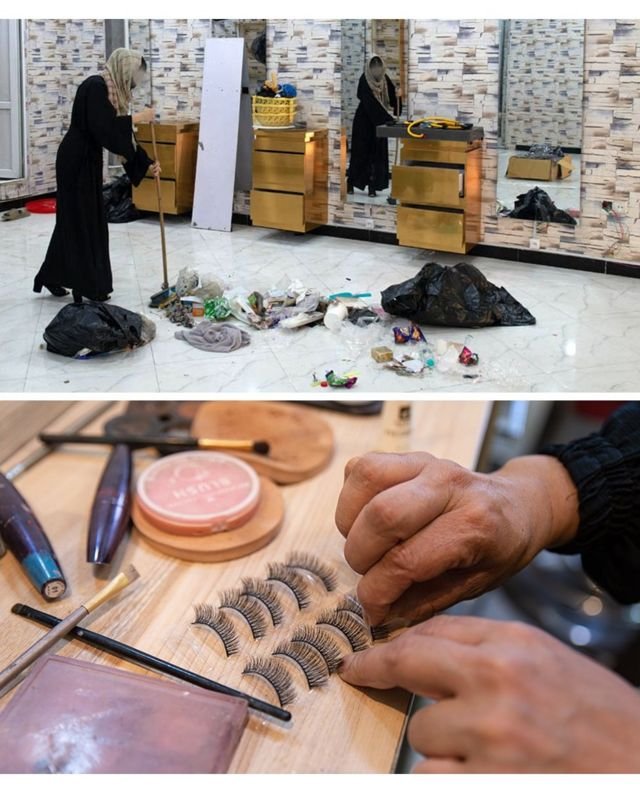

# [World] 塔利班政权压迫阿富汗女性权利的五大时刻

#  塔利班政权压迫阿富汗女性权利的五大时刻

  * 尤吉塔·利玛耶（Yogita Limaye） 
  * BBC阿富汗事务记者 

> 图像来源，  Nava Jamshidi/BBC

**“我们将会允许女性在我们的架构内学习和工作，女性在我们的社会中将会非常活跃，”塔利班在2021年8月15日夺权后不久的首次新闻发布会上曾经这样宣布。**

两年过去了，塔利班政府已经用行动全然打破了这些承诺。在他们统治下，妇女权益受到全世界最严厉的压制——塔利班领导层引入了一系列严酷的宗教法令，一些地区性的裁决持续地在整个阿富汗全面实施。

在所有这些关键时刻，BBC都在实地与阿富汗的女孩和妇女进行交流，记录在她们日渐萎缩的生活与世界当中，那些悲痛、恐惧、希望和坚持。

##  2021年9月——女子中学停课

塔利班第一次显现出对女性的态度，是在接管权力一个月后。教育部发表一份声明之后，中学向男孩开放，完全没有提及女孩。

“在各地方，人们告诉我们不要上学了，”当时一名17岁的女学生在喀布尔这样告诉我们，“11年来，哪怕有暴力风险，我还是努力学习，想成为一名医生。我大受打击，”她一边啜泣，一边向出门上学的兄弟挥手告别。

同一周，喀布尔市政府的女性雇员被市长告知，要留在家里，只有那些男性无法从事的工作被允许继续由女性担当。

但还是有一些女性心存希望。“他们让大学保持开放，所以我认为他们很快会改变政策，”一名大学生当时对我们说。

当时，我们到访了塔利班道德警察的总部——“劝善惩恶部”（The Ministry of the Propagation of Virtue and the Prevention of Vice）。它设在前政权的妇女事务部曾经所在的同一个院子——塔利班夺权后几个星期，该部门就被废除。

有人告诉我们，女性可以进入该部门，但我们一个都没有看到。

“你们为什么关闭女校？”我问一个坐在院子里的塔利班发言人，他身边围着一群塔利班武装人员。

“是女孩们自己不去上学，”他回答说。

当受到质疑时，他说：“我们将在全国范围内开放女校，我们正在致力改善保安状况。”

##  2021年12月至2022年3月——限制出行、中学教育承诺破产

> 图像加注文字，坎大哈的女子学校，2011年（上）与本周（下）的对比

女性对限制的反应是走上阿富汗城市的街头，要求工作和学习的权利。她们多次遭到塔利班政府的暴力阻止。

“我被人用电线抽打，”一名抗议者在她朋友家的私密会面中告诉我们。她一直在转移地点，生怕被抓住。

2022年1月，至少有四名女性活动人士被拘留——她们被关押多个星期，期间被殴打。

限制措施是逐步实施的。2021年12月，塔利班政府的劝善惩恶部颁令，女性出行超过72公里（45英里）就必须有近亲男性陪同。

然后，又忽然出现一丝希望。

2023年3月21日，塔利班教育部门宣布“所有学生”将可以在新学期开始时重返学校。

多名塔利班官员告诉我们，女校将重新开放。

两天后，BBC一个团队看到女学生们涌入塞义德·乌尔·舒哈达（Sayed ul Shuhada）学校。重返教室的她们擦拭着桌子上的灰尘，并兴奋地谈笑着。然而几分钟后，气氛就变了。

当地一名塔利班教育官员向校长转发了一条WhatsApp讯息，称女子中学会继续关闭，直至另行通知。

很多学生泪崩了。“这是什么国家？我们犯了什么罪？”一位名叫法蒂玛（Fatima）的学生说。

塔利班政府在解释有关举动时很谨慎——称这是回归传统伊斯兰和阿富汗价值观。与此同时，很多极端保守的神职人员、部落长老以及他们的追随者是帮助塔利班在阿富汗夺权的后援力量。我们被告知，政府内部有人担心，一旦采取任何违反长老们信仰的举措，就可能会失去这部分支持。

##  2022年5月——强制实施着装新规

![Pre-Taliban graffiti in Kabul 'Brave! Afghan women will not be silent anymore' \(top\), November 2021 which has now been replaced with the message: 'If Afghan woman knows her values, she will cover herself.' \(phototaken13August2023\(bottom\)

> 图像来源，  Nava Jamshidi/BBC
>
> 图像加注文字，塔利班掌权前的喀布尔涂鸦（上）写着：“勇敢吧！阿富汗女性不再沉默”；如今，它被这样的标语（下）取代：“如果阿富汗女性知道自身价值，她会将自己包裹起来”

不到两个月之后的2022年5月7日，政府宣布了一项受到塔利班最高领导人穆拉·希巴图拉·阿胡恩扎达（Mullah Haibatullah Akhundzada）支持的法令，要求女性从头到脚用衣物包裹。

“那些年龄不太老也不太小的女性，必须遮盖脸部，除了眼睛，”法令中写道。

该法令还要求男家庭成员应确保妇女和女孩的服从，否则会面临行动。

我们在实地探访中可以看到，街上出现的女性数量和她们的着装都发生了变化。

那些曾经穿长款彩色束腰衫、戴头巾、穿牛仔裤和高跟鞋的女性告诉我们，她们已经开始穿宽松的黑色长罩袍，戴头巾、戴外科口罩遮住脸部，并且穿运动鞋或靴子。

还有更多的女性开始穿黑色“布卡”（burka，长罩袍）。

“如果这意味着他们会允许我们上学和工作，我们也不在乎要穿什么，”其中一人解释说。

在女性开始从公共生活中消失的同时，那些被剥夺了工作权利和养家糊口能力的贫困妇女，则越来越多地出现在街头，乞求帮助。

我们开始听说，越来越多的女孩被家庭逼迫早婚，因为她们无法接受教育或者找到工作。

##  2022年10月至12月——禁止上大学、进入公共场所和NGO工作

> 图像加注文字，2020年9月（上）与2023年8月（下）的卡哈湖（Lake Qargha）

至2022年10月，已有几个月没有新增任何重大限制。他们允许女孩参加大学入学考试，包括那些未完成最后一年学业的女生，这时人们开始重燃希望。

在我们与塔利班领导人的对话中，明显可以察觉塔利班内部在女性受教育问题上存在分歧。

“一些宗教学者对女孩子上学有意见，政府正试图建立共识并解决这个问题，”塔利班发言人扎比胡拉·穆賈希德（Zabihullah Mujahid）在一次采访中这样告诉我们。

但是坎大哈的高层领导人却继续坚持强硬立场。到年底时，女性的自由大幅萎缩。

11月，劝善惩恶部一名发言人向我们表示，女性已被禁止进入喀布尔的公园，因为妇女不遵守沙里亚法（伊斯兰教法）。

我们经常看到这类裁判，在一个城市宣布之后往往在全阿富汗实施——公园禁令正是如此。

这次当我们到访该部门时，就被告知女性不再允许进入——而我们作为外国人才成为例外。

不远处，从俯瞰喀布尔一个游乐园的餐厅屋顶，我们看到父亲们带着孩子，看到塔利班战士，还看到一群晚上出来玩得正开心的男孩，唯独看不到任何一名女性。

女性还被禁止进入健身房、游泳池和公共浴场。

“作为阿富汗的女孩，我们每天醒来都会面对新的禁令，”一名女学生告诉我们说，“我很幸运是在塔利班来之前就上完中学，但我现在担心大学也可能对女性关闭。”

她说对了。2022年12月20日，塔利班高等教育部长下令，所有公立和私立大学立即暂停全部女性教育，直至另行通知。

四天后，又来了另一个严酷的打击。塔利班的经济部告诉所有在阿富汗运营的本地和国际非政府组织，要求他们的女性员工停止上班，否则将撤销其许可证。

##  2023年7月——禁开美容院

> 图像来源，  Nava Jamshidi/BBC
>
> 图像加注文字，一名女子在打扫的美容院（上）和一家在住宅中重开的秘密美容院（下）

美发沙龙和美容院是最后几个可以让女性不在塔利班监视下聚集的地方。

但是，塔利班政府在7月4日宣布关闭这些场所，这对大多数人来说并不意外。

据估计约有6万名女性受雇于美发美容院。

一位沙龙店主告诉我们：“这是我家唯一的收入来源。我丈夫健康有问题，无法工作。我该如何养活我的孩子们？”

尽管有风险，但她还是决定在家中开设美容院，因为她说，已经别无选择。

我们看到一些被迫待在家中的女性，试图在限制之下寻找生活。一些秘密的地下学校正在该国部分地区运营。一些非政府组织仍在努力避开监控的情况下雇佣女性。

女性被允许从事保安、公共卫生、艺术和手工艺等少数领域的工作。

而且，尽管被拘留和暴力对待的风险非常高，仍然有阿富汗女性不时走上街头，发出自己的声音。

其中一位告诉我们：“我们不是20年前塔利班压制下的那些女性了。我们已经改变了，他们必须接受，哪怕我们要为此付出生命。”

