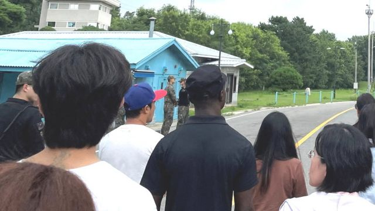

# [World] 朝鲜称越境美国士兵寻求庇护 因反感美军种族歧视“下决心倒戈”

#  朝鲜称越境美国士兵寻求庇护 因反感美军种族歧视“下决心倒戈”

  * 克里斯蒂·库尼（Christy Cooney） 
  * BBC记者 

> 图像来源，  Reuters
>
> 图像加注文字，这名23岁的美国军人于今年7月18日，在参加导览活动时从韩国越境进入北韩。

**朝鲜（北韩）当局表示，美国军人特拉维斯·金（Travis King）上个月越境进入该国领土，是因为在美国军队中遭受了“非人的虐待和种族歧视”。**

这名23岁的美国军人于今年7月18日，在参加导览活动时从韩国越境进入朝鲜。

朝鲜官媒称金“表示愿意寻求庇护”，这是朝鲜方面首次就这起案件发表公开评论。美国方面则表示尚无法核实这些说法。

一位五角大楼官员对此信息回应说，目前的优先工作是通过各种可能的渠道让特拉维斯·金安全回家。

美国官员早前表示，他们认为金是故意越境。金是一名侦察兵，自2021年1月以来从军，并作为轮换人员来到韩国。

> 图像来源，  AFP
>
> 图像加注文字，韩国士兵（左）在板门店休战村面向北方站岗，该村位于分隔朝鲜和韩国的非军事区（DMZ）的联合警备区（JSA）。

在越境之前，他因被指控袭击在韩国美军营中被拘留了两个月，并于7月10日被释放。他原本该返回美国接受纪律审讯，但他成功离开了机场，随后参加了前往分隔两国的非军事区（DMZ）的民间导览。

朝鲜中央通讯社（KCNA）称：“在调查过程中，特拉维斯·金坦白交代，自己对美军内部非人的虐待和种族歧视抱有反感，下决心倒戈投到朝鲜民主主义人民共和国。”

“他对不平等的美国社会感到极大的失望，并表明，愿流亡朝鲜或第三国。”

朝鲜是少数仍然在奉行共产主义的国家之一，长期以来一直高度神秘并与世隔绝。

朝韩非军事区（DMZ）是世界上设防最严密的地区之一，布满地雷，被电网和铁丝网围绕，并受监视摄像头监控。武装士兵24小时保持警惕。

> 图像来源，  Reuters
>
> 图像加注文字，朝鲜方面称，金 (戴黑帽者) 表示在美军遭到种族歧视。

一名自称参加了同一批导览的民众描述说，当时团队刚刚参观完该地点的一座建筑，“这个人哈哈大笑然后从一些建筑物中间跑开了”。

“我一开始以为是恶作剧，但是他没有回来，我意识到这不是开玩笑，然后每个人都反应过来，情况就大乱了。”这位民众说。

他们还补充说，该男子越境时并未看到朝鲜驻守的士兵。

“在坐巴士返回的路上，当我们到达一个检查站时……有人说我们去时有43人，回来时只剩42人。”

对于这名美国士兵的情况，众人对他的担忧越来越大。朝鲜当局与美韩联合国指挥部之间的谈判一直在进行。

