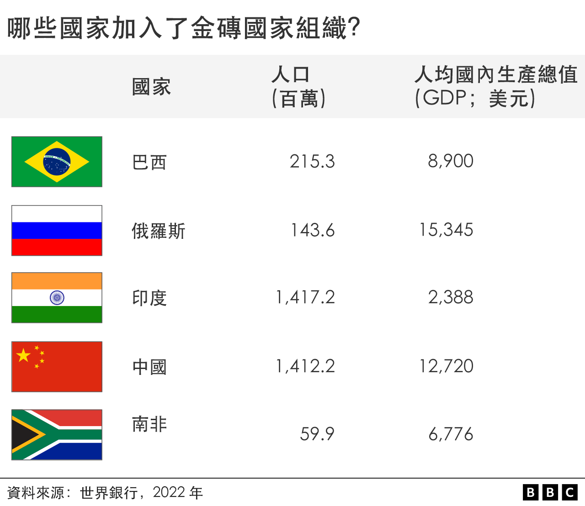
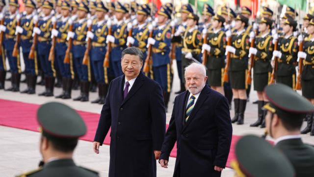
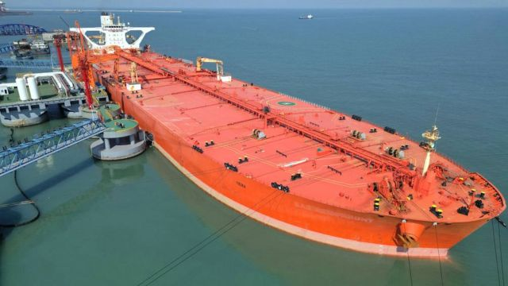
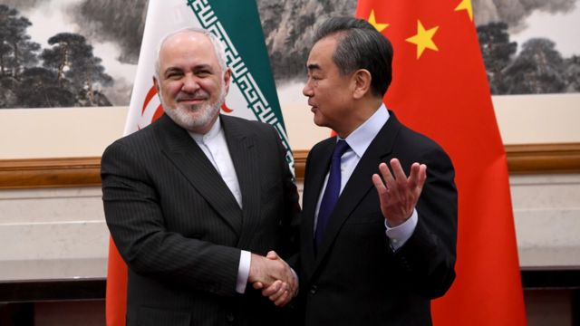
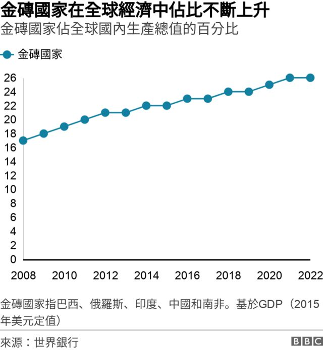

# [World] 金砖国家集团：这是什么组织，为何有40多个国家想加入？

#  金砖国家集团：这是什么组织，为何有40多个国家想加入？

> 图像来源，  Getty Images
>
> 图像加注文字，印有曼德拉头像的金砖峰会广告。

**由巴西、俄罗斯、印度、中国和南非五国组成的金砖国家集团领导人将于8月22日在约翰内斯堡举行会议，会议的一个关键议题是——是否接纳新成员。**

此次峰会的东道国南非表示，现在有40个或更多国家希望加入该集团。

##  “金砖”是怎么来的？

2001年，投资银行高盛（Goldman Sachs）的经济学家吉姆·奥尼尔（Jim O'Neill）创造了金砖四国“Bric”（巴西、俄罗斯、印度和中国）的缩写。当时南非还没有纳入其中。

这些国家都是中等收入大国，当时经济发展迅速。他预测，到 2050年，这四个国家将成为世界主要经济体。

##  金砖集团有多重要？

金砖国家共有32.4亿人口，国民收入总和达26万亿美元。这相当于全球总量的26%。

然而，根据美国智库大西洋理事会（Atlantic Council）的数据，在联合国主要金融机构国际货币基金组织（IMF）中，金砖国家仅拥有15%的投票权。

> 图像来源，  Getty Images
>
> 图像加注文字，同为金砖国家的巴西和中国近年来高层来往密切。

##  金砖五国的目标是什么？

成立金砖集团的目的是，寻找改革国际货币基金组织和世界银行等国际金融机构的方法，为新兴经济体创造“更大的发言权和代表性”。

2014年，金砖国家国家成立了新开发银行（NBD），资金规模达2500亿美元，为新兴国家的发展提供贷款。

埃及和阿拉伯联合酋长国等非金砖国家也加入了新开发银行。

##  金砖国家是否会创建共同货币？

巴西和俄罗斯的主要政治家最近建议，为金砖集团创建一种货币，以挑战美元在国际贸易和金融中的主导地位。

然而，南非驻金砖国家和亚洲大使阿尼尔·苏克拉尔（Anil Sooklal）表示，这并不在约翰内斯堡峰会的议程上。

高盛集团的吉姆·奥尼尔（Jim O'Neill）是最早提出“金砖”国家构想的人，他对英国《金融时报》说，创建共同货币的想法“非常荒谬”。

> 图像来源，  Getty Images
>
> 图像加注文字，俄罗斯目前向金砖国家的合作伙伴印度和中国出口大部分原油。

##  金砖国家有哪些共同点和分歧？

都柏林圣三一学院发展地理学家帕德雷格·卡莫迪（Padraig Carmody）教授说，每个金砖国家都是各自地区的大国。

“然而，中国已经成为老大，”他说，“通过金砖集团，中国正在使自己成为全球南方国家的主要代言人，呼吁改革或推翻现有的国际秩序。”

印度是中国在亚太地区的竞争对手。两国边界争端由来已久，印度一直与美国等国合作，遏制中国在该地区影响力的扩张。

在如何对待西方国家的问题上，金砖国家也存在分歧。

总部位于伦敦的智库查塔姆研究所（Chatham House）全球经济与金融项目主任克里昂·巴特勒（Creon Butler）说：“俄罗斯将金砖五国视为其对抗西方的一部分，帮助其克服西方因入侵乌克兰而对其实施的制裁。”

在西方国家对俄罗斯石油实施制裁后，印度和中国已成为俄罗斯石油的最大客户。

2023年2月，俄罗斯还与中国和南非举行了联合海军演习。

然而，其他金砖成员国并不希望它成为一个公开的反西方条约。

“南非、巴西和印度不希望世界分裂，”巴特勒说。“反对西方将不利于他们的安全和繁荣。”

> 图像来源，  Getty Images
>
> 图像加注文字，伊朗要求加入金砖集团。

##  哪些国家希望加入金砖集团？

南非驻金砖国家和亚洲大使阿尼尔·苏克拉尔（Anil Sooklal）最近说，已有22个国家正式要求加入该集团，还有同样数量的国家表示有兴趣加入。

这些国家包括伊朗、阿根廷、古巴、哈萨克斯坦、埃塞俄比亚、沙特阿拉伯、阿拉伯联合酋长国和委内瑞拉。

卡莫迪教授说：“有一种观点认为，力量平衡正在从西方转移，越来越多的发展中国家正在寻求像金砖国家这样的崛起力量。”

“但金砖国家是一个非常排外的集团，”他说，“接纳新成员会不会削弱其影响力呢？“

巴特勒说：“我猜会有几个国家加入。但它们可能是像阿根廷这样的国家，而不是像伊朗这样的复杂国家。”

##  本次峰会将讨论什么？

2023 年金砖国家领导人峰会将于8月22至24日在约翰内斯堡举行。

决定谁能加入该集团可能是主要议题。

会议议程上的其他议题包括：应对气候变化；扩大发展中国家的贸易、投资机会和创新；改革全球治理体系，给予发展中国家更大的发言权。

南非邀请了来自非洲、拉丁美洲、亚洲和加勒比海地区 60 多个国家的领导人参加此次峰会。

不过，俄罗斯总统普京不会出席。国际刑事法院以战争罪对他发出了逮捕令，但他对此罪予以否认。

作为该法院的签署国，如果普京抵达南非领土，南非将有正式义务执行逮捕令。

普京总统表示，他将以虚拟方式出席峰会，而俄罗斯外交部长谢尔盖·拉夫罗夫（Sergei Lavrov）将亲自出席。

