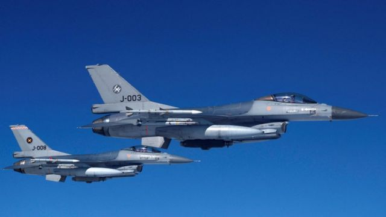

# [World] 乌克兰战争：美国批准丹麦荷兰向乌提供F16战机，捐赠总量可能超过50架

#  乌克兰战争：美国批准丹麦荷兰向乌提供F16战机，捐赠总量可能超过50架

  * 雅罗斯拉夫·卢基夫（Jaroslav Lukiv） 
  * BBC记者 

> 图像来源，  Reuters
>
> 图像加注文字，乌克兰一直推动其盟友提供先进的战斗机，以对抗俄罗斯的空中打击。

**美国同意丹麦和荷兰将美制F16战斗机转交给乌克兰，前提是在乌克兰飞行员完成操作训练后。**

美国国务院发言人表示：“这样，乌克兰就可以充分利用其新的能力。”

乌克兰对这个从去年开始就一直在争取推行的决定表示赞扬。

不过，基辅要使用F16来试图对抗俄罗斯的空中优势，预计还需要等几个月。

荷兰据信有大约24架可操作的F16战机将如期退役，然后被更先进的战机取代。

丹麦也正在计划对其30架F16的机群进行升级。

美国及其盟友此前曾排除了向乌克兰提供F16的可能性，担心这样做会造成与拥有核武器的俄罗斯敌对关系升级。

2022年2月对乌克兰发动全面入侵的俄罗斯，目前未有公开对战机一事发表评论。

美国国务院发言人表示，荷兰和丹麦均已在转让多用途F16战机一事获得“正式保证”。

发言人补充指，这将在“第一批飞行员完成培训后”进行。

荷兰外交大臣胡克斯特拉（Wopke Hoekstra）对美国的决定表示欢迎，他在X（以前为推特）上发表帖子表示：“这标志着乌克兰守卫其人民与国家的一个重大里程碑。”

丹麦国防部长雅各布·埃勒曼-延森（Jakob Ellemann－Jensen）附和了这一论调。

他告诉丹麦瑞查（Ritzau）新闻社：“政府已经数次表示，培训之后的下一步自然是捐赠。我们正在与亲密盟友讨论此事。”

在乌克兰，国防部长列兹尼科夫（Oleksii Reznikov）形容美国的决定是“大好消息”。

他在X上写道：“我们的军队已经证明当中有很多快速学习者。我们将很快证明乌克兰的胜利必将到来。感谢我们在美国、荷兰和丹麦的所有伙伴及朋友们。胜利在望！”

有11个成员国的乌克兰西方盟友联盟将于本月晚些时候开始对乌克兰飞行员进行培训，预计明年能够投入作战。

本周较早前，乌克兰空军发言人伊纳特（Yuriy Ihnat）承认，基辅无法在今年秋冬开始操作F16战机。

F16“战隼”战斗机被广泛认为是世界上最可靠的战斗机种之一。

据美国空军介绍，它可以装备精确制导的导弹和炸弹，并能以1500英里（2400公里）时速飞行。

F16的目标锁定能力将令乌克兰能够在各种天气条件以及夜间以更高的准确性打击俄罗斯军队。

据信乌克兰拥有的数十架战斗机——大部分是米格系列——全为苏联时代留下，而且该国目前在空中实力上明显弱于俄罗斯。

基辅需要现代化的战机，来帮助在俄罗斯定期的导弹和无人机袭击当中保卫其领空，同时支援乌克兰南部和东部的反攻——这些反攻迄今为止取得的成果有限。

