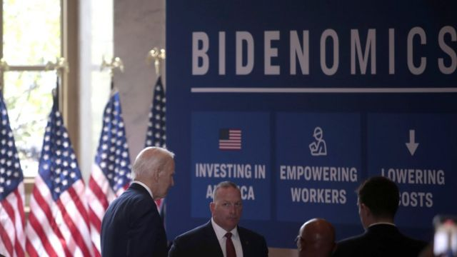

# [World] 美国大选2024观察：为什么对特朗普来说，坏消息反而是好消息？

#  美国大选2024观察：为什么对特朗普来说，坏消息反而是好消息？

  * 卡蒂·凯伊（Katty Kay） 
  * 美国特派记者 

> 图像来源，  Reuters

**这一个美国大选周期已然乱七八糟。常理下通常是负面的消息，现在却成了正面影响——至少两个主要参选人和他们的支持率是这样的。**

对唐纳德·特朗普（Donald Trump）的刑事指控案件数量不断累积——但是他在共和党初选中的民意支持率和竞选资金也一样飙升。这位前总统正逆地而起。现任总统乔·拜登（Joe Biden）面对的问题却是相反——他似乎飞不起来。无论这个国家当前的表现多么出色，他在民调中的支持率都升不上去。

拜登掌管下的经济受到全世界几乎所有国家羡慕。通胀率在下降（3%的数字不到欧盟或英国的一半），失业率也低（3.5%），对衰退的担忧也在减轻。美国人仍然受制于较高的利率和高于新冠疫情前的价格水平，但是总统在今年夏天周游美国各地，提醒人们他议程中的关键部分——《通胀削减法案》（Inflation Reduction Act）和《晶片法案》（CHIPS Act）——已经为美国经济注入了数万亿美元的政府资金。

然而，拜登似乎并未因经济复苏而得到太多赞许。路透社最近一项民意调查显示，54%的美国人不满意拜登的工作——这实际上比三月份更差了几个百分点，而当时经济衰退的可能性更大，通胀率也更高。比起他2021年就任时的32%，这要差得更多。经济好转了，他的民意数据却下滑。好消息并非好消息。

一部分的问题在于，拜登很多大规模支出计划仍然在批核阶段。我访问过的政府官员表示，他们希望随着资金在全国各地的项目中分发，政治规则将恢复正常，人们会开始看到总统工作的成果，并因此给予回报。这就是为什么白宫将他的计划称为“拜登经济学（Bidenomics）”。但这当中也存在风险。如果通胀回升，经济衰退迹象重现，那么共和党人将得到一个唾手可得的负面竞选广告口号。

> 图像来源，  EPA

与此同时，特朗普面临的情况则相反——坏消息并非坏消息。

“如果选民要面对的问题是特朗普应该进监狱还是进白宫，特朗普就赢了。”这是特朗普在佐治亚州被指控干预2020年选举的当晚，我从他一个关联人那里收到的短信。

通常情况下，可能坐牢对于总统候选人来说不会是什么好消息，但是这个关联人却有这样一种违反直觉的思路：“我以这个做卖点，能够比说‘拜登很差劲，不值得连任’容易得多。”需要明确的一点是，这和说“他是无辜的”是两回事。

在特朗普势力范围内的人甚至认为这对他们来说可能是一个积极因素，这颇为令人惊叹。惊叹，但在这个正反颠倒的世界里，又算不上十分意外。那些强势的初选民调数据和涌进来的竞选捐款表明，尽管他面临法律问题，甚或是正正因为如此，共和党选民更加喜欢特朗普了。

特朗普的竞选团队押下赌注，希望美国关键选区的选民，比如宾夕法尼亚州的费城郊区和威斯康辛州的密尔沃基等，会对将一位美国前总统送进监狱的主意反感到一个程度，令他们投票选举特朗普重返白宫。这可能是出于一种让他能摆脱法律困境的希望。

但现在为时尚早，未知选民到2024年11月时是否真的会这样看待此事。

最近对全体选民的民意调查显示，大多数美国人认为特朗普的确犯了罪。大多数人也表示不会投票给他。

“我认为他的团队认识到他现在所面临的危险，但他们想要掌控共和党，”曾在特朗普任总统期间担任其公关顾问的安东尼·斯卡拉姆齐（Anthony Scaramucci）说。

“因此，他们会让他尽可能长时间地处在竞选过程中，但我认为他最终会在法律和家庭压力共同作用下退出。”

这并不意味着他们对乔·拜登感到满意——他们并不满意。即使民主党人也在质疑他是否年纪太老，不适合争取连任。

有一件事是确定的，就是这场竞选将会继续非同寻常。

