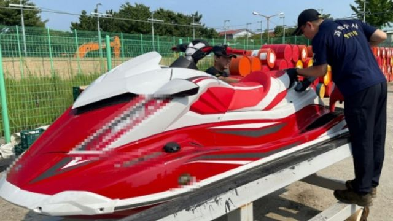

# [World] 男子骑摩托艇逃离中国，穿越黄海300公里前往韩国，疑为异见人士权平

#  男子骑摩托艇逃离中国，穿越黄海300公里前往韩国，疑为异见人士权平

  * 杉丽雅（Celia Hatton）、哈里逊·琼斯（Harrison Jones） 
  * BBC记者 

> 图像来源，  South Korea Coast Guard/AFP
>
> 图像加注文字，被称呼为“权平”的男子被指骑这台摩托艇靠近仁川附近时遇到麻烦。

**一名被指是中国维权活动人士的男子在韩国被捕，据称他当时正用摩托艇逃往韩国。**

韩国海岸防卫队表示，该男子利用望远镜和指南针作工具，在黄海行驶了约300公里（186英里），但后来被困海上。

当地媒体称呼该男子为权平（Kwon Pyong），指他是中国国家主席习近平的批评者，不过其身份未获核实。

中国驻首尔大使馆拒绝就事件置评。

近年来，北京方面增加了在机场和其它法定边境口岸实施出境限制令的频率，以阻止活动人士离开中国。

很多亲北京的东南亚国家不再收容寻求庇护的人，这使得希望逃离的异见人士面对更多的困难。

上月，知名中国人权律师卢思位在老挝被捕并被送回中国，未能前往美国与妻儿团聚。

但是，驾驶摩托艇穿越惊涛骇浪前往韩国，可能是较为极端的一种逃离方式。

韩国海岸警卫队表示，该名男子当时身穿救生衣和戴头盔，用排气量1800毫升的机器拖着五桶燃油，从中国山东省出发。

警卫队解释道，“他在途中加油然后把空桶丢在海中”，此外还指他在仁川西部港口外的邮轮码头附近遇到麻烦并呼救。

海岸警卫队没有透露该男子的身份，但表示他于上周三（8月16日）因试图“自行偷渡”进入该市而被拘留。有关方面没有怀疑他可能是间谍。工作地在韩国的非营利组织“对话中国”（Dialogue China）的倡议人士李大善（Lee Dae-seon）在周二（8月22日）法新社表示，35岁的权平是逃亡者。

权平在中国曾因公开批评习近平而入狱。

他若以常规出行途径离开中国并申请庇护，很可能会遇到问题，而且他也很可能受到出境限制，令他不能合法地离开中国。

李大善表示：“尽管（权平）违反法律进入韩国的方式是错误的，但中国当局自2016年以来对他的的监控和政治迫害，才是他冒生命危险越洋前往韩国背后的原因。”

他还表示，权平现在正考虑是否在韩国申请难民身份——该国每年仅有少量申请获批，权亦可能考虑申请去第三国。

